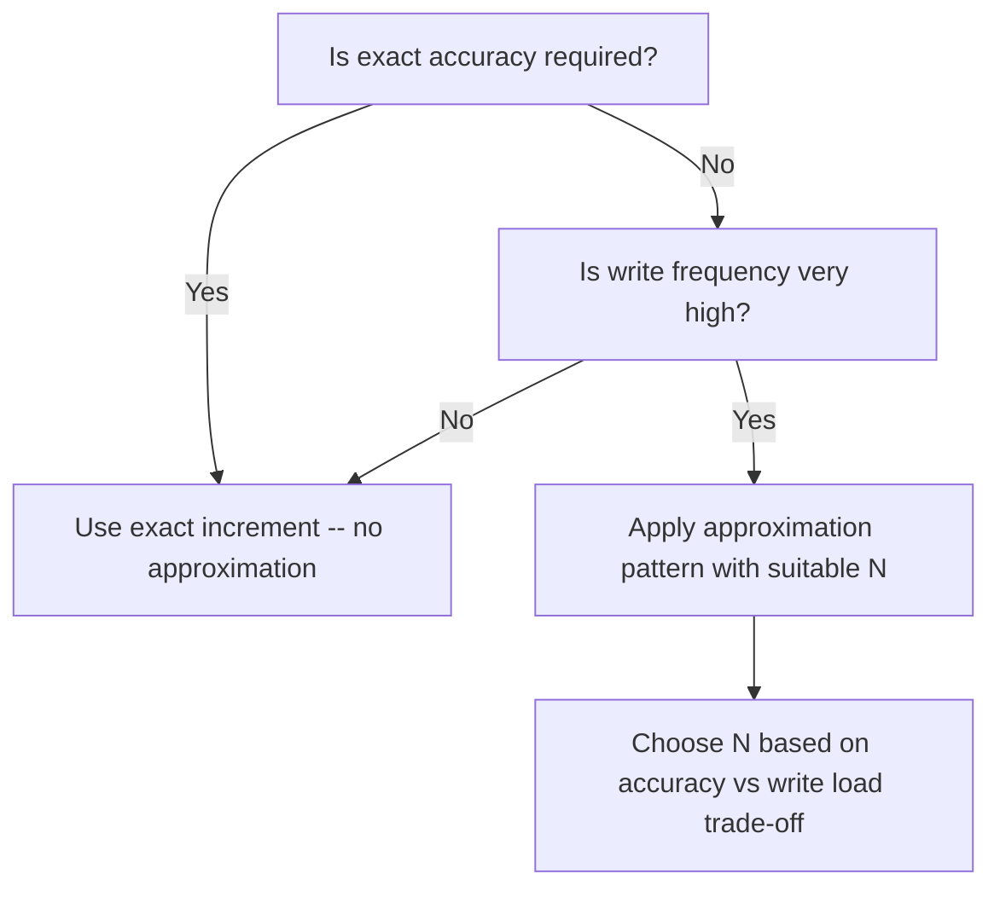

# How to Implement the Approximation Pattern in MongoDB

The approximation pattern is a MongoDB schema design technique for reducing write load on fields that are updated very frequently but where exact accuracy is not required. Instead of incrementing a counter on every single event, you update it only when a random condition is met -- typically once every N events. The result is a value that is approximately correct with far fewer write operations.

## The Problem: High-Frequency Counter Updates

Consider a website tracking page views. If a popular article receives 10,000 views per minute, you need 10,000 `$inc` operations per minute on a single document. This creates write contention on the document's WiredTiger lock and can become a bottleneck.

```javascript
// Naive approach -- one write per view
await db.collection("articles").updateOne(
  { _id: articleId },
  { $inc: { viewCount: 1 } }
);
```

At high request rates, these updates queue up and the document becomes a hotspot.

## The Approximation Pattern: Probabilistic Updates

Instead of updating on every event, choose a probability factor N. Only update the document with probability 1/N, and when you do, increment by N.

```javascript
// Update approximately 1 in 100 times, but increment by 100
const N = 100;

async function recordView(db, articleId) {
  if (Math.random() < 1 / N) {
    await db.collection("articles").updateOne(
      { _id: articleId },
      { $inc: { viewCount: N } }
    );
  }
}
```

Over a large number of events, the expected value of `viewCount` approaches the true count. The approximation error decreases as the number of events grows.

## Choosing the Right N

The approximation error for a given N over K events is roughly `sqrt(K / N)`. For 1 million views with N=100:

- Expected writes: 10,000 (100x reduction)
- Approximate error: around 100 views (0.01% of 1 million)

```javascript
// N=10 gives better accuracy, fewer write savings
// N=100 gives 100x write reduction, ~0.01% error at 1M events
// N=1000 gives 1000x write reduction, ~0.1% error at 1M events

const N_OPTIONS = {
  high_accuracy: 10,
  balanced: 100,
  high_performance: 1000
};
```

## Implementation with Configurable Factor

```javascript
class ApproximationCounter {
  constructor(collection, factor = 100) {
    this.collection = collection;
    this.factor = factor;
  }

  async increment(filter, field) {
    if (Math.random() < 1 / this.factor) {
      await this.collection.updateOne(
        filter,
        { $inc: { [field]: this.factor } }
      );
      return true;
    }
    return false;
  }
}

const viewCounter = new ApproximationCounter(
  db.collection("articles"),
  100
);

// In request handler
await viewCounter.increment({ _id: articleId }, "viewCount");
```

## Schema Design

The document schema does not need to change. The approximation is entirely in the application layer.

```javascript
// articles collection
{
  _id: ObjectId("64a1b2c3d4e5f6789abc0001"),
  title: "Getting Started with MongoDB",
  slug: "getting-started-mongodb",
  authorId: ObjectId("..."),
  viewCount: 142300,    // approximate, updated probabilistically
  likeCount: 834,       // exact -- likes are infrequent enough
  commentCount: 47,     // exact -- comments are infrequent
  publishedAt: new Date("2024-01-10")
}
```

## When Approximation Is Appropriate



## Combining with the Computed Pattern

Store both the approximate view count and a last-computed timestamp. Periodically run an exact aggregation from a separate events collection to recalibrate the counter.

```javascript
// events collection records every view (write-only, no contention)
await db.collection("viewEvents").insertOne({
  articleId: articleId,
  userId: userId,
  viewedAt: new Date(),
  sessionId: sessionId
});

// Periodic recalibration job (runs hourly)
async function recalibrateViewCounts(db) {
  const pipeline = [
    {
      $group: {
        _id: "$articleId",
        exactCount: { $sum: 1 }
      }
    }
  ];

  const counts = await db.collection("viewEvents").aggregate(pipeline).toArray();

  for (const { _id, exactCount } of counts) {
    await db.collection("articles").updateOne(
      { _id },
      {
        $set: {
          viewCount: exactCount,
          viewCountLastCalibrated: new Date()
        }
      }
    );
  }
}
```

## Use Cases

- **Page view counters**: Popular pages receive thousands of views per minute
- **Like/reaction counters**: Viral content can receive bursts of reactions
- **Product impression counters**: How many times a product was shown in search results
- **Streaming play counts**: Music or video play tracking
- **Ad impression counters**: Tracking advertisement exposures

## Performance Impact

```javascript
// Measure write rate reduction
// Without approximation: 10,000 writes/minute per popular article
// With N=100: approximately 100 writes/minute (100x reduction)
// Accuracy at 1M events: error < 0.1%

const stats = await db.collection("articles").findOne(
  { _id: articleId },
  { projection: { viewCount: 1 } }
);
console.log("Approximate view count:", stats.viewCount);
```

## Summary

The approximation pattern reduces write contention on high-frequency counter fields by using probabilistic updates. Instead of writing on every event, the application writes with probability 1/N and increments by N, producing a counter that is approximately equal to the true count. The approximation error decreases as the total count grows, making it very accurate at high volumes. Use this pattern for view counts, impression counts, and other metrics where an accuracy of 99.9% is acceptable. Combine with a periodic exact recalibration job for fields where you occasionally need to reset to the true count.
