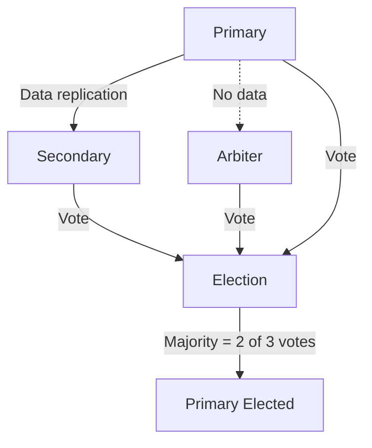
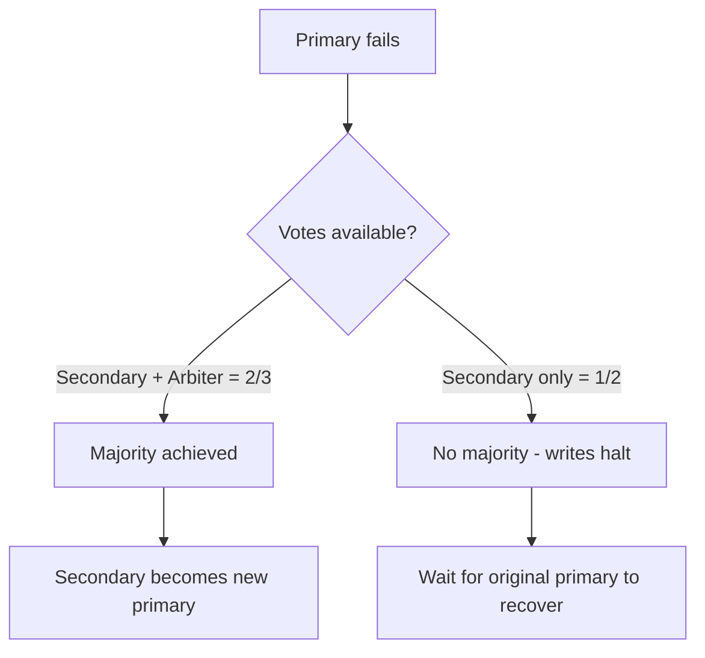

# How to Use Arbiter Nodes in MongoDB Replica Set

Author: [nawazdhandala](https://www.github.com/nawazdhandala)

Tags: MongoDB, Replica Set, Arbiter, Election, Configuration

Description: Learn when and how to add an arbiter node to a MongoDB replica set to maintain quorum with an even number of data members without the cost of a full data copy.

---

## What is an Arbiter

An arbiter is a special replica set member that holds no data and cannot become primary. Its sole purpose is to vote in elections, providing an odd number of voting members to break ties when the set would otherwise have an even number of data-bearing members.

An arbiter is lightweight: it uses very little memory and disk space because it stores no collection data. It is ideal when you want a 2-node primary/secondary setup but need a tiebreaker for elections without paying for a full third server.



## When to Use an Arbiter

Use an arbiter when:
- You have exactly 2 data-bearing members and need a tiebreaker
- You cannot afford a third full server but need election quorum
- You are cost-constrained (arbiter can run on a minimal VM)

Do NOT use an arbiter when:
- You already have an odd number of data-bearing members (3, 5, 7)
- Your workload requires the third member to serve reads
- You want the third server to be available for failover with full data

## Adding an Arbiter

Start a `mongod` with the same `--replSet` name but minimal configuration. The arbiter does not need a large `dbpath`:

```bash
# arbiter mongod.conf
replication:
  replSetName: "rs0"
net:
  port: 27020
  bindIp: 0.0.0.0
storage:
  dbPath: /data/arbiter
  # Small storage - no user data will be stored
```

```bash
mongod --config /etc/mongod-arbiter.conf
```

Then from the primary:

```javascript
// Add the arbiter
rs.addArb("arbiter.example.com:27020");
```

Or using rs.add() with arbiterOnly:

```javascript
rs.add({ host: "arbiter.example.com:27020", arbiterOnly: true });
```

## Configuring an Arbiter at rs.initiate()

```javascript
rs.initiate({
  _id: "rs0",
  members: [
    { _id: 0, host: "primary.example.com:27017" },
    { _id: 1, host: "secondary.example.com:27018" },
    { _id: 2, host: "arbiter.example.com:27020", arbiterOnly: true }
  ]
});
```

## Verifying the Arbiter

```javascript
// rs.status() shows arbiter state
rs.status().members.forEach(m => {
  print(m.name, m.stateStr);
});
// server1:27017  PRIMARY
// server2:27018  SECONDARY
// arbiter:27020  ARBITER

// rs.conf() shows arbiterOnly: true
rs.conf().members.find(m => m.arbiterOnly);
```

## Arbiter Behavior in Elections

With a 2-member primary/secondary set and no arbiter:
- Primary goes down: secondary has 1 of 2 votes - NO majority, cannot elect new primary
- Writes halt until the original primary recovers

With an arbiter added:
- Primary goes down: secondary + arbiter = 2 of 3 votes - majority achieved
- Secondary is elected new primary within seconds



## Limitations and Considerations

1. **No data safety increase**: An arbiter does not store data, so it adds no redundancy. If both data-bearing members fail, data is lost.

2. **Only one arbiter per replica set**: MongoDB recommends at most one arbiter per set.

3. **Security concerns**: Arbiters still receive oplog metadata and connection credentials. Run them in the same trusted network as data members.

4. **PSA (Primary-Secondary-Arbiter) sets**: In a PSA set, if the secondary goes down, you lose write majority and the primary will step down because it cannot satisfy `w: majority`. Use `w: 1` or understand this limitation.

```javascript
// PSA write concern consideration
// With PSA: if secondary is down, majority write concern will fail
db.orders.insertOne(
  { orderId: "123" },
  { writeConcern: { w: 1 } }  // safe for PSA when secondary is down
);

// Or set write concern at the collection level:
db.runCommand({
  collMod: "orders",
  writeConcern: { w: 1 }
});
```

## Arbiter Resource Requirements

```yaml
# Minimal arbiter configuration
replication:
  replSetName: "rs0"
net:
  port: 27020
  bindIp: 0.0.0.0
storage:
  dbPath: /data/arbiter
  # A few MB is sufficient - no user data
systemLog:
  destination: file
  path: /var/log/mongodb/arbiter.log
```

An arbiter typically uses less than 1 MB of disk space for data and very little RAM.

## Security: Authentication with Arbiter

If your replica set uses keyfile authentication or x.509, the arbiter must use the same keyfile:

```yaml
security:
  keyFile: /etc/mongodb/keyfile
```

The arbiter participates in the same authentication handshake as all other members.

## Removing an Arbiter

```javascript
rs.remove("arbiter.example.com:27020");
```

After removal, verify quorum is still maintained with the remaining members. If removing the arbiter leaves an even number of voters, add another data-bearing member or add a new arbiter.

## Monitoring an Arbiter

```javascript
// Check arbiter health in rs.status()
const arbiterStatus = rs.status().members.find(m => m.stateStr === "ARBITER");
if (!arbiterStatus || arbiterStatus.health !== 1) {
  print("WARNING: Arbiter is unhealthy or not found");
} else {
  print("Arbiter is healthy:", arbiterStatus.name);
}
```

## PSA vs. Three-Node Replica Sets

| Topology | Fault Tolerance | Write Majority | Read Scalability |
|---|---|---|---|
| PSA (P+S+Arbiter) | Lose 1 data member | Lost when secondary is down | 1 secondary available |
| 3 data nodes | Lose 1 data member | Maintained unless 2 nodes fail | 2 secondaries available |

For production workloads that need high write availability, a three-data-node replica set is safer than PSA.

## Summary

An arbiter is a lightweight replica set member that votes in elections without storing any data. Add one with `rs.addArb("host:port")` when you have an even number of data-bearing members and need a tiebreaker for elections. Be aware of the PSA topology limitation: if the secondary goes down, write concern `majority` cannot be satisfied even though the primary is still running. For critical production systems with strict availability requirements, prefer three full data-bearing members over a PSA topology.
