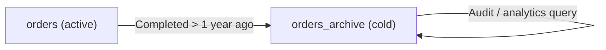

# How to Implement the Archive Pattern in MongoDB

The archive pattern separates active, frequently queried documents from older, rarely accessed documents by moving them to a dedicated archive collection. This keeps the main collection small, improves cache hit rates, and reduces index sizes, while still preserving historical data for compliance or analytics.

## Why Archive?

Over time, collections grow. An orders collection might hold millions of delivered, refunded, or cancelled orders that are rarely read. Every index on that collection must maintain entries for all those old documents, consuming RAM and slowing writes. Archiving removes old documents from the hot path without deleting them.



## Designing for Archival

Add an `archivedAt` field (null for active documents) and an `isArchived` boolean for easy filtering.

```javascript
// Active order
{
  _id: ObjectId("64a1b2c3d4e5f6789abc0001"),
  customerId: ObjectId("..."),
  status: "delivered",
  total: 149.99,
  placedAt: new Date("2022-01-15"),
  deliveredAt: new Date("2022-01-20"),
  isArchived: false,
  archivedAt: null
}
```

## Archive Collection Schema

The archive collection mirrors the main collection. Use the same schema so documents can be restored without transformation.

```javascript
// Create the archive collection with an index for date-based queries
db.createCollection("orders_archive");
db.orders_archive.createIndex({ placedAt: 1 });
db.orders_archive.createIndex({ customerId: 1, placedAt: -1 });
db.orders_archive.createIndex({ archivedAt: 1 });
```

## Archive Job: Move Old Documents

Run a scheduled job to move documents older than a threshold from the active collection to the archive.

```javascript
async function archiveOldOrders(db, olderThanDays = 365) {
  const cutoff = new Date();
  cutoff.setDate(cutoff.getDate() - olderThanDays);

  let archived = 0;
  const cursor = db.collection("orders").find({
    status: { $in: ["delivered", "cancelled", "refunded"] },
    placedAt: { $lt: cutoff },
    isArchived: false
  }).batchSize(500);

  for await (const doc of cursor) {
    const session = client.startSession();
    await session.withTransaction(async () => {
      // Insert into archive
      await db.collection("orders_archive").insertOne(
        { ...doc, isArchived: true, archivedAt: new Date() },
        { session }
      );
      // Delete from active collection
      await db.collection("orders").deleteOne(
        { _id: doc._id },
        { session }
      );
    });
    await session.endSession();
    archived++;
  }

  console.log(`Archived ${archived} orders.`);
  return archived;
}
```

## Bulk Archive with Aggregation

For large collections, process in batches to avoid long-running transactions.

```javascript
async function archiveBatch(db, batchSize = 1000) {
  const cutoff = new Date(Date.now() - 365 * 24 * 60 * 60 * 1000);

  // Find batch of documents to archive
  const toArchive = await db.collection("orders")
    .find({
      status: { $in: ["delivered", "cancelled"] },
      placedAt: { $lt: cutoff }
    })
    .limit(batchSize)
    .toArray();

  if (toArchive.length === 0) return 0;

  const archiveDocs = toArchive.map((doc) => ({
    ...doc,
    isArchived: true,
    archivedAt: new Date()
  }));

  const ids = toArchive.map((doc) => doc._id);

  // Bulk insert into archive, then bulk delete from active
  await db.collection("orders_archive").insertMany(archiveDocs, { ordered: false });
  await db.collection("orders").deleteMany({ _id: { $in: ids } });

  return toArchive.length;
}

// Run in a loop until complete
let total = 0;
let count;
do {
  count = await archiveBatch(db, 1000);
  total += count;
  console.log(`Archived ${total} so far...`);
} while (count > 0);
```

## Querying Across Active and Archive

Use `$unionWith` to query both collections when you need complete history.

```javascript
// Get all orders for a customer (active + archived)
const allOrders = await db.collection("orders").aggregate([
  { $match: { customerId: ObjectId("64a1b2c3d4e5f6789abc0001") } },
  {
    $unionWith: {
      coll: "orders_archive",
      pipeline: [
        { $match: { customerId: ObjectId("64a1b2c3d4e5f6789abc0001") } }
      ]
    }
  },
  { $sort: { placedAt: -1 } }
]).toArray();
```

## Restoring an Archived Document

If a customer disputes a refund and the order needs to be reactive, move it back.

```javascript
async function restoreOrder(db, orderId) {
  const archived = await db.collection("orders_archive")
    .findOne({ _id: orderId });

  if (!archived) throw new Error("Order not found in archive");

  const session = client.startSession();
  await session.withTransaction(async () => {
    const restored = { ...archived, isArchived: false, archivedAt: null };
    await db.collection("orders").insertOne(restored, { session });
    await db.collection("orders_archive").deleteOne(
      { _id: orderId },
      { session }
    );
  });
  await session.endSession();
}
```

## Using TTL on Archive for Retention Policies

If you only need to keep archived documents for a limited time (for example, 7 years for tax compliance), add a TTL index on the archive collection.

```javascript
// Automatically delete archived orders after 7 years
db.orders_archive.createIndex(
  { archivedAt: 1 },
  { expireAfterSeconds: 7 * 365 * 24 * 60 * 60 }
);
```

## Summary

The archive pattern moves infrequently accessed documents to a separate collection to keep the active collection lean. Active collection indexes stay small, cache hit rates improve, and write performance increases because fewer documents compete for index space. Design the archive collection with the same schema as the active collection to allow restoration without transformation. Use transactions to ensure atomicity when moving documents, and use `$unionWith` when you need to query across both collections. Combine with TTL indexes on the archive collection to enforce data retention policies automatically.
