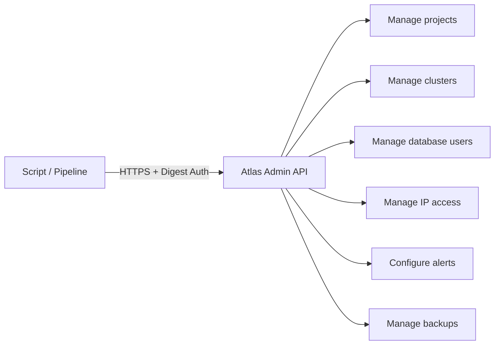

# How to Automate MongoDB Atlas with the Atlas Admin API

Author: [nawazdhandala](https://www.github.com/nawazdhandala)

Tags: MongoDB, Atlas, API, Automation, DevOps

Description: Learn how to use the MongoDB Atlas Admin API to programmatically manage clusters, users, IP access lists, and alerts using HTTP requests and API keys.

---

## What is the Atlas Admin API

The MongoDB Atlas Admin API is a RESTful HTTP API that provides programmatic access to all Atlas management operations. Every action available in the Atlas UI can be performed through the API, making it suitable for infrastructure-as-code workflows, CI/CD pipelines, and custom management tools.



## Authentication

The Atlas Admin API uses HTTP Digest Authentication with API keys. Generate keys in the Atlas UI:

1. Click **Access Manager** in the top navigation.
2. Click **API Keys**.
3. Click **Create API Key**.
4. Assign roles (e.g., **Organization Owner** for full access or **Project Data Access Admin** for limited access).
5. Copy the public and private keys.

Example curl with Digest Auth:

```bash
PUBLIC_KEY="your-public-key"
PRIVATE_KEY="your-private-key"
PROJECT_ID="your-project-id"
BASE_URL="https://cloud.mongodb.com/api/atlas/v2"

curl --user "${PUBLIC_KEY}:${PRIVATE_KEY}" \
  --digest \
  --header "Accept: application/vnd.atlas.2023-01-01+json" \
  --header "Content-Type: application/json" \
  "${BASE_URL}/groups/${PROJECT_ID}/clusters"
```

## API Versioning

Atlas Admin API v2 uses date-based version headers:

```bash
--header "Accept: application/vnd.atlas.2023-01-01+json"
```

Always specify a version to avoid breaking changes when the API is updated.

## Listing Clusters

```bash
curl --user "${PUBLIC_KEY}:${PRIVATE_KEY}" \
  --digest \
  --header "Accept: application/vnd.atlas.2023-01-01+json" \
  "${BASE_URL}/groups/${PROJECT_ID}/clusters" | jq '.'
```

## Creating a Cluster

```bash
curl --user "${PUBLIC_KEY}:${PRIVATE_KEY}" \
  --digest \
  --header "Accept: application/vnd.atlas.2023-01-01+json" \
  --header "Content-Type: application/json" \
  --request POST \
  --data '{
    "name": "myCluster",
    "clusterType": "REPLICASET",
    "mongoDBMajorVersion": "7.0",
    "replicationSpecs": [
      {
        "numShards": 1,
        "regionConfigs": [
          {
            "providerName": "AWS",
            "regionName": "US_EAST_1",
            "priority": 7,
            "electableSpecs": {
              "instanceSize": "M10",
              "nodeCount": 3
            }
          }
        ]
      }
    ]
  }' \
  "${BASE_URL}/groups/${PROJECT_ID}/clusters"
```

## Polling Cluster State

Cluster creation is asynchronous. Poll the state until it reaches `IDLE`:

```bash
#!/bin/bash
CLUSTER_NAME="myCluster"

while true; do
  STATE=$(curl -s --user "${PUBLIC_KEY}:${PRIVATE_KEY}" \
    --digest \
    --header "Accept: application/vnd.atlas.2023-01-01+json" \
    "${BASE_URL}/groups/${PROJECT_ID}/clusters/${CLUSTER_NAME}" | \
    jq -r '.stateName')

  echo "Cluster state: $STATE"

  if [ "$STATE" = "IDLE" ]; then
    echo "Cluster is ready"
    break
  fi

  sleep 30
done
```

## Managing Database Users

Create a user:

```bash
curl --user "${PUBLIC_KEY}:${PRIVATE_KEY}" \
  --digest \
  --header "Accept: application/vnd.atlas.2023-01-01+json" \
  --header "Content-Type: application/json" \
  --request POST \
  --data '{
    "username": "appuser",
    "password": "securepassword123",
    "databaseName": "admin",
    "roles": [
      {
        "roleName": "readWrite",
        "databaseName": "myapp"
      }
    ]
  }' \
  "${BASE_URL}/groups/${PROJECT_ID}/databaseUsers"
```

Update a user's roles:

```bash
curl --user "${PUBLIC_KEY}:${PRIVATE_KEY}" \
  --digest \
  --header "Accept: application/vnd.atlas.2023-01-01+json" \
  --header "Content-Type: application/json" \
  --request PATCH \
  --data '{
    "roles": [
      { "roleName": "read", "databaseName": "myapp" },
      { "roleName": "readWrite", "databaseName": "analytics" }
    ]
  }' \
  "${BASE_URL}/groups/${PROJECT_ID}/databaseUsers/admin/appuser"
```

Delete a user:

```bash
curl --user "${PUBLIC_KEY}:${PRIVATE_KEY}" \
  --digest \
  --header "Accept: application/vnd.atlas.2023-01-01+json" \
  --request DELETE \
  "${BASE_URL}/groups/${PROJECT_ID}/databaseUsers/admin/appuser"
```

## Managing IP Access Lists

Add an IP entry:

```bash
curl --user "${PUBLIC_KEY}:${PRIVATE_KEY}" \
  --digest \
  --header "Accept: application/vnd.atlas.2023-01-01+json" \
  --header "Content-Type: application/json" \
  --request POST \
  --data '[
    {
      "ipAddress": "203.0.113.10",
      "comment": "Office static IP"
    }
  ]' \
  "${BASE_URL}/groups/${PROJECT_ID}/accessList"
```

Add a CIDR block with expiration:

```bash
curl --user "${PUBLIC_KEY}:${PRIVATE_KEY}" \
  --digest \
  --header "Accept: application/vnd.atlas.2023-01-01+json" \
  --header "Content-Type: application/json" \
  --request POST \
  --data '[
    {
      "cidrBlock": "10.0.0.0/8",
      "comment": "Temporary VPN range",
      "deleteAfterDate": "2026-06-30T00:00:00Z"
    }
  ]' \
  "${BASE_URL}/groups/${PROJECT_ID}/accessList"
```

## Getting a Connection String

```bash
curl --user "${PUBLIC_KEY}:${PRIVATE_KEY}" \
  --digest \
  --header "Accept: application/vnd.atlas.2023-01-01+json" \
  "${BASE_URL}/groups/${PROJECT_ID}/clusters/myCluster" | \
  jq '.connectionStrings.standardSrv'
```

## Configuring Alerts

Create an alert for high CPU usage:

```bash
curl --user "${PUBLIC_KEY}:${PRIVATE_KEY}" \
  --digest \
  --header "Accept: application/vnd.atlas.2023-01-01+json" \
  --header "Content-Type: application/json" \
  --request POST \
  --data '{
    "eventTypeName": "NORMALIZED_SYSTEM_CPU_USER",
    "enabled": true,
    "threshold": {
      "operator": "GREATER_THAN",
      "threshold": 85,
      "units": "RAW"
    },
    "notifications": [
      {
        "typeName": "EMAIL",
        "emailAddress": "ops@example.com",
        "intervalMin": 5,
        "delayMin": 0
      }
    ]
  }' \
  "${BASE_URL}/groups/${PROJECT_ID}/alertConfigs"
```

## Python Wrapper Example

For complex automation, wrap the API in Python using the `requests` library:

```python
import os
import requests
from requests.auth import HTTPDigestAuth

BASE_URL = "https://cloud.mongodb.com/api/atlas/v2"
PUBLIC_KEY = os.environ["ATLAS_PUBLIC_KEY"]
PRIVATE_KEY = os.environ["ATLAS_PRIVATE_KEY"]
PROJECT_ID = os.environ["ATLAS_PROJECT_ID"]

HEADERS = {
    "Accept": "application/vnd.atlas.2023-01-01+json",
    "Content-Type": "application/json"
}

auth = HTTPDigestAuth(PUBLIC_KEY, PRIVATE_KEY)

def list_clusters():
    resp = requests.get(
        f"{BASE_URL}/groups/{PROJECT_ID}/clusters",
        auth=auth,
        headers=HEADERS
    )
    resp.raise_for_status()
    return resp.json()["results"]

def create_database_user(username, password, db_name, role):
    payload = {
        "username": username,
        "password": password,
        "databaseName": "admin",
        "roles": [{"roleName": role, "databaseName": db_name}]
    }
    resp = requests.post(
        f"{BASE_URL}/groups/{PROJECT_ID}/databaseUsers",
        auth=auth,
        headers=HEADERS,
        json=payload
    )
    resp.raise_for_status()
    return resp.json()

if __name__ == "__main__":
    clusters = list_clusters()
    for c in clusters:
        print(f"{c['name']}: {c['stateName']}")
```

## Summary

The MongoDB Atlas Admin API provides HTTP-based control over all Atlas resources using Digest Authentication with API keys. Use it to create clusters, manage database users, configure IP access lists, set up alerts, and retrieve connection strings. Always include an API version header and poll cluster state for async operations. For complex workflows, wrap the API calls in Python or another language with an HTTP client for better error handling and retry logic.
