# How to Set Up MongoDB Atlas Cluster Autoscaling

Author: [nawazdhandala](https://www.github.com/nawazdhandala)

Tags: MongoDB, Atlas, Autoscaling, Cloud, Operation

Description: Learn how to configure MongoDB Atlas cluster autoscaling to automatically adjust compute and storage tiers in response to workload changes, reducing cost and manual intervention.

---

## Overview

MongoDB Atlas supports two types of autoscaling:

1. **Compute autoscaling** - automatically scales the cluster tier (CPU and RAM) up or down based on CPU utilization and system memory
2. **Storage autoscaling** - automatically increases disk storage when usage approaches the limit

Autoscaling applies to dedicated clusters (M10 and above). It is not available for free-tier (M0) or shared clusters (M2/M5).

```mermaid
flowchart TD
    A[Atlas Metrics] --> B{CPU > 75%?\nfor 1 hour}
    B -- yes --> C[Scale Up: next tier]
    B -- no --> D{CPU < 50%?\nfor 24 hours}
    D -- yes --> E[Scale Down: previous tier]
    D -- no --> F[No Change]

    G[Disk Usage] --> H{> 90% full?}
    H -- yes --> I[Increase Disk Size]
    H -- no --> J[No Change]
```



## Enabling Compute Autoscaling

### Via Atlas UI

1. Open your Atlas project and navigate to your cluster
2. Click **Edit Configuration**
3. Under **Cluster Tier**, expand **Autoscale** options
4. Toggle **Compute** autoscaling on
5. Set the minimum and maximum cluster tiers
6. Click **Review Changes** and **Apply**

### Via Atlas CLI

```bash
atlas clusters update myCluster \
  --projectId <PROJECT_ID> \
  --autoScalingComputeEnabled \
  --autoScalingComputeScaleDownEnabled \
  --autoScalingMinInstanceSize M10 \
  --autoScalingMaxInstanceSize M50
```

### Via Atlas API

```bash
curl --user "publicKey:privateKey" --digest \
  --header "Content-Type: application/json" \
  --request PATCH \
  "https://cloud.mongodb.com/api/atlas/v1.0/groups/<PROJECT_ID>/clusters/myCluster" \
  --data '{
    "autoScaling": {
      "compute": {
        "enabled": true,
        "scaleDownEnabled": true,
        "minInstanceSize": "M10",
        "maxInstanceSize": "M50"
      }
    }
  }'
```

## Enabling Storage Autoscaling

Storage autoscaling only scales upward. It increases disk size automatically and does not scale down.

### Via Atlas UI

1. In the cluster edit panel, locate **Storage**
2. Toggle **Autoscale Storage** on
3. Set the maximum storage limit

### Via Atlas CLI

```bash
atlas clusters update myCluster \
  --projectId <PROJECT_ID> \
  --autoScalingDiskGBEnabled
```

## Autoscaling Thresholds

### Compute Scale-Up Triggers

| Condition | Scale-Up Action |
|---|---|
| Average CPU utilization > 75% for 1 hour | Upgrade to next cluster tier |
| System memory utilization > 90% for 1 hour | Upgrade to next cluster tier |

### Compute Scale-Down Triggers

| Condition | Scale-Down Action |
|---|---|
| Average CPU utilization < 50% for 24 hours | Downgrade to previous tier (if enabled) |

Scale-down must be explicitly enabled and respects the configured minimum tier.

### Storage Scale-Up Trigger

| Condition | Scale-Up Action |
|---|---|
| Disk usage > 90% | Increase disk size by the next increment |

## Setting Min and Max Tier Bounds

Bounds prevent over-scaling or excessive cost spikes:

```bash
atlas clusters update myCluster \
  --projectId <PROJECT_ID> \
  --autoScalingComputeEnabled \
  --autoScalingMinInstanceSize M20 \
  --autoScalingMaxInstanceSize M60
```

If CPU spikes push the cluster to M60 and it stays there, autoscaling stops because the maximum is reached. Atlas sends a notification when the maximum tier is hit.

## Monitoring Autoscaling Events

Autoscaling events appear in the Atlas Activity Feed:

```bash
atlas events list --projectId <PROJECT_ID> --limit 20 | grep -i autoscal
```

Or programmatically via the Events API:

```bash
curl --user "publicKey:privateKey" --digest \
  "https://cloud.mongodb.com/api/atlas/v1.0/groups/<PROJECT_ID>/events?eventType=AUTO_SCALING_INITIATED"
```

## Terraform Configuration

```hcl
resource "mongodbatlas_cluster" "main" {
  project_id = var.project_id
  name       = "my-cluster"

  auto_scaling_compute_enabled            = true
  auto_scaling_compute_scale_down_enabled = true
  auto_scaling_disk_gb_enabled            = true

  provider_auto_scaling_compute_min_instance_size = "M10"
  provider_auto_scaling_compute_max_instance_size = "M60"

  provider_name               = "AWS"
  provider_region_name        = "US_EAST_1"
  provider_instance_size_name = "M20"

  cluster_type = "REPLICASET"
  replication_factor = 3
}
```

## Limitations

- Available only for dedicated clusters M10 and above
- Compute autoscaling is not available for NVMe storage clusters
- Autoscaling events require a brief rolling restart during tier changes
- Storage autoscaling cannot reduce disk size (only increases)
- Multi-region or multi-cloud clusters have specific autoscaling restrictions

## Alerts for Autoscaling Events

Set up Atlas alerts so the team is notified when autoscaling fires:

1. Go to **Alerts** in your Atlas project
2. Click **Add New Alert**
3. Choose **Cluster** as the category
4. Select **Auto Scaling - Scale Up Initiated** or **Auto Scaling - Scale Down Initiated**
5. Configure notification channels (email, Slack, PagerDuty, etc.)

## Summary

MongoDB Atlas cluster autoscaling removes the need to manually resize clusters during traffic spikes or quiet periods. Enable compute autoscaling with explicit minimum and maximum tier bounds to control cost exposure. Enable storage autoscaling to eliminate disk-full emergencies. Monitor the Activity Feed and configure alerts so the team is always aware of scaling events. For persistent high utilization that keeps triggering scale-up, investigate the underlying queries rather than relying on autoscaling as a substitute for optimization.
