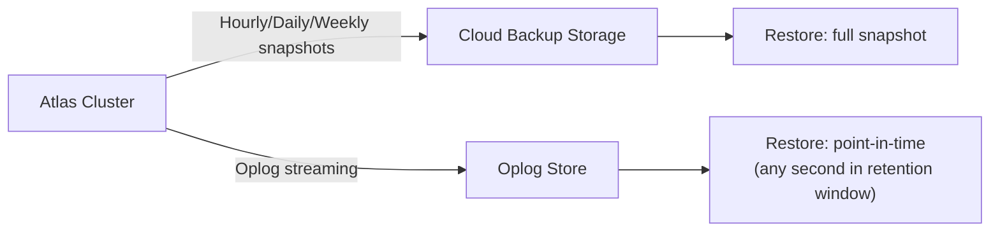

# How to Use MongoDB Atlas Backup and Point-in-Time Recovery

Author: [nawazdhandala](https://www.github.com/nawazdhandala)

Tags: MongoDB, Atlas, Backup, Point-in-Time Recovery, Data Safety

Description: Learn how to configure MongoDB Atlas Cloud Backup, enable point-in-time recovery, restore to any point in time, and implement a solid backup strategy for Atlas clusters.

---

## MongoDB Atlas Backup Options

MongoDB Atlas provides two backup tiers:

- **Cloud Backup** (recommended) - automated snapshots stored in cloud object storage (S3, GCS, Azure Blob). Supports point-in-time recovery. Available on M10+ clusters.
- **Legacy Backups** (deprecated) - continuous backups via the older backup infrastructure.



## Enabling Cloud Backup

### Via Atlas UI

1. Navigate to your Atlas cluster.
2. Click **Backup** in the left sidebar.
3. Click **Edit Backup Policy** (or enable backup on the cluster configuration page).
4. Choose snapshot frequency and retention periods.
5. Enable **Point in Time Restore** (requires oplog backup).
6. Save the policy.

### Via Atlas API

Enable backup using the Atlas Admin API:

```bash
curl -X PATCH \
  "https://cloud.mongodb.com/api/atlas/v1.0/groups/{groupId}/clusters/{clusterName}" \
  --digest -u "{publicKey}:{privateKey}" \
  -H "Content-Type: application/json" \
  -d '{
    "providerBackupEnabled": true,
    "pitEnabled": true
  }'
```

### Via Terraform (Atlas Provider)

```javascript
resource "mongodbatlas_cluster" "my_cluster" {
  project_id = var.atlas_project_id
  name       = "my-production-cluster"

  provider_name               = "AWS"
  provider_region_name        = "US_EAST_1"
  provider_instance_size_name = "M30"

  cloud_backup = true  // Enable Cloud Backup

  advanced_configuration {
    javascript_enabled = false
  }
}
```

## Snapshot Policy Configuration

Configure custom snapshot frequency and retention:

```javascript
// Atlas Admin API: Set backup policy
curl -X PUT \
  "https://cloud.mongodb.com/api/atlas/v1.0/groups/{groupId}/clusters/{clusterName}/backup/schedule" \
  --digest -u "{publicKey}:{privateKey}" \
  -H "Content-Type: application/json" \
  -d '{
    "referenceHourOfDay": 2,
    "referenceMinuteOfHour": 0,
    "restoreWindowDays": 7,
    "policies": [
      {
        "policyItems": [
          {
            "frequencyInterval": 6,
            "frequencyType": "hourly",
            "retentionUnit": "days",
            "retentionValue": 2
          },
          {
            "frequencyInterval": 1,
            "frequencyType": "daily",
            "retentionUnit": "days",
            "retentionValue": 7
          },
          {
            "frequencyInterval": 6,
            "frequencyType": "weekly",
            "retentionUnit": "weeks",
            "retentionValue": 4
          },
          {
            "frequencyInterval": 40,
            "frequencyType": "monthly",
            "retentionUnit": "months",
            "retentionValue": 12
          }
        ]
      }
    ]
  }'
```

## Viewing Existing Snapshots

### Via Atlas UI

Go to your cluster - Backup - Snapshots. You will see a list of all available snapshots with their creation time and size.

### Via Atlas API

```bash
curl -X GET \
  "https://cloud.mongodb.com/api/atlas/v1.0/groups/{groupId}/clusters/{clusterName}/backup/snapshots" \
  --digest -u "{publicKey}:{privateKey}"
```

Sample response:

```javascript
{
  "results": [
    {
      "id": "5f4863944e173000014fa8bf",
      "createdAt": "2026-03-31T02:00:00Z",
      "expiresAt": "2026-04-07T02:00:00Z",
      "snapshotType": "scheduled",
      "status": "completed",
      "storageSizeBytes": 1073741824,
      "type": "replicaSet"
    }
  ]
}
```

## Restoring from a Snapshot

### Full Snapshot Restore via Atlas UI

1. Go to cluster - Backup - Snapshots.
2. Click the `...` menu next to a snapshot.
3. Choose **Restore** - select target cluster or download.
4. Confirm the restore.

### Point-in-Time Restore

Restore to any second within the `restoreWindowDays` period:

1. Go to cluster - Backup - Point in Time Restore.
2. Enter the target date and time.
3. Select the target cluster (can be same or different cluster).
4. Confirm.

### Via Atlas API: Initiate a Restore

```bash
# Point-in-time restore to a specific timestamp
curl -X POST \
  "https://cloud.mongodb.com/api/atlas/v1.0/groups/{groupId}/clusters/{clusterName}/backup/restoreJobs" \
  --digest -u "{publicKey}:{privateKey}" \
  -H "Content-Type: application/json" \
  -d '{
    "delivery": {
      "methodName": "AUTOMATED_RESTORE",
      "targetClusterName": "my-staging-cluster",
      "targetGroupId": "{stagingGroupId}"
    },
    "oplogTs": 1711858800,
    "oplogInc": 1,
    "pointInTimeUTCSeconds": 1711858800
  }'
```

For a snapshot restore (not PITR):

```javascript
{
  "delivery": {
    "methodName": "AUTOMATED_RESTORE",
    "targetClusterName": "my-staging-cluster",
    "targetGroupId": "{stagingGroupId}"
  },
  "snapshotId": "5f4863944e173000014fa8bf"
}
```

## Node.js: Monitoring Restore Job

```javascript
const axios = require("axios");

const baseUrl = "https://cloud.mongodb.com/api/atlas/v1.0";
const groupId = process.env.ATLAS_GROUP_ID;
const clusterName = "my-cluster";
const auth = {
  username: process.env.ATLAS_PUBLIC_KEY,
  password: process.env.ATLAS_PRIVATE_KEY
};

async function checkRestoreStatus(restoreJobId) {
  while (true) {
    const response = await axios.get(
      `${baseUrl}/groups/${groupId}/clusters/${clusterName}/backup/restoreJobs/${restoreJobId}`,
      { auth, httpsAgent: new require("https").Agent({ rejectUnauthorized: true }) }
    );

    const job = response.data;
    console.log(`Restore status: ${job.status}`);

    if (job.status === "COMPLETED") {
      console.log("Restore completed successfully");
      break;
    } else if (job.status === "FAILED") {
      console.error("Restore failed:", job.statusMessage);
      break;
    }

    // Wait before polling again
    await new Promise(r => setTimeout(r, 30000));  // 30 seconds
  }
}

checkRestoreStatus("your-restore-job-id").catch(console.error);
```

## Download Snapshot for Local Restore

```bash
# Request a download via Atlas API
curl -X POST \
  "https://cloud.mongodb.com/api/atlas/v1.0/groups/{groupId}/clusters/{clusterName}/backup/restoreJobs" \
  --digest -u "{publicKey}:{privateKey}" \
  -H "Content-Type: application/json" \
  -d '{
    "delivery": { "methodName": "DOWNLOAD" },
    "snapshotId": "5f4863944e173000014fa8bf"
  }'

# The response includes a download URL
# Download and restore locally
curl -o atlas-backup.tar.gz "https://download-url..."
tar -xzf atlas-backup.tar.gz
mongorestore --dir extracted-backup/
```

## Backup Best Practices

- **Enable Cloud Backup on all production clusters** - it is required for point-in-time recovery.
- **Set `restoreWindowDays` to at least 7** for reasonable recovery flexibility.
- **Test restores quarterly** by restoring to a staging cluster and verifying data integrity.
- **Monitor backup storage costs** - Atlas charges for storage used by snapshots.
- **Use a 3-2-1 strategy**: 3 copies, 2 media types, 1 offsite - Atlas handles this automatically with cross-region replication options.
- **Document RTO/RPO targets** and validate that your backup policy meets them.
- **Alert on backup failures** - Atlas sends notifications if a scheduled backup fails.

## Summary

MongoDB Atlas Cloud Backup provides automated snapshots with configurable frequency and retention, plus point-in-time recovery using oplog streaming. Enable it in the Atlas UI or via API, configure a snapshot policy with hourly/daily/weekly/monthly retention, and set `restoreWindowDays` for PITR coverage. Restore to any second within the retention window via the Atlas UI, API, or Terraform. Regularly test restores to a staging cluster to verify backup integrity and measure actual restore time.
