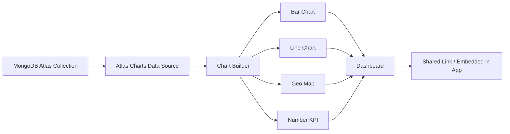

# How to Use MongoDB Atlas Charts for Data Visualization

Author: [nawazdhandala](https://www.github.com/nawazdhandala)

Tags: MongoDB, Atlas, Charts, Data Visualization, Dashboard

Description: Learn how to use MongoDB Atlas Charts to build interactive dashboards, create charts from your collections, embed visualizations in applications, and share insights with your team.

---

## What is MongoDB Atlas Charts

Atlas Charts is the native data visualization tool built into MongoDB Atlas. It allows you to create charts, graphs, and dashboards directly from your MongoDB collections without exporting data or writing aggregation queries manually.

Key features:
- Drag-and-drop chart builder.
- SQL-free - works directly with MongoDB documents.
- Supports aggregation pipelines as data sources.
- Embeddable in web applications.
- Shareable dashboards with access controls.
- Real-time data (refreshes on load).



## Getting Started with Atlas Charts

### Step 1: Enable Charts

1. Log in to [cloud.mongodb.com](https://cloud.mongodb.com).
2. In the left sidebar, click **Charts**.
3. Click **Activate Atlas Charts** if it is your first time.

Charts is available on all Atlas tiers including the M0 free tier.

### Step 2: Create a Data Source

1. Click **Data Sources** in Charts.
2. Click **Add Data Source**.
3. Select your Atlas cluster and database.
4. Choose the collections you want to visualize.
5. Click **Finish**.

### Step 3: Create a Dashboard

1. Click **Dashboards**.
2. Click **Add Dashboard**.
3. Give it a name (e.g., "Sales Overview").
4. Click **Add Chart** to add your first visualization.

## Building Charts

### Bar Chart: Orders by Status

1. Click **Add Chart**.
2. Select your data source (collection: `orders`).
3. Choose **Bar Chart** as the chart type.
4. Drag `status` to the **X Axis** encoding channel.
5. Drag `_id` to the **Y Axis** encoding channel with **COUNT** aggregation.
6. Click **Save and Close**.

Result: a bar chart showing how many orders are in each status.

### Line Chart: Revenue Over Time

1. Add a new chart and select **Line Chart**.
2. Drag `createdAt` to the **X Axis** with **Day** time granularity.
3. Drag `amount` to the **Y Axis** with **SUM** aggregation.
4. Add `status` as a **Series** (color) to break down by status.

Result: a line chart showing daily revenue trends by status.

### Geo Map: User Distribution

Requires a geospatial field (GeoJSON Point or `[longitude, latitude]` array):

1. Add a **Geo Scatter Chart**.
2. Drag your GeoJSON location field to the **Coordinates** channel.
3. Optionally drag a field to **Color** to differentiate categories.

### Number / KPI Chart

Show a single metric prominently:

1. Add a **Number** chart type.
2. Drag `amount` to the **Number** channel with **SUM** aggregation.
3. Add a filter: `status = "completed"`.

Result: total revenue from completed orders as a KPI number.

## Using Aggregation Pipeline as Data Source

For complex calculations, use a custom aggregation pipeline:

1. In the chart builder, click the **Pipeline** tab next to the collection name.
2. Enter your aggregation pipeline:

```javascript
[
  { "$match": { "status": "completed", "createdAt": { "$gte": { "$date": "2026-01-01" } } } },
  { "$group": {
    "_id": { "month": { "$month": "$createdAt" }, "year": { "$year": "$createdAt" } },
    "revenue": { "$sum": "$amount" },
    "orderCount": { "$sum": 1 }
  }},
  { "$sort": { "_id.year": 1, "_id.month": 1 } }
]
```

3. Use the resulting fields in your chart encodings.

## Filtering and Interactivity

### Adding Filters to a Dashboard

1. In the dashboard editor, click **Add Filter**.
2. Choose a field (e.g., `status`) and filter type (e.g., dropdown).
3. Apply the filter - it updates all charts on the dashboard simultaneously.

Dashboard filters allow non-technical users to explore data interactively.

### Chart-Level Filters

Add a filter to an individual chart:

1. In the chart builder, click the **Filters** tab.
2. Click **Add Filter**.
3. Set the condition (e.g., `amount > 100`).

```javascript
// Equivalent filter expression
{ "amount": { "$gt": 100 } }
```

## Embedding Charts in Your Application

Atlas Charts can be embedded in web applications as interactive iframes or via the JavaScript SDK.

### Embedding via Unauthenticated Iframe

1. On any chart or dashboard, click **...** - **Embed Chart**.
2. Enable **Unauthenticated**.
3. Copy the embed code.

```html
<iframe
  style="background: #F1F5F4; border: none; border-radius: 2px; box-shadow: 0 2px 10px 0 rgba(70, 76, 79, .2);"
  width="640"
  height="480"
  src="https://charts.mongodb.com/charts-myapp-abc/embed/charts?id=chart-id&theme=light">
</iframe>
```

### Embedding via JavaScript SDK (Authenticated)

```bash
npm install @mongodb-js/charts-embed-dom
```

```javascript
import ChartsEmbedSDK from "@mongodb-js/charts-embed-dom";

const sdk = new ChartsEmbedSDK({
  baseUrl: "https://charts.mongodb.com/charts-myapp-abc"
});

const chart = sdk.createChart({
  chartId: "your-chart-id",
  height: "400px",
  theme: "light",
  filter: { status: "active" }  // Optional: override filter programmatically
});

// Render into a DOM element
await chart.render(document.getElementById("chart-container"));
```

### Dynamic Filtering in Embedded Charts

Update chart filters dynamically based on user selection:

```javascript
// Update the chart filter based on user input
async function filterByRegion(region) {
  await chart.setFilter({ region: region });
}

document.getElementById("regionSelect").addEventListener("change", (e) => {
  filterByRegion(e.target.value);
});
```

## Sharing Dashboards

### Share with Team Members

1. Open the dashboard.
2. Click **Share** in the top right.
3. Add team members by email and set their permission level (Viewer, Editor, Owner).

### Public Sharing (Read-Only Link)

1. Click **Share** - **Public Sharing**.
2. Enable public access.
3. Copy the URL.

Anyone with the URL can view the dashboard without logging in.

## Atlas Charts Access Control

Control access at the data source level:

```text
Permission Level    Access
------------------------------------------
Viewer              Can view charts and dashboards
Editor              Can create and edit charts
Owner               Full control including sharing
```

You can also restrict which fields in a collection are accessible to Charts by configuring field-level access in App Services.

## Best Practices

- **Use aggregation pipelines for complex metrics** - pre-compute totals and averages in the pipeline rather than relying on Charts aggregations for performance.
- **Create separate dashboards per audience** - operations team, executive, marketing.
- **Use dashboard-level filters** so users can slice data without needing to understand MongoDB.
- **Cache expensive charts** - set a refresh interval appropriate for your data update frequency.
- **Embed charts with authentication** for production applications to prevent unauthorized data access.
- **Limit embedded chart access** to specific IP ranges or authenticated users in production.

## Sample Dashboard Layout

```text
Row 1: KPI Numbers (4 wide cards)
  - Total Revenue MTD
  - Total Orders MTD
  - Avg Order Value
  - New Customers This Week

Row 2: Trend Charts (2 wide charts)
  - Revenue Over Time (line chart, past 30 days)
  - Orders by Status (bar chart)

Row 3: Detail Charts (2 wide charts)
  - Top Products by Revenue (horizontal bar)
  - Geographic Distribution (geo map)
```

## Summary

MongoDB Atlas Charts is a built-in visualization tool that creates charts and dashboards directly from Atlas collections, without exporting data. Build charts using a drag-and-drop interface or aggregation pipeline queries, organize them into dashboards, and add interactive filters. Embed charts in web applications using iframes or the JavaScript SDK with dynamic filtering. Share dashboards with team members via access-controlled links or embed with authentication for production use.
