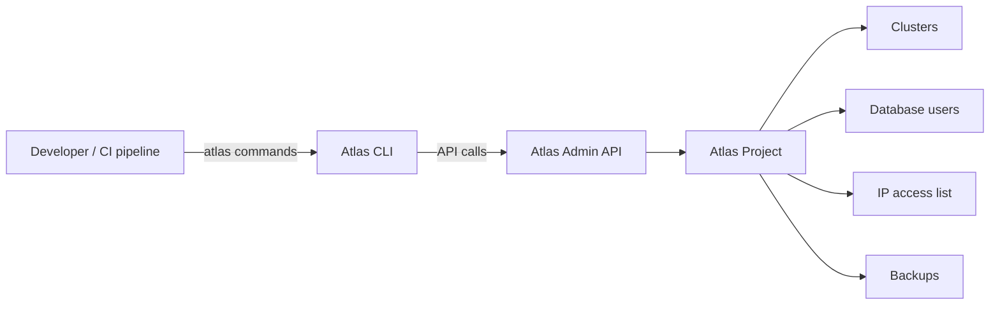

# How to Manage MongoDB Atlas through the Atlas CLI

Author: [nawazdhandala](https://www.github.com/nawazdhandala)

Tags: MongoDB, Atlas, CLI, DevOps, Automation

Description: Learn how to install and use the MongoDB Atlas CLI to manage clusters, database users, IP access lists, and backups from the command line.

---

## What is the Atlas CLI

The Atlas CLI (`atlas`) is an official command-line tool for managing MongoDB Atlas resources. It provides the same capabilities as the Atlas UI and Admin API but in a scriptable, pipeline-friendly format. The CLI is useful for automating cluster provisioning, integrating Atlas management into CI/CD pipelines, and performing bulk operations.



## Installing the Atlas CLI

On macOS:

```bash
brew install mongodb-atlas-cli
```

On Linux:

```bash
wget https://fastdl.mongodb.org/mongocli/mongodb-atlas-cli_1.18.0_linux_x86_64.tar.gz
tar -xzf mongodb-atlas-cli_1.18.0_linux_x86_64.tar.gz
sudo mv atlas /usr/local/bin/
```

On Windows:

```bash
winget install MongoDB.AtlasCLI
```

Verify:

```bash
atlas --version
```

## Authenticating

Log in interactively (opens a browser for OAuth):

```bash
atlas auth login
```

For non-interactive CI pipelines, use API keys:

```bash
export MONGODB_ATLAS_PUBLIC_API_KEY="your-public-key"
export MONGODB_ATLAS_PRIVATE_API_KEY="your-private-key"
```

Or configure a profile:

```bash
atlas config set public_api_key your-public-key
atlas config set private_api_key your-private-key
atlas config set org_id your-org-id
atlas config set project_id your-project-id
```

## Setting a Default Project

```bash
atlas config set project_id <YOUR_PROJECT_ID>
```

After this, all cluster and user commands apply to this project by default.

## Managing Clusters

List all clusters:

```bash
atlas clusters list
```

Describe a specific cluster:

```bash
atlas clusters describe myCluster
```

Create a free-tier M0 cluster:

```bash
atlas clusters create myCluster \
  --provider AWS \
  --region US_EAST_1 \
  --tier M0 \
  --mdbVersion 7.0
```

Create an M10 dedicated cluster:

```bash
atlas clusters create prodCluster \
  --provider AWS \
  --region US_EAST_1 \
  --tier M10 \
  --mdbVersion 7.0 \
  --diskSizeGB 40
```

Pause a cluster (stops billing for compute, storage still charged):

```bash
atlas clusters pause myCluster
```

Resume a paused cluster:

```bash
atlas clusters start myCluster
```

Delete a cluster (irreversible):

```bash
atlas clusters delete myCluster --force
```

## Managing Database Users

List all database users:

```bash
atlas dbusers list
```

Create a read/write user for a specific database:

```bash
atlas dbusers create \
  --username appuser \
  --password "$(openssl rand -base64 24)" \
  --role readWrite@myapp
```

Create an admin user:

```bash
atlas dbusers create \
  --username admin \
  --password "secure-password" \
  --role atlasAdmin
```

Update a user's password:

```bash
atlas dbusers update appuser --password "new-password"
```

Delete a user:

```bash
atlas dbusers delete appuser
```

## Managing IP Access Lists

List current IP access list entries:

```bash
atlas accessLists list
```

Add a specific IP address:

```bash
atlas accessLists create \
  --ip 203.0.113.10 \
  --comment "Office static IP"
```

Add a CIDR block:

```bash
atlas accessLists create \
  --cidr 10.0.0.0/8 \
  --comment "VPC internal range"
```

Allow access from anywhere (not recommended for production):

```bash
atlas accessLists create --ip 0.0.0.0/0 --comment "Open access"
```

Remove an entry:

```bash
atlas accessLists delete 203.0.113.10
```

## Getting a Connection String

```bash
atlas clusters connectionStrings describe myCluster
```

This returns the standard and SRV connection strings. Use the SRV format in applications:

```bash
CONNECTION_STRING=$(atlas clusters connectionStrings describe myCluster \
  --output json | jq -r '.standardSrv')
echo $CONNECTION_STRING
```

## Managing Backups

List cloud backup snapshots for a cluster:

```bash
atlas backups snapshots list myCluster
```

Create an on-demand snapshot:

```bash
atlas backups snapshots create myCluster --desc "Pre-migration snapshot"
```

Restore from a snapshot:

```bash
atlas backups restores start \
  --clusterName myCluster \
  --snapshotId <SNAPSHOT_ID> \
  --targetClusterName myRestoredCluster \
  --targetProjectId <PROJECT_ID>
```

## CI/CD Pipeline Example

A shell script to provision a cluster, add a user, and open access:

```bash
#!/bin/bash
set -e

PROJECT_ID="${ATLAS_PROJECT_ID}"
CLUSTER_NAME="staging-${CI_BUILD_NUMBER}"
DB_PASSWORD="$(openssl rand -base64 24)"

echo "Creating cluster: $CLUSTER_NAME"
atlas clusters create "$CLUSTER_NAME" \
  --projectId "$PROJECT_ID" \
  --provider AWS \
  --region US_EAST_1 \
  --tier M10 \
  --mdbVersion 7.0

echo "Waiting for cluster to be ready..."
atlas clusters watch "$CLUSTER_NAME" --projectId "$PROJECT_ID"

echo "Creating database user..."
atlas dbusers create \
  --projectId "$PROJECT_ID" \
  --username "app_${CI_BUILD_NUMBER}" \
  --password "$DB_PASSWORD" \
  --role readWrite@staging

echo "Adding CI runner IP to access list..."
MY_IP=$(curl -s https://checkip.amazonaws.com)
atlas accessLists create \
  --projectId "$PROJECT_ID" \
  --ip "$MY_IP" \
  --comment "CI runner for build $CI_BUILD_NUMBER"

echo "Done. Connection details:"
atlas clusters connectionStrings describe "$CLUSTER_NAME" \
  --projectId "$PROJECT_ID"
```

## Output Formats

The Atlas CLI supports multiple output formats:

```bash
# Default human-readable table
atlas clusters list

# JSON output for scripting
atlas clusters list --output json

# Go template for custom formatting
atlas clusters list --output "go-template={{range .}}{{.Name}}{{end}}"
```

## Summary

The MongoDB Atlas CLI provides full control over Atlas resources from the command line. Authenticate with API keys for CI/CD pipelines, manage clusters with `atlas clusters` commands, control access with `atlas accessLists`, manage users with `atlas dbusers`, and automate backups with `atlas backups`. Use `--output json` for scripting and combine with `jq` for parsing responses in shell pipelines.
