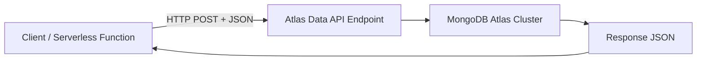

# How to Use MongoDB Atlas Data API

Author: [nawazdhandala](https://www.github.com/nawazdhandala)

Tags: MongoDB, Atlas, Data API, REST API, HTTP

Description: Learn how to use the MongoDB Atlas Data API to query and modify data via HTTP requests without a MongoDB driver, ideal for serverless and edge environments.

---

## What is the Atlas Data API

The Atlas Data API exposes MongoDB collections as a RESTful HTTP endpoint. You can perform CRUD operations using standard HTTP requests (POST with JSON bodies) without installing a MongoDB driver.

Use cases:
- Serverless functions where installing native dependencies is limited.
- Edge runtimes (Cloudflare Workers, Deno Deploy) that cannot use TCP connections.
- Simple integrations from any language with HTTP support.
- Quick prototyping without a backend.



## Enabling the Data API

1. In the Atlas UI, go to your project.
2. In the left sidebar, click **App Services**.
3. Create a new App or select an existing one.
4. Click **Data API** in the left menu.
5. Click **Enable Data API**.
6. Choose the cluster to link.
7. Copy the **App ID** and **Data API URL** (e.g., `https://data.mongodb-api.com/app/{app-id}/endpoint/data/v1`).

## Authentication

The Data API uses API keys for authentication. Create an API key in App Services:

1. In App Services, click **Authentication**.
2. Enable **API Keys** provider.
3. Click **Create API Key** and copy the key.

Include the key in every request:

```text
Headers:
  api-key: your-api-key-here
  Content-Type: application/json
```

## Data API Endpoints

```text
Endpoint                       Action
----------------------------------------------
/action/findOne                Find one document
/action/find                   Find multiple documents
/action/insertOne              Insert one document
/action/insertMany             Insert multiple documents
/action/updateOne              Update one document
/action/updateMany             Update multiple documents
/action/replaceOne             Replace one document
/action/deleteOne              Delete one document
/action/deleteMany             Delete multiple documents
/action/aggregate              Run an aggregation pipeline
```

## Examples

### Base URL and Headers

```text
Base URL: https://data.mongodb-api.com/app/{app-id}/endpoint/data/v1
Headers:
  Content-Type: application/json
  api-key: <your-api-key>
```

### Find a Single Document

```bash
curl -X POST \
  "https://data.mongodb-api.com/app/myapp-abc/endpoint/data/v1/action/findOne" \
  -H "Content-Type: application/json" \
  -H "api-key: your-api-key" \
  -d '{
    "dataSource": "Cluster0",
    "database": "myapp",
    "collection": "users",
    "filter": { "email": "alice@example.com" }
  }'
```

Response:

```javascript
{
  "document": {
    "_id": "64f1a2b3c4d5e6f7a8b9c0d1",
    "email": "alice@example.com",
    "name": "Alice",
    "createdAt": { "$date": "2026-03-31T00:00:00Z" }
  }
}
```

### Find Multiple Documents

```bash
curl -X POST \
  "https://data.mongodb-api.com/app/myapp-abc/endpoint/data/v1/action/find" \
  -H "Content-Type: application/json" \
  -H "api-key: your-api-key" \
  -d '{
    "dataSource": "Cluster0",
    "database": "myapp",
    "collection": "orders",
    "filter": { "status": "active" },
    "projection": { "orderId": 1, "amount": 1, "_id": 0 },
    "sort": { "createdAt": -1 },
    "limit": 10
  }'
```

### Insert a Document

```bash
curl -X POST \
  "https://data.mongodb-api.com/app/myapp-abc/endpoint/data/v1/action/insertOne" \
  -H "Content-Type: application/json" \
  -H "api-key: your-api-key" \
  -d '{
    "dataSource": "Cluster0",
    "database": "myapp",
    "collection": "users",
    "document": {
      "name": "Bob",
      "email": "bob@example.com",
      "createdAt": { "$date": "2026-03-31T10:00:00Z" }
    }
  }'
```

Response:

```javascript
{
  "insertedId": "64f1a2b3c4d5e6f7a8b9c0d2"
}
```

### Update a Document

```bash
curl -X POST \
  "https://data.mongodb-api.com/app/myapp-abc/endpoint/data/v1/action/updateOne" \
  -H "Content-Type: application/json" \
  -H "api-key: your-api-key" \
  -d '{
    "dataSource": "Cluster0",
    "database": "myapp",
    "collection": "users",
    "filter": { "email": "bob@example.com" },
    "update": { "$set": { "name": "Robert", "updatedAt": { "$date": "2026-03-31T11:00:00Z" } } }
  }'
```

### Delete a Document

```bash
curl -X POST \
  "https://data.mongodb-api.com/app/myapp-abc/endpoint/data/v1/action/deleteOne" \
  -H "Content-Type: application/json" \
  -H "api-key: your-api-key" \
  -d '{
    "dataSource": "Cluster0",
    "database": "myapp",
    "collection": "users",
    "filter": { "email": "bob@example.com" }
  }'
```

### Aggregation Pipeline

```bash
curl -X POST \
  "https://data.mongodb-api.com/app/myapp-abc/endpoint/data/v1/action/aggregate" \
  -H "Content-Type: application/json" \
  -H "api-key: your-api-key" \
  -d '{
    "dataSource": "Cluster0",
    "database": "myapp",
    "collection": "orders",
    "pipeline": [
      { "$match": { "status": "completed" } },
      { "$group": { "_id": "$customerId", "total": { "$sum": "$amount" } } },
      { "$sort": { "total": -1 } },
      { "$limit": 5 }
    ]
  }'
```

## JavaScript (Fetch API) Example

```javascript
const APP_ID = "myapp-abc";
const API_KEY = process.env.ATLAS_DATA_API_KEY;
const BASE_URL = `https://data.mongodb-api.com/app/${APP_ID}/endpoint/data/v1`;

const headers = {
  "Content-Type": "application/json",
  "api-key": API_KEY
};

async function findDocuments(collection, filter = {}, limit = 20) {
  const response = await fetch(`${BASE_URL}/action/find`, {
    method: "POST",
    headers,
    body: JSON.stringify({
      dataSource: "Cluster0",
      database: "myapp",
      collection,
      filter,
      limit
    })
  });

  if (!response.ok) {
    throw new Error(`API error: ${response.status} ${await response.text()}`);
  }

  const data = await response.json();
  return data.documents;
}

async function insertDocument(collection, document) {
  const response = await fetch(`${BASE_URL}/action/insertOne`, {
    method: "POST",
    headers,
    body: JSON.stringify({
      dataSource: "Cluster0",
      database: "myapp",
      collection,
      document
    })
  });

  const data = await response.json();
  return data.insertedId;
}

// Usage
const users = await findDocuments("users", { status: "active" });
console.log("Active users:", users.length);

const newId = await insertDocument("logs", {
  event: "api_call",
  timestamp: new Date().toISOString()
});
console.log("Log entry inserted:", newId);
```

## Cloudflare Workers Example

```javascript
// wrangler.toml must include ATLAS_DATA_API_KEY as secret
export default {
  async fetch(request, env) {
    const APP_ID = "myapp-abc";
    const BASE_URL = `https://data.mongodb-api.com/app/${APP_ID}/endpoint/data/v1`;

    const url = new URL(request.url);
    const userId = url.searchParams.get("userId");

    const response = await fetch(`${BASE_URL}/action/findOne`, {
      method: "POST",
      headers: {
        "Content-Type": "application/json",
        "api-key": env.ATLAS_DATA_API_KEY
      },
      body: JSON.stringify({
        dataSource: "Cluster0",
        database: "myapp",
        collection: "users",
        filter: { userId }
      })
    });

    const data = await response.json();
    return new Response(JSON.stringify(data.document), {
      headers: { "Content-Type": "application/json" }
    });
  }
};
```

## Data API vs MongoDB Driver

```text
Concern                   Data API              MongoDB Driver
------------------------------------------------------------------
Transport                 HTTPS                 TCP (MongoDB wire protocol)
Supported environments    Any HTTP client       Requires MongoDB driver
Latency                   Higher (HTTP overhead)  Lower
Connection pooling        None                  Built-in
Aggregation support       Yes                   Yes (full)
Transactions              No                    Yes
Performance               Lower                 Higher
Ideal for                 Serverless, edge      Backend services
```

## Best Practices

- **Never expose API keys in client-side code** - the Data API is meant for server-to-server calls.
- **Use App Services Rules** to restrict which collections and operations the API key can access.
- **Cache responses** where possible - the Data API has higher latency than a driver connection.
- **Prefer the MongoDB driver** for backend services where TCP connectivity is available.
- **Use HTTPS only** - always use the `https://` endpoint.
- **Set appropriate API key permissions** - create keys with minimal required access.

## Summary

The MongoDB Atlas Data API exposes your collections over HTTPS, allowing CRUD and aggregation operations from any environment with HTTP support. Enable it in Atlas App Services, authenticate with API keys, and POST JSON request bodies to the action endpoints. It is ideal for serverless edge functions and environments where installing a native MongoDB driver is not feasible. For high-performance backend services with full feature support, use a native MongoDB driver instead.
