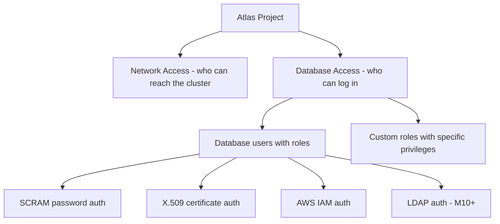

# How to Use MongoDB Atlas Database Access Controls

Author: [nawazdhandala](https://www.github.com/nawazdhandala)

Tags: MongoDB, Atlas, Security, Access Control, Role

Description: Learn how to configure MongoDB Atlas database access controls including custom roles, database users, SCRAM authentication, and X.509 certificate authentication.

---

## Atlas Database Access Overview

MongoDB Atlas Database Access controls who can connect to your cluster and what operations they can perform. It is separate from Atlas organization and project access (which controls who can manage Atlas itself). Database Access manages credentials and privileges for applications and tools connecting to MongoDB.



## Built-In Atlas Roles

Atlas provides predefined roles for common use cases:

| Role | Scope | Capabilities |
|---|---|---|
| `atlasAdmin` | All databases | Full admin access |
| `readWriteAnyDatabase` | All databases | Read and write everywhere |
| `readAnyDatabase` | All databases | Read everywhere |
| `dbAdmin` | Specific database | Schema management, index management |
| `readWrite` | Specific database | Insert, update, delete, find |
| `read` | Specific database | Find only |
| `clusterMonitor` | Cluster | Server status, explain, currentOp |
| `backup` | Cluster | Backup operations |

## Creating a Database User with SCRAM Auth

Via the Atlas UI:

1. Go to **Security > Database Access**.
2. Click **Add New Database User**.
3. Select **Password** authentication.
4. Enter username and password (or auto-generate).
5. Choose a built-in role or custom role.
6. Click **Add User**.

Via the Atlas CLI:

```bash
# App user with read/write on a specific database
atlas dbusers create \
  --username appuser \
  --password "$(openssl rand -base64 20)" \
  --role readWrite@myapp

# Read-only analytics user
atlas dbusers create \
  --username analytics_reader \
  --password "$(openssl rand -base64 20)" \
  --role read@myapp \
  --role read@reporting
```

Via mongosh (connecting with an admin user):

```javascript
db.getSiblingDB("admin").createUser({
  user: "appuser",
  pwd: "securePassword",
  roles: [
    { role: "readWrite", db: "myapp" },
    { role: "read", db: "shared_config" }
  ]
});
```

## Creating a Custom Role

Custom roles allow you to grant specific actions on specific collections rather than whole databases.

Via the Atlas UI:

1. Go to **Security > Database Access**.
2. Click the **Custom Roles** tab.
3. Click **Add New Custom Role**.
4. Add actions (e.g., `find`, `insert`, `update`, `remove`) scoped to specific collections.

Via the Atlas Admin API:

```bash
curl --user "${PUBLIC_KEY}:${PRIVATE_KEY}" \
  --digest \
  --header "Accept: application/vnd.atlas.2023-01-01+json" \
  --header "Content-Type: application/json" \
  --request POST \
  --data '{
    "roleName": "ordersReadOnly",
    "actions": [
      {
        "action": "FIND",
        "resources": [
          {
            "db": "myapp",
            "collection": "orders"
          }
        ]
      }
    ]
  }' \
  "https://cloud.mongodb.com/api/atlas/v2/groups/${PROJECT_ID}/customDBRoles"
```

Assign the custom role to a user:

```bash
atlas dbusers create \
  --username reporting_service \
  --password "$(openssl rand -base64 20)" \
  --role ordersReadOnly@admin
```

## Setting Password Authentication Restrictions

Restrict a user to specific source IPs using mongosh:

```javascript
db.getSiblingDB("admin").runCommand({
  updateUser: "appuser",
  authenticationRestrictions: [
    {
      clientSource: ["10.0.1.0/24", "10.0.2.0/24"],
      serverAddress: []
    }
  ]
});
```

## Using X.509 Certificate Authentication

X.509 authentication replaces passwords with client certificates. This is suitable for services where storing a password is undesirable.

Step 1: In Atlas, go to **Security > Database Access** and create a user with **Certificate** authentication method.

Step 2: Download the generated certificate from Atlas.

Step 3: Connect using the certificate:

```bash
mongosh "mongodb+srv://mycluster.example.mongodb.net/myapp?authSource=%24external&authMechanism=MONGODB-X509" \
  --tls \
  --tlsCertificateKeyFile /path/to/client.pem
```

```javascript
const { MongoClient } = require("mongodb");

const client = new MongoClient(uri, {
  tls: true,
  tlsCertificateKeyFile: "/path/to/client.pem",
  authMechanism: "MONGODB-X509",
  authSource: "$external"
});
```

## Using Temporary Users

Atlas supports creating users that automatically expire:

```bash
atlas dbusers create \
  --username temp_support_user \
  --password "$(openssl rand -base64 20)" \
  --role read@myapp \
  --deleteAfter "2026-04-07T00:00:00Z"
```

This is useful for granting temporary support access without manual cleanup.

## Rotating Passwords

Update a user's password without downtime by:

1. Creating a new user with the new password and same roles.
2. Updating the application connection string.
3. Waiting for old connections to drain.
4. Deleting the old user.

Or update in place (causes a brief connection interruption if the connection pool does not reconnect automatically):

```bash
atlas dbusers update appuser --password "new-secure-password"
```

With the Node.js driver, connection pool reconnection handles the credential update transparently in most cases.

## Auditing Database Access

Atlas Enterprise tiers support audit logging. Enable it to record authentication attempts, user creation, and privilege changes:

Via the Atlas API:

```bash
curl --user "${PUBLIC_KEY}:${PRIVATE_KEY}" \
  --digest \
  --header "Accept: application/vnd.atlas.2023-01-01+json" \
  --header "Content-Type: application/json" \
  --request PATCH \
  --data '{
    "enabled": true,
    "auditFilter": "{\"atype\": {\"$in\": [\"authenticate\", \"createUser\", \"dropUser\", \"updateUser\", \"grantRolesToUser\"]}}"
  }' \
  "https://cloud.mongodb.com/api/atlas/v2/groups/${PROJECT_ID}/auditing"
```

## Summary

Atlas Database Access controls which credentials and roles can connect to your MongoDB cluster. Use built-in roles for common patterns and custom roles for fine-grained collection-level privileges. Prefer X.509 certificate authentication for service accounts, use temporary users for support access, and enable audit logging on M10+ tiers to track all authentication and user management events. Rotate passwords by creating new users and migrating connections before deleting old credentials.
