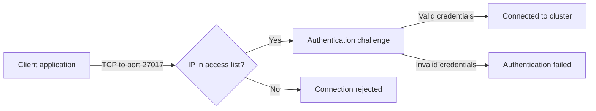

# How to Configure MongoDB Atlas IP Access List

Author: [nawazdhandala](https://www.github.com/nawazdhandala)

Tags: MongoDB, Atlas, Security, Network, Access

Description: Learn how to configure and manage the MongoDB Atlas IP access list to control which IP addresses and CIDR blocks can connect to your clusters.

---

## What is the IP Access List

The MongoDB Atlas IP Access List (formerly called the IP Whitelist) is a network-layer security control that specifies which IP addresses or CIDR blocks are allowed to initiate TCP connections to your Atlas cluster on port 27017. Any connection attempt from an address not in the list is rejected before authentication even occurs.



## Why the IP Access List is Not Sufficient Alone

The IP access list is a perimeter control, not a substitute for authentication and authorization. Always combine it with:

- Strong database user passwords or X.509 certificates
- Minimal-privilege roles
- VPC peering or private endpoints for production environments

## Adding an IP Address via the Atlas UI

1. Go to **Security > Network Access**.
2. Click **Add IP Address**.
3. Choose:
   - **Add Current IP Address** (auto-detects your current IP)
   - **Allow Access from Anywhere** (adds `0.0.0.0/0`, not recommended for production)
   - Enter a specific IP or CIDR block manually
4. Add an optional comment for documentation.
5. Set an expiration date (optional, useful for temporary access).
6. Click **Confirm**.

## Adding Entries via the Atlas CLI

Add your current IP:

```bash
# Get current IP and add it
MY_IP=$(curl -s https://checkip.amazonaws.com)
atlas accessLists create --ip "$MY_IP" --comment "Developer laptop"
```

Add a specific IP:

```bash
atlas accessLists create \
  --ip "203.0.113.50" \
  --comment "Production server static IP"
```

Add a CIDR block:

```bash
atlas accessLists create \
  --cidr "10.0.0.0/16" \
  --comment "AWS VPC private range"
```

Add a temporary entry (expires after a date):

```bash
atlas accessLists create \
  --ip "198.51.100.20" \
  --comment "Contractor access - expires end of week" \
  --deleteAfter "2026-04-07T23:59:59Z"
```

## Listing Current Entries

```bash
atlas accessLists list
```

Output example:

```
IP ADDRESS      TYPE    COMMENT                       CREATED
10.0.0.0/16     CIDR    AWS VPC private range         2026-01-15
203.0.113.50    IP      Production server static IP   2026-02-01
198.51.100.20   IP      Contractor access             2026-04-01
```

## Removing Entries

```bash
# Remove a specific IP
atlas accessLists delete "203.0.113.50"

# Remove a CIDR block
atlas accessLists delete "10.0.0.0/16"
```

## Managing via the Admin API

List all entries:

```bash
curl --user "${PUBLIC_KEY}:${PRIVATE_KEY}" \
  --digest \
  --header "Accept: application/vnd.atlas.2023-01-01+json" \
  "https://cloud.mongodb.com/api/atlas/v2/groups/${PROJECT_ID}/accessList"
```

Add entries in bulk (multiple in one request):

```bash
curl --user "${PUBLIC_KEY}:${PRIVATE_KEY}" \
  --digest \
  --header "Accept: application/vnd.atlas.2023-01-01+json" \
  --header "Content-Type: application/json" \
  --request POST \
  --data '[
    {
      "ipAddress": "203.0.113.10",
      "comment": "Web server 1"
    },
    {
      "ipAddress": "203.0.113.11",
      "comment": "Web server 2"
    },
    {
      "cidrBlock": "10.0.0.0/16",
      "comment": "Internal VPC range"
    }
  ]' \
  "https://cloud.mongodb.com/api/atlas/v2/groups/${PROJECT_ID}/accessList"
```

Delete a specific IP:

```bash
curl --user "${PUBLIC_KEY}:${PRIVATE_KEY}" \
  --digest \
  --header "Accept: application/vnd.atlas.2023-01-01+json" \
  --request DELETE \
  "https://cloud.mongodb.com/api/atlas/v2/groups/${PROJECT_ID}/accessList/203.0.113.10"
```

## Automating IP Access for Dynamic Environments

In cloud environments where application server IPs change (auto-scaling groups, Lambda functions, containers), manage the access list dynamically.

Example: update the access list during a deployment pipeline:

```bash
#!/bin/bash
set -e

NEW_IP="$1"
COMMENT="$2"
PROJECT_ID="${ATLAS_PROJECT_ID}"

# Remove old entries with the same comment
OLD_IPS=$(atlas accessLists list --output json | \
  jq -r --arg comment "$COMMENT" '.[] | select(.comment == $comment) | .ipAddress')

for ip in $OLD_IPS; do
  echo "Removing old entry: $ip"
  atlas accessLists delete "$ip" || true
done

# Add new IP
echo "Adding new IP: $NEW_IP"
atlas accessLists create --ip "$NEW_IP" --comment "$COMMENT"
```

## Using VPC CIDR for Static Ranges

For applications running in AWS, add the VPC CIDR block rather than individual instance IPs:

```bash
# Add entire VPC CIDR - all instances in the VPC can reach Atlas
atlas accessLists create \
  --cidr "10.10.0.0/16" \
  --comment "Production VPC us-east-1"
```

Combined with VPC peering or private endpoints, this is the recommended approach for production workloads.

## Combining IP Access List with Private Endpoints

When private endpoints are configured, restrict the access list to private ranges only:

```bash
# Remove any public IP entries
atlas accessLists list --output json | \
  jq -r '.[].ipAddress' | \
  grep -v "^10\.\|^172\.1[6-9]\.\|^172\.2[0-9]\.\|^172\.3[01]\.\|^192\.168\." | \
  while read ip; do
    echo "Removing public IP: $ip"
    atlas accessLists delete "$ip"
  done

# Keep only the private endpoint VPC CIDR
atlas accessLists create --cidr "10.0.0.0/8" --comment "Private ranges only"
```

## Summary

The Atlas IP access list is the first line of network defense for your cluster. Add specific IPs and CIDR blocks via the UI, Atlas CLI, or Admin API. Use temporary entries with expiration dates for contractor or support access. For cloud environments with dynamic IPs, automate access list updates in your deployment pipeline. In production, prefer VPC CIDRs combined with VPC peering or private endpoints over managing individual IP addresses.
