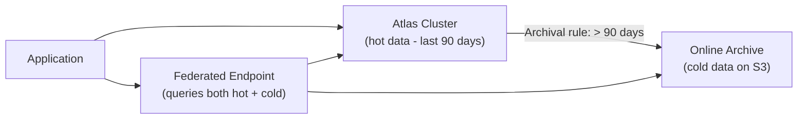

# How to Use MongoDB Atlas Online Archive for Cold Data

Author: [nawazdhandala](https://www.github.com/nawazdhandala)

Tags: MongoDB, Atlas, Online archive, Cold data, Cost optimisation

Description: Learn how to configure MongoDB Atlas Online Archive to automatically move old data from your Atlas cluster to cheaper S3-based storage while keeping it queryable.

---

## What Is Atlas Online Archive

Atlas Online Archive automatically moves documents older than a configurable age from an Atlas cluster to fully managed S3-based object storage. The archived data remains queryable through a federated endpoint - you do not lose access to it. This reduces cluster storage costs while maintaining query access to historical data.



## Step 1: Create an Archival Rule in Atlas UI

1. Navigate to your cluster in Atlas.
2. Click **Online Archive** in the left sidebar.
3. Click **Configure Online Archive**.
4. Choose the database, collection, and date field to archive on (e.g., `createdAt`).
5. Set the age threshold: documents older than N days are archived.
6. Click **Next** and activate the rule.

Atlas runs the archival process in the background. Archived documents are removed from the cluster and stored in Atlas-managed S3.

## Step 2: Understand Archival Rule Fields

```javascript
// The archival rule in Atlas REST API format (for reference):
{
  "dbName": "production",
  "collName": "events",
  "criteria": {
    "type": "DATE",
    "dateField": "createdAt",
    "dateFormat": "ISODATE",
    "expireAfterDays": 90
  },
  "dataProcessRegion": {
    "cloudProvider": "AWS",
    "region": "US_EAST_1"
  },
  "partitionFields": [
    { "fieldName": "createdAt", "order": 0 },
    { "fieldName": "category",  "order": 1 }
  ]
}
```

`partitionFields` control how archived data is organised on S3. Good partition choices enable partition pruning and faster queries on the archive.

## Step 3: Query Archived Data via Federated Endpoint

Atlas creates a **federated database instance** automatically when you activate Online Archive. Connect to the federated endpoint to query both hot and cold data.

```javascript
const { MongoClient } = require("mongodb");

// Federated connection string - found in Atlas UI > Online Archive > Connect
const client = new MongoClient(process.env.ATLAS_FEDERATED_URI, { tls: true });
await client.connect();
const db = client.db("production");

// Query spans both Atlas cluster (hot) and Online Archive (cold) transparently
const oldEvents = await db.collection("events").find({
  createdAt: { $lt: new Date("2026-01-01") },
  category: "purchase"
}).sort({ createdAt: -1 }).limit(100).toArray();

// Aggregation across hot + cold data
const annualRevenue = await db.collection("events").aggregate([
  {
    $group: {
      _id: { year: { $year: "$createdAt" } },
      total: { $sum: "$amount" }
    }
  },
  { $sort: { "_id.year": 1 } }
]).toArray();
```

## Step 4: Query Only the Archive (Exclude Cluster Data)

Target only archived data by adding a filter on `$arch.status` (the internal archive flag) or by using the archive-specific collection in the federated view.

```javascript
// Use partition field filters to limit archive scans
// (partition pruning avoids reading irrelevant S3 objects)
const q1Archive = await db.collection("events").find({
  createdAt: {
    $gte: new Date("2025-01-01"),
    $lt:  new Date("2025-04-01")
  }
}).toArray();
```

## Step 5: Monitor Archive Activity

```javascript
// Use the Atlas Admin API to check archive status
// GET /api/atlas/v1.0/groups/{groupId}/clusters/{clusterName}/onlineArchives

// Via Atlas UI: Online Archive tab shows:
// - Status (Active / Paused)
// - Archival progress
// - Number of documents archived
// - Storage used
```

## Step 6: Pause and Resume Archival

You can pause archival to stop new documents from being moved without deleting existing archived data.

```javascript
// Atlas Admin API - pause archival rule
// PATCH /api/atlas/v1.0/groups/{groupId}/clusters/{clusterName}/onlineArchives/{archiveId}
// { "paused": true }

// Resume:
// { "paused": false }
```

## Step 7: Restore Archived Data to the Cluster

If you need archived data back in the cluster for processing, use Atlas Data Federation aggregation with `$out` to write it back.

```javascript
// Write archived data back to a collection in the live cluster
await db.collection("events").aggregate([
  {
    $match: {
      createdAt: { $gte: new Date("2025-01-01"), $lt: new Date("2025-04-01") }
    }
  },
  {
    $out: {
      db:   "production",
      coll: "events_q1_2025_restored"
    }
  }
]).toArray();
```

## Cost Model

Online Archive charges are based on:
- **Data scanned** per query (GB scanned) - optimise by using partition fields in queries.
- **Data stored** in S3 (GB per month) - significantly cheaper than Atlas cluster storage.
- **Compute** for the federated query engine.

```javascript
// Cost optimisation: always include partition fields in archive queries
// Bad: full S3 scan
db.collection("events").find({});

// Good: partition pruning on createdAt and category
db.collection("events").find({
  createdAt: { $gte: new Date("2025-01-01"), $lt: new Date("2025-04-01") },
  category: "purchase"
});
```

## Best Practices

- Choose `partitionFields` that match your most common archive query filters.
- Keep the `dateField` in the first partition position for time-range queries.
- Test federated queries with `explain()` to verify partition pruning is active.
- Use `expireAfterDays` conservatively at first; you can decrease it later to archive more aggressively.

## Summary

MongoDB Atlas Online Archive automatically moves documents older than a configured threshold from your Atlas cluster to managed S3 storage, reducing cluster costs while maintaining query access via a federated endpoint. Connect to the federated URI to query hot and cold data together, use partition fields in filters for cost-efficient scans, and restore archived data back to the cluster with an aggregation `$out` stage when needed.
