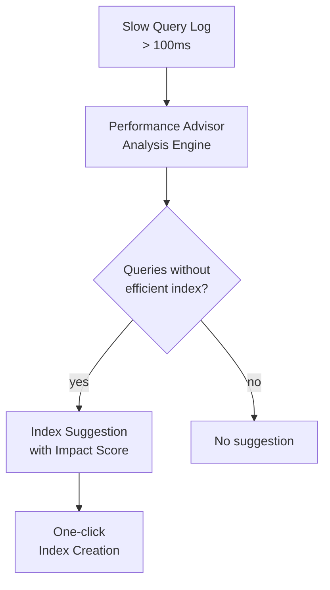

# How to Use MongoDB Atlas Performance Advisor for Index Suggestions

Author: [nawazdhandala](https://www.github.com/nawazdhandala)

Tags: MongoDB, Atlas, Performance, Index, Optimization

Description: Learn how to use MongoDB Atlas Performance Advisor to review slow query logs, understand index suggestions, and create recommended indexes to improve query performance.

---

## Overview

The MongoDB Atlas Performance Advisor analyzes slow queries captured by the database profiler and recommends indexes that would improve their execution. It surfaces actionable index suggestions ranked by their estimated impact, along with the specific queries that would benefit.



## Accessing Performance Advisor

1. Log in to [cloud.mongodb.com](https://cloud.mongodb.com)
2. Navigate to your Atlas project
3. Click on your cluster name
4. Click the **Performance Advisor** tab

The advisor shows query shapes analyzed over the selected time window (1 hour, 24 hours, or 7 days).

## Understanding Suggestions

Each suggestion includes:

- **Impact score** - how much the index is expected to improve query performance (higher is better)
- **Index fields** - the suggested index key pattern
- **Query count** - number of slow queries that would benefit
- **Average execution time** - current average before the index
- **Namespace** - the database and collection

### Sample Suggestion

```yaml
Namespace: shop.orders
Index: { status: 1, createdAt: -1 }
Average Execution Time: 1,243 ms
Query Count (24h): 8,742
Impact: High
```

## Reading the Query Shapes

Click any suggestion to see the query shapes driving it:

```javascript
// Query shape 1 (2,100 executions, avg 1,850 ms)
db.orders.find(
  { "status": "pending" },
  { "sort": { "createdAt": -1 } }
)

// Query shape 2 (6,642 executions, avg 980 ms)
db.orders.find(
  { "status": { "$in": ["pending", "processing"] } }
)
```

## Creating Suggested Indexes

### Via the Performance Advisor UI

1. Click **Create Index** next to a suggestion
2. Review the index definition
3. Choose whether to build in the background (non-blocking for rolling index builds)
4. Click **Create Index**

### Via mongosh

Copy the index command shown in the advisor:

```javascript
db.getSiblingDB("shop").orders.createIndex(
  { "status": 1, "createdAt": -1 },
  { name: "status_createdAt_idx", background: true }
)
```

### Via Atlas CLI

```bash
atlas clusters indexes create \
  --projectId <PROJECT_ID> \
  --clusterName myCluster \
  --db shop \
  --collection orders \
  --key "status:1,createdAt:-1" \
  --indexName "status_createdAt_idx"
```

## Evaluating Index Suggestions

Not every suggestion should be applied immediately. Consider:

### Check for Redundant Indexes

If `{ status: 1, createdAt: -1 }` is suggested and `{ status: 1 }` already exists, the compound index makes the prefix index redundant.

```javascript
// Verify existing indexes before creating new ones
db.orders.getIndexes()
```

### Estimate Index Size

Large indexes consume RAM. Check the current WiredTiger cache usage before adding more indexes:

```javascript
db.orders.stats({ indexDetails: true }).indexSizes
```

### Check Write Overhead

Each additional index increases write latency. For write-heavy collections, weigh the read gain against write cost.

## Automating Index Reviews with the Atlas API

Retrieve suggestions programmatically:

```bash
curl --user "publicKey:privateKey" --digest \
  "https://cloud.mongodb.com/api/atlas/v1.0/groups/<PROJECT_ID>/processes/<host:port>/performanceAdvisor/suggestedIndexes?since=1716000000000&duration=86400000"
```

Sample response:

```javascript
{
  "suggestedIndexes": [
    {
      "id": "abc123",
      "impact": ["avg_ms", "count"],
      "index": [
        { "namespace": "shop.orders" },
        { "index": [["status", 1], ["createdAt", -1]] }
      ],
      "avgObjSize": 512,
      "impact_score": 9.8
    }
  ]
}
```

## Namespace Picker and Slow Query Threshold

Performance Advisor uses operations that take longer than the slow query threshold (default 100ms). To tune this threshold:

```javascript
// Reduce threshold to capture more queries for analysis
db.setProfilingLevel(1, { slowms: 50 })
```

Changing `slowms` affects the query log and Performance Advisor analysis simultaneously.

## Performance Advisor vs. Query Profiler

| Feature | Performance Advisor | Query Profiler |
|---|---|---|
| Source | Slow query logs | `system.profile` collection |
| Index suggestions | Yes (automated) | No (manual analysis) |
| Historical window | Up to 7 days | Limited by profile size |
| Access | Atlas UI / API | mongosh / Compass |
| Cost | Included in Atlas | Included in all editions |

## Summary

The MongoDB Atlas Performance Advisor automates index discovery by analyzing slow query patterns and surfacing ranked suggestions with one-click creation. Use it as a routine maintenance step: review suggestions weekly, create high-impact indexes after verifying they do not duplicate existing ones, and monitor query execution times before and after to confirm the improvement. Combined with regular `explain()` analysis and the Query Profiler, it forms a complete query optimization workflow for Atlas clusters.
