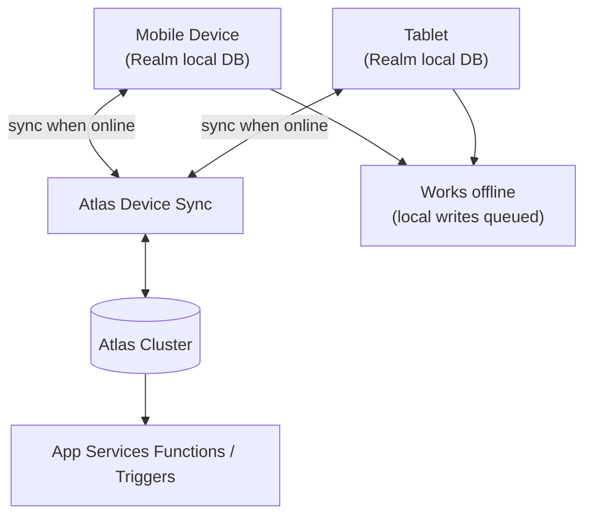

# How to Set Up MongoDB Atlas Realm Sync for Mobile Apps

Author: [nawazdhandala](https://www.github.com/nawazdhandala)

Tags: MongoDB, Atlas, Realm Sync, Mobile, Offline-first

Description: Learn how to configure MongoDB Atlas Device Sync (Realm Sync) to build offline-first mobile apps that automatically sync data with Atlas when connectivity is restored.

---

## What Is Atlas Device Sync

Atlas Device Sync (previously called Realm Sync) is a service that synchronises data between mobile/edge devices running the Atlas Device SDK and a MongoDB Atlas cluster. Devices work with a local Realm database and changes are automatically merged into Atlas when the device comes online.



## Step 1: Enable Atlas Device Sync

1. In Atlas UI open your App Services application.
2. Click **Device Sync** in the left navigation.
3. Choose **Flexible Sync** (recommended) or **Partition-Based Sync**.
4. Select the linked Atlas cluster and database.
5. Click **Enable Sync**.

## Step 2: Configure Flexible Sync Permissions

Flexible Sync uses a queryable fields configuration and permissions rules to control which documents each user can sync.

```javascript
// App Services > Device Sync > Configuration
// Define which fields users can filter/subscribe on:
{
  "queryable_fields_names": ["owner_id", "status", "category"]
}

// App Services > Rules > Collection-level permissions (tasks collection):
{
  "defaultRoles": [
    {
      "name": "owner",
      "applyWhen": {},
      "read": { "owner_id": "%%user.id" },
      "write": { "owner_id": "%%user.id" }
    }
  ]
}
```

## Step 3: Install the Atlas Device SDK (React Native)

```bash
npm install realm @realm/react
```

## Step 4: Define Your Data Model

```javascript
// models/Task.js
import Realm from "realm";

class Task extends Realm.Object {
  static schema = {
    name: "Task",
    primaryKey: "_id",
    properties: {
      _id:       "objectId",
      owner_id:  "string",
      title:     "string",
      status:    { type: "string", default: "pending" },
      createdAt: "date",
      updatedAt: "date"
    }
  };
}

export default Task;
```

## Step 5: Connect to Atlas with Flexible Sync

```javascript
// App.js (React Native)
import React from "react";
import Realm from "realm";
import { AppProvider, UserProvider, RealmProvider } from "@realm/react";
import Task from "./models/Task";
import TaskList from "./components/TaskList";

const APP_ID = "myapp-abcde";  // Your Atlas App Services App ID

export default function App() {
  return (
    <AppProvider id={APP_ID}>
      <UserProvider fallback={<LoginScreen />}>
        <RealmProvider
          schema={[Task]}
          sync={{
            flexible: true,
            initialSubscriptions: {
              update(subs, realm) {
                // Subscribe to the current user's tasks only
                const myTasks = realm.objects(Task).filtered(
                  "owner_id == $0",
                  realm.syncSession?.config?.user?.id
                );
                subs.add(myTasks, { name: "myTasks" });
              }
            }
          }}
        >
          <TaskList />
        </RealmProvider>
      </UserProvider>
    </AppProvider>
  );
}
```

## Step 6: Read and Write Data

```javascript
// components/TaskList.js
import React from "react";
import { View, Text, Button, FlatList } from "react-native";
import { useRealm, useQuery, useUser } from "@realm/react";
import Realm from "realm";
import Task from "../models/Task";

export default function TaskList() {
  const realm  = useRealm();
  const user   = useUser();
  const tasks  = useQuery(Task, (collection) =>
    collection.filtered("owner_id == $0", user.id).sorted("createdAt", true)
  );

  function addTask(title) {
    realm.write(() => {
      realm.create(Task, {
        _id:       new Realm.BSON.ObjectId(),
        owner_id:  user.id,
        title,
        status:    "pending",
        createdAt: new Date(),
        updatedAt: new Date()
      });
    });
    // The local write is immediately visible; sync uploads to Atlas automatically
  }

  function completeTask(task) {
    realm.write(() => {
      task.status    = "completed";
      task.updatedAt = new Date();
    });
  }

  return (
    <View>
      <Button title="Add Task" onPress={() => addTask("New task")} />
      <FlatList
        data={tasks}
        keyExtractor={(t) => t._id.toString()}
        renderItem={({ item }) => (
          <Text onPress={() => completeTask(item)}>
            {item.title} - {item.status}
          </Text>
        )}
      />
    </View>
  );
}
```

## Step 7: Handle Sync Errors

```javascript
// In RealmProvider configuration, add an onSyncError handler
<RealmProvider
  schema={[Task]}
  sync={{
    flexible: true,
    onError: (session, error) => {
      console.error("Sync error:", error.name, error.message);
      if (error.isFatal) {
        // Fatal errors require re-opening the Realm
        console.error("Fatal sync error - user must log in again");
      }
    }
  }}
>
  {children}
</RealmProvider>
```

## Step 8: Monitor Sync Progress

```javascript
// Access sync session and subscribe to progress notifications
import { useRealm } from "@realm/react";
import { ProgressDirection, ProgressMode } from "realm";

function SyncStatus() {
  const realm = useRealm();

  React.useEffect(() => {
    const session = realm.syncSession;
    if (!session) return;

    const token = session.addProgressNotification(
      ProgressDirection.Upload,
      ProgressMode.ReportIndefinitely,
      (transferred, transferable) => {
        console.log(`Upload: ${transferred} / ${transferable} bytes`);
      }
    );

    return () => session.removeProgressNotification(token);
  }, [realm]);

  return null;
}
```

## Flexible Sync vs Partition-Based Sync

| Feature | Flexible Sync | Partition-Based Sync |
|---|---|---|
| Subscription model | Query-based | Partition key value |
| Granularity | Per-object (field-level filter) | Per-partition (all or nothing) |
| Complexity | Higher configuration | Simpler to start |
| Recommended | Yes (current default) | Legacy |

## Summary

MongoDB Atlas Device Sync enables offline-first mobile apps by syncing a local Realm database with Atlas when connectivity is available. Enable Flexible Sync in App Services, define queryable fields and permissions rules, install the Atlas Device SDK, and use `RealmProvider` with `flexible: true` and `initialSubscriptions` to subscribe to the documents each user needs. Local writes are immediately available and automatically uploaded to Atlas; remote changes are downloaded and merged without any manual conflict resolution code.
