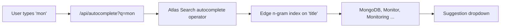

# How to Implement Search Autocomplete with MongoDB Atlas Search

Author: [nawazdhandala](https://www.github.com/nawazdhandala)

Tags: MongoDB, Atlas Search, Autocomplete, Full-Text Search, Search

Description: Learn how to build a fast search autocomplete feature using MongoDB Atlas Search autocomplete operator and an edge n-gram index analyzer.

---

## Overview

MongoDB Atlas Search provides a dedicated `autocomplete` operator that returns prefix-matched suggestions in real time. It uses an edge n-gram tokenizer to pre-index all possible prefixes of a field at write time, making each keystroke query fast.



## Step 1: Create an Atlas Search Index with Autocomplete Analyzer

In the Atlas UI or via the Atlas CLI create a search index on the collection. The `autocomplete` type uses the `edgeGram` tokenizer.

```javascript
// Atlas Search index definition (JSON)
{
  "mappings": {
    "dynamic": false,
    "fields": {
      "title": [
        {
          "type": "autocomplete",
          "analyzer": "lucene.standard",
          "tokenization": "edgeGram",
          "minGrams": 2,
          "maxGrams": 15,
          "foldDiacritics": true
        }
      ],
      "category": {
        "type": "string"
      }
    }
  }
}
```

## Step 2: Run an Autocomplete Query

```javascript
const { MongoClient } = require("mongodb");

const client = new MongoClient(process.env.ATLAS_URI);
const db = client.db("catalog");

async function autocomplete(query, limit = 10) {
  const results = await db.collection("products").aggregate([
    {
      $search: {
        index: "products_search",
        autocomplete: {
          query: query,
          path: "title",
          fuzzy: {
            maxEdits: 1,        // allow 1 character typo
            prefixLength: 2     // first 2 chars must match exactly
          }
        }
      }
    },
    { $limit: limit },
    {
      $project: {
        _id: 1,
        title: 1,
        category: 1,
        score: { $meta: "searchScore" }
      }
    }
  ]).toArray();

  return results;
}

// Test
const suggestions = await autocomplete("mongo");
console.log(suggestions);
```

## Step 3: Add Highlighting to Show the Matched Prefix

```javascript
async function autocompleteWithHighlight(query, limit = 10) {
  return db.collection("products").aggregate([
    {
      $search: {
        index: "products_search",
        autocomplete: {
          query,
          path: "title"
        },
        highlight: { path: "title" }
      }
    },
    { $limit: limit },
    {
      $project: {
        title: 1,
        category: 1,
        score: { $meta: "searchScore" },
        highlights: { $meta: "searchHighlights" }
      }
    }
  ]).toArray();
}

// Each result.highlights looks like:
// [{ path: "title", texts: [{ value: "Mon", type: "hit" }, { value: "goDB", type: "text" }] }]
```

## Step 4: Scope Autocomplete to a Category

```javascript
async function autocompleteByCategory(query, category, limit = 10) {
  return db.collection("products").aggregate([
    {
      $search: {
        index: "products_search",
        compound: {
          must: [
            {
              autocomplete: {
                query,
                path: "title"
              }
            }
          ],
          filter: [
            {
              text: {
                query: category,
                path: "category"
              }
            }
          ]
        }
      }
    },
    { $limit: limit },
    { $project: { _id: 1, title: 1, category: 1 } }
  ]).toArray();
}
```

## Step 5: Build the Express API Endpoint

```javascript
const express = require("express");
const app = express();

app.get("/api/autocomplete", async (req, res) => {
  const { q, category, limit = "10" } = req.query;

  if (!q || q.trim().length < 2) {
    return res.json({ suggestions: [] });
  }

  try {
    const suggestions = category
      ? await autocompleteByCategory(q.trim(), category, parseInt(limit))
      : await autocomplete(q.trim(), parseInt(limit));

    res.json({ suggestions });
  } catch (err) {
    console.error(err);
    res.status(500).json({ error: "Search unavailable" });
  }
});

app.listen(3000);
```

## Step 6: Debounce Requests on the Client

Do not fire a request on every keystroke. Debounce to 200-300 ms.

```javascript
// Vanilla JS debounce
function debounce(fn, delay) {
  let timer;
  return (...args) => {
    clearTimeout(timer);
    timer = setTimeout(() => fn(...args), delay);
  };
}

const searchInput = document.getElementById("search");
const suggestionBox = document.getElementById("suggestions");

const fetchSuggestions = debounce(async (q) => {
  if (q.length < 2) { suggestionBox.innerHTML = ""; return; }

  const res = await fetch(`/api/autocomplete?q=${encodeURIComponent(q)}`);
  const { suggestions } = await res.json();

  suggestionBox.innerHTML = suggestions
    .map((s) => `<li data-id="${s._id}">${s.title}</li>`)
    .join("");
}, 250);

searchInput.addEventListener("input", (e) => fetchSuggestions(e.target.value));
```

## Index Configuration Options

| Option | Description | Default |
|---|---|---|
| `tokenization` | `edgeGram` (prefix) or `rightEdgeGram` (suffix) | `edgeGram` |
| `minGrams` | Minimum n-gram length | 2 |
| `maxGrams` | Maximum n-gram length | 15 |
| `foldDiacritics` | Normalise accented characters | true |

## Performance Tips

- Index only the fields used in `autocomplete` queries to keep the Atlas Search index small.
- Cache popular suggestions at the application layer with a short TTL (5-10 seconds).
- Use `$limit` early in the pipeline to avoid streaming large result sets.
- The Atlas Search index is eventually consistent; new documents appear within seconds.

## Summary

MongoDB Atlas Search's `autocomplete` operator powers real-time prefix suggestions using an edge n-gram index. Define the index with `edgeGram` tokenization, query it with the `autocomplete` operator inside `$search`, optionally add fuzzy matching for typo tolerance, and return highlighted snippets to show users what matched. A debounced front-end request loop and a scoped category filter round out a production-ready autocomplete feature.
