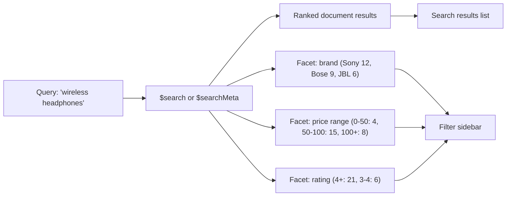

# How to Use $search with Facets in MongoDB Atlas Search

Author: [nawazdhandala](https://www.github.com/nawazdhandala)

Tags: MongoDB, Atlas Search, Facet, Full-text search, Search

Description: Learn how to build faceted search navigation in MongoDB Atlas Search using the $searchMeta stage to return category counts alongside search results.

---

## What Are Search Facets

Facets are aggregated counts of field values across a search result set. They power the filter sidebar found on e-commerce sites: "Category (Electronics 42, Books 18)", "Price range (Under $50: 31, $50-$100: 28)". Atlas Search computes facet counts as part of the search itself, not as a separate aggregation pass.



## Step 1: Create the Search Index with Facet Fields

Fields used in facets must be indexed with the `stringFacet` or `numberFacet` / `dateFacet` type alongside the `string` type for text search.

```javascript
// Atlas Search index definition
{
  "mappings": {
    "dynamic": false,
    "fields": {
      "name": {
        "type": "string",
        "analyzer": "lucene.standard"
      },
      "description": {
        "type": "string",
        "analyzer": "lucene.standard"
      },
      "brand": [
        { "type": "string" },
        { "type": "stringFacet" }
      ],
      "category": [
        { "type": "string" },
        { "type": "stringFacet" }
      ],
      "price": [
        { "type": "number" },
        { "type": "numberFacet" }
      ],
      "rating": {
        "type": "number"
      },
      "createdAt": [
        { "type": "date" },
        { "type": "dateFacet" }
      ]
    }
  }
}
```

## Step 2: Get Facet Counts with $searchMeta

`$searchMeta` returns only the metadata (facet counts, total hits) without the documents themselves. Use it in a parallel request to get filter counts.

```javascript
const { MongoClient } = require("mongodb");

const client = new MongoClient(process.env.ATLAS_URI);
const db = client.db("catalog");

async function getFacets(query) {
  return db.collection("products").aggregate([
    {
      $searchMeta: {
        index: "products_search",
        facet: {
          operator: {
            text: {
              query,
              path: ["name", "description"]
            }
          },
          facets: {
            brandFacet: {
              type: "string",
              path: "brand",
              numBuckets: 10
            },
            categoryFacet: {
              type: "string",
              path: "category",
              numBuckets: 20
            },
            priceFacet: {
              type: "number",
              path: "price",
              boundaries: [0, 25, 50, 100, 250, 1000],
              default: "1000+"
            }
          }
        }
      }
    }
  ]).toArray();
}

const meta = await getFacets("wireless headphones");
console.log(JSON.stringify(meta, null, 2));
```

## Step 3: Get Documents and Facets in One Round-Trip

Use `$search` with a `$facet` pipeline stage alongside `$searchMeta` called in parallel, or use the `$search` + `$searchMeta` compound in a `$facet` aggregation stage.

```javascript
async function searchWithFacets(query, page = 1, pageSize = 20) {
  const [docsResult, facetsResult] = await Promise.all([
    // Documents query
    db.collection("products").aggregate([
      {
        $search: {
          index: "products_search",
          text: {
            query,
            path: ["name", "description"]
          }
        }
      },
      { $skip: (page - 1) * pageSize },
      { $limit: pageSize },
      {
        $project: {
          name: 1,
          brand: 1,
          category: 1,
          price: 1,
          rating: 1,
          score: { $meta: "searchScore" }
        }
      }
    ]).toArray(),

    // Facet counts query
    db.collection("products").aggregate([
      {
        $searchMeta: {
          index: "products_search",
          facet: {
            operator: {
              text: { query, path: ["name", "description"] }
            },
            facets: {
              brandFacet: { type: "string", path: "brand", numBuckets: 10 },
              categoryFacet: { type: "string", path: "category", numBuckets: 20 },
              priceFacet: {
                type: "number",
                path: "price",
                boundaries: [0, 25, 50, 100, 250, 1000],
                default: "1000+"
              }
            }
          }
        }
      }
    ]).toArray()
  ]);

  return {
    docs: docsResult,
    facets: facetsResult[0]?.facet ?? {},
    count: facetsResult[0]?.count?.lowerBound ?? 0
  };
}
```

## Step 4: Apply Facet Filters to the Search

When a user clicks a filter, add it as a `filter` clause in the `compound` operator.

```javascript
async function searchFiltered(query, filters = {}) {
  const filterClauses = [];

  if (filters.brand) {
    filterClauses.push({
      text: { query: filters.brand, path: "brand" }
    });
  }

  if (filters.category) {
    filterClauses.push({
      text: { query: filters.category, path: "category" }
    });
  }

  if (filters.minPrice !== undefined || filters.maxPrice !== undefined) {
    const rangeClause = { path: "price" };
    if (filters.minPrice !== undefined) rangeClause.gte = filters.minPrice;
    if (filters.maxPrice !== undefined) rangeClause.lte = filters.maxPrice;
    filterClauses.push({ range: rangeClause });
  }

  const searchStage = {
    index: "products_search",
    compound: {
      must: [
        { text: { query, path: ["name", "description"] } }
      ]
    }
  };

  if (filterClauses.length > 0) {
    searchStage.compound.filter = filterClauses;
  }

  return db.collection("products").aggregate([
    { $search: searchStage },
    { $limit: 20 },
    {
      $project: {
        name: 1, brand: 1, category: 1, price: 1, rating: 1,
        score: { $meta: "searchScore" }
      }
    }
  ]).toArray();
}
```

## Step 5: Render the Facet Sidebar

```javascript
function renderFacets(facets) {
  const html = [];

  if (facets.brandFacet?.buckets) {
    html.push("<h3>Brand</h3><ul>");
    facets.brandFacet.buckets.forEach((b) => {
      html.push(`<li><label><input type="checkbox" value="${b._id}"> ${b._id} (${b.count})</label></li>`);
    });
    html.push("</ul>");
  }

  if (facets.priceFacet?.buckets) {
    html.push("<h3>Price</h3><ul>");
    facets.priceFacet.buckets.forEach((b) => {
      html.push(`<li><label><input type="checkbox" value="${b._id}"> ${b._id} (${b.count})</label></li>`);
    });
    html.push("</ul>");
  }

  return html.join("\n");
}
```

## Facet Type Reference

| Facet type | Index type | Use for |
|---|---|---|
| `string` | `stringFacet` | Categories, brands, tags, status values |
| `number` | `numberFacet` | Price ranges, rating ranges, age buckets |
| `date` | `dateFacet` | Date ranges (year, month, week) |

## Summary

MongoDB Atlas Search facets use `$searchMeta` with a `facet` operator to return bucket counts for string fields (using `stringFacet` index type) and numeric ranges (using `numberFacet`). Define facet fields in the index with dual types, query facets in parallel with the main document search, and apply user-selected filters as `filter` clauses in the `compound` operator to re-run the search within the chosen category or price range.
