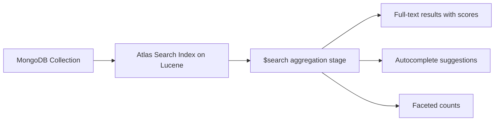

# How to Use $search in MongoDB Atlas for Full-Text Search

Author: [nawazdhandala](https://www.github.com/nawazdhandala)

Tags: MongoDB, Atlas Search, Full-Text Search, $search, Atlas

Description: Learn how to use MongoDB Atlas Search's $search aggregation stage for advanced full-text search with fuzzy matching, autocomplete, facets, and relevance scoring.

---

## How Atlas Search Works

MongoDB Atlas Search is a full-text search engine built on Apache Lucene, available on MongoDB Atlas clusters. It provides far more advanced search capabilities than the standard `$text` operator, including:

- Fuzzy matching (typo tolerance)
- Autocomplete
- Synonyms
- Faceted search
- Highlighting matched text
- Compound queries with boosting

Atlas Search uses a separate search index (different from a regular MongoDB index) defined with an index mapping.



## Prerequisites

Atlas Search requires:
1. A MongoDB Atlas cluster (M0 free tier or higher).
2. An Atlas Search index created on the collection.
3. Using the `$search` aggregation stage (not `$text`).

## Creating an Atlas Search Index

In the Atlas UI, navigate to: Cluster - Search - Create Search Index.

Or create it programmatically using the Atlas CLI or API. A basic dynamic mapping index definition:

```javascript
{
  "mappings": {
    "dynamic": true
  }
}
```

An explicit mapping for better control:

```javascript
{
  "mappings": {
    "dynamic": false,
    "fields": {
      "title": { "type": "string", "analyzer": "lucene.english" },
      "body": { "type": "string", "analyzer": "lucene.english" },
      "tags": { "type": "string" },
      "price": { "type": "number" },
      "category": { "type": "stringFacet" }
    }
  }
}
```

## Syntax

```javascript
db.collection.aggregate([
  {
    $search: {
      index: "default",   // optional if default index name is "default"
      <operator>: { ... }
    }
  }
])
```

## Examples

### Basic Text Search

```javascript
db.articles.aggregate([
  {
    $search: {
      text: {
        query: "mongodb performance",
        path: ["title", "body"]
      }
    }
  },
  {
    $project: {
      title: 1,
      score: { $meta: "searchScore" }
    }
  },
  { $sort: { score: -1 } }
])
```

### Fuzzy Search (Typo Tolerance)

Allow up to 1 character edit distance (handles typos):

```javascript
db.articles.aggregate([
  {
    $search: {
      text: {
        query: "mongdb indexs",  // typos: "mongdb" and "indexs"
        path: ["title", "body"],
        fuzzy: { maxEdits: 1 }
      }
    }
  },
  { $project: { title: 1, score: { $meta: "searchScore" } } },
  { $sort: { score: -1 } },
  { $limit: 5 }
])
```

### Autocomplete

Requires the field to be indexed with `"type": "autocomplete"` in the search index mapping:

```javascript
// Search index mapping must include:
// "title": { "type": "autocomplete" }

db.articles.aggregate([
  {
    $search: {
      autocomplete: {
        query: "mongo",
        path: "title"
      }
    }
  },
  { $project: { title: 1, _id: 0 } },
  { $limit: 5 }
])
```

### Phrase Search

Match an exact sequence of words:

```javascript
db.articles.aggregate([
  {
    $search: {
      phrase: {
        query: "mongodb index performance",
        path: "body"
      }
    }
  },
  { $project: { title: 1, score: { $meta: "searchScore" } } }
])
```

### Compound Query with Boosting

Combine multiple conditions with different weights:

```javascript
db.articles.aggregate([
  {
    $search: {
      compound: {
        must: [
          {
            text: {
              query: "mongodb",
              path: "tags"
            }
          }
        ],
        should: [
          {
            text: {
              query: "performance",
              path: "title",
              score: { boost: { value: 3 } }  // boost title matches
            }
          },
          {
            text: {
              query: "performance",
              path: "body"
            }
          }
        ]
      }
    }
  },
  { $project: { title: 1, score: { $meta: "searchScore" } } },
  { $sort: { score: -1 } }
])
```

### Highlight Matched Terms

Return snippets showing where terms were matched:

```javascript
db.articles.aggregate([
  {
    $search: {
      text: {
        query: "mongodb index",
        path: "body"
      },
      highlight: {
        path: "body"
      }
    }
  },
  {
    $project: {
      title: 1,
      highlights: { $meta: "searchHighlights" }
    }
  }
])
```

Sample output:

```javascript
{
  "title": "MongoDB Index Types Explained",
  "highlights": [
    {
      "path": "body",
      "texts": [
        { "value": "Single-field, compound, text, and geospatial ", "type": "text" },
        { "value": "indexes", "type": "hit" },
        { "value": " all serve different purposes.", "type": "text" }
      ]
    }
  ]
}
```

### Faceted Search

Count results by category while returning search results:

```javascript
db.products.aggregate([
  {
    $searchMeta: {
      facet: {
        operator: {
          text: { query: "laptop", path: "name" }
        },
        facets: {
          categoryFacet: {
            type: "string",
            path: "category",
            numBuckets: 5
          },
          priceFacet: {
            type: "number",
            path: "price",
            boundaries: [0, 500, 1000, 2000],
            default: "Other"
          }
        }
      }
    }
  }
])
```

### Node.js Example

```javascript
const { MongoClient } = require("mongodb");

async function atlasSearch(searchQuery) {
  // Connect to Atlas cluster
  const uri = process.env.MONGODB_ATLAS_URI;
  const client = new MongoClient(uri);
  await client.connect();

  const articles = client.db("blog").collection("articles");

  // Full-text search with fuzzy matching and highlighting
  const results = await articles.aggregate([
    {
      $search: {
        index: "default",
        compound: {
          should: [
            {
              text: {
                query: searchQuery,
                path: "title",
                fuzzy: { maxEdits: 1 },
                score: { boost: { value: 5 } }
              }
            },
            {
              text: {
                query: searchQuery,
                path: "body",
                fuzzy: { maxEdits: 1 }
              }
            }
          ]
        },
        highlight: { path: ["title", "body"] }
      }
    },
    {
      $project: {
        title: 1,
        score: { $meta: "searchScore" },
        highlights: { $meta: "searchHighlights" }
      }
    },
    { $sort: { score: -1 } },
    { $limit: 10 }
  ]).toArray();

  results.forEach(doc => {
    console.log(`[${doc.score.toFixed(2)}] ${doc.title}`);
  });

  await client.close();
}

atlasSearch("mongodb indexing").catch(console.error);
```

## $search vs $text Comparison

```text
Feature                    $text (built-in)    $search (Atlas Search)
-----------------------------------------------------------------------
Fuzzy matching             No                  Yes
Autocomplete               No                  Yes
Facets                     No                  Yes
Highlighting               No                  Yes
Synonyms                   No                  Yes
Compound queries           Limited             Full support
Lucene analyzers           No                  Yes
Sorting by score           Yes                 Yes
Available without Atlas    Yes                 No
```

## Best Practices

- **Use dynamic mappings for rapid prototyping** then switch to explicit mappings for production to control index size.
- **Use autocomplete indexes** only on fields where users will type partial words - they increase index size.
- **Combine `$search` with `$limit` early** in the pipeline to avoid processing thousands of results downstream.
- **Use `$searchMeta` for faceted counts** without retrieving full documents.
- **Monitor Atlas Search index size** in the Atlas UI to understand the storage impact of your index mappings.
- **Prefer `$search` over `$text`** for user-facing search features - the improved relevance and fuzzy matching significantly improve user experience.

## Summary

MongoDB Atlas Search's `$search` aggregation stage provides advanced full-text search powered by Apache Lucene. It supports fuzzy matching, autocomplete, phrase search, compound queries with boosting, highlighting, and faceted search - capabilities far beyond the built-in `$text` operator. To use it, create an Atlas Search index in the Atlas UI or API, then query using the `$search` aggregation stage.
