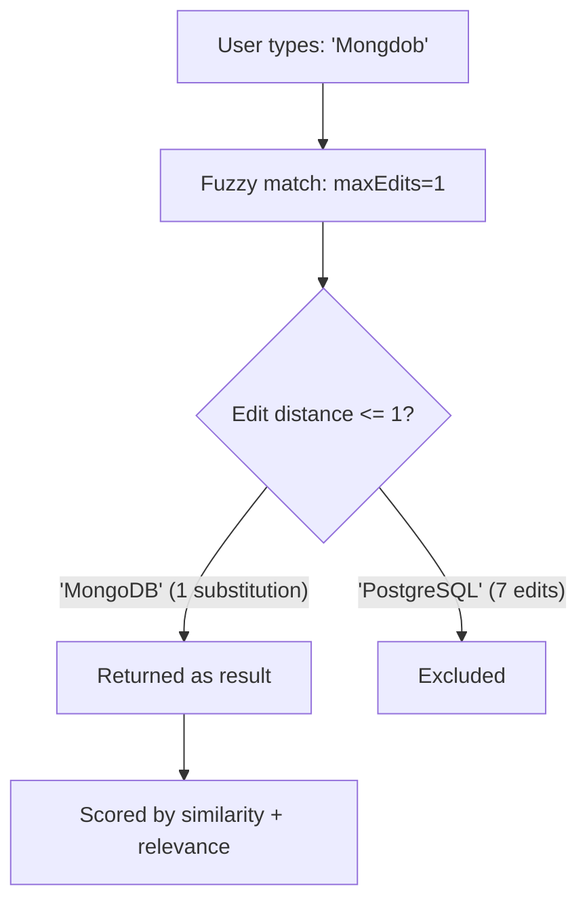

# How to Use $search with Fuzzy Matching in MongoDB Atlas

Author: [nawazdhandala](https://www.github.com/nawazdhandala)

Tags: MongoDB, Atlas Search, Fuzzy Matching, Full-Text Search, Search

Description: Learn how to use fuzzy matching in MongoDB Atlas Search to tolerate typos and spelling variations in user queries using the $search operator.

---

## What Is Fuzzy Matching

Fuzzy matching finds documents whose field values are similar but not identical to the query term. It uses Levenshtein distance (edit distance) to measure how many single-character insertions, deletions, or substitutions separate the query from a stored token.



## Basic Fuzzy Text Search

```javascript
const { MongoClient } = require("mongodb");

const client = new MongoClient(process.env.ATLAS_URI);
const db = client.db("catalog");

async function fuzzySearch(query) {
  return db.collection("products").aggregate([
    {
      $search: {
        index: "products_search",
        text: {
          query: query,
          path: "title",
          fuzzy: {
            maxEdits: 1,       // 0 = exact, 1 = one edit, 2 = two edits (max)
            prefixLength: 3,   // first 3 chars must match exactly (improves precision)
            maxExpansions: 50  // max number of terms considered for each token
          }
        }
      }
    },
    { $limit: 10 },
    {
      $project: {
        _id: 1,
        title: 1,
        score: { $meta: "searchScore" }
      }
    }
  ]).toArray();
}

const results = await fuzzySearch("Mongdob");
// Returns documents with "MongoDB" in the title
```

## Fuzzy Matching Across Multiple Fields

```javascript
async function fuzzySearchMultiField(query) {
  return db.collection("articles").aggregate([
    {
      $search: {
        index: "articles_search",
        compound: {
          should: [
            {
              text: {
                query,
                path: "title",
                fuzzy: { maxEdits: 1, prefixLength: 3 },
                score: { boost: { value: 3 } }  // title matches rank higher
              }
            },
            {
              text: {
                query,
                path: "body",
                fuzzy: { maxEdits: 1, prefixLength: 3 }
              }
            },
            {
              text: {
                query,
                path: "tags",
                fuzzy: { maxEdits: 1, prefixLength: 2 }
              }
            }
          ],
          minimumShouldMatch: 1
        }
      }
    },
    { $limit: 10 },
    {
      $project: {
        title: 1,
        tags: 1,
        score: { $meta: "searchScore" }
      }
    }
  ]).toArray();
}
```

## Combining Fuzzy Match with Filters

```javascript
async function fuzzySearchWithFilter(query, category, minRating) {
  return db.collection("products").aggregate([
    {
      $search: {
        index: "products_search",
        compound: {
          must: [
            {
              text: {
                query,
                path: "name",
                fuzzy: { maxEdits: 1, prefixLength: 2 }
              }
            }
          ],
          filter: [
            {
              text: {
                query: category,
                path: "category"
              }
            },
            {
              range: {
                path: "rating",
                gte: minRating
              }
            }
          ]
        }
      }
    },
    { $limit: 20 },
    {
      $project: {
        name: 1,
        category: 1,
        rating: 1,
        price: 1,
        score: { $meta: "searchScore" }
      }
    }
  ]).toArray();
}

// Find "databse" (typo) tools in the "software" category with rating >= 4
const results = await fuzzySearchWithFilter("databse", "software", 4);
```

## Fuzzy Phrase Search

For multi-word queries, split the query into tokens and apply fuzzy matching per token using `compound`.

```javascript
async function fuzzyPhraseSearch(query) {
  const tokens = query.trim().split(/\s+/);

  // Each token gets its own fuzzy text clause
  const mustClauses = tokens.map((token) => ({
    text: {
      query: token,
      path: ["title", "description"],
      fuzzy: { maxEdits: 1, prefixLength: 2 }
    }
  }));

  return db.collection("docs").aggregate([
    {
      $search: {
        index: "docs_search",
        compound: {
          must: mustClauses
        }
      }
    },
    { $limit: 10 },
    { $project: { title: 1, score: { $meta: "searchScore" } } }
  ]).toArray();
}
```

## Fuzzy Matching Parameters Reference

| Parameter | Values | Effect |
|---|---|---|
| `maxEdits` | 0, 1, 2 | Maximum Levenshtein distance. 0 = exact, 2 = most lenient |
| `prefixLength` | integer >= 0 | Characters at the start that must match exactly; reduces false positives |
| `maxExpansions` | integer | Number of terms the fuzzy query expands to; limit for performance |

## Search Index Definition for Fuzzy Queries

The search index does not need special configuration for fuzzy matching - it works on any `string` type field. However, use the `lucene.standard` analyzer for broad language support.

```javascript
// Atlas Search index definition
{
  "mappings": {
    "dynamic": false,
    "fields": {
      "title": {
        "type": "string",
        "analyzer": "lucene.standard"
      },
      "description": {
        "type": "string",
        "analyzer": "lucene.standard"
      },
      "category": {
        "type": "string"
      },
      "rating": {
        "type": "number"
      }
    }
  }
}
```

## When to Use Fuzzy Matching

Use fuzzy matching when:
- End users are typing in a search box and may make typos.
- The search field contains proper nouns, technical terms, or product names that vary in spelling.
- You want forgiving search behaviour similar to major search engines.

Avoid fuzzy matching when:
- Exact prefix autocomplete is sufficient (use `autocomplete` operator instead).
- The field is a structured identifier like SKU, phone number, or ISO code.
- `maxEdits: 2` causes too many false positives; lower to 1 or use `prefixLength` to narrow results.

## Summary

MongoDB Atlas Search fuzzy matching uses the `fuzzy` option on the `text` operator inside `$search`. Set `maxEdits` to control typo tolerance, `prefixLength` to anchor the first few characters, and `maxExpansions` to cap performance cost. Combine fuzzy clauses with `compound` to filter by category or range, and boost title matches over body text to improve result relevance.
