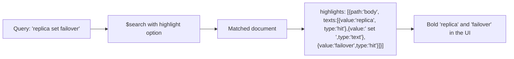

# How to Use $search with Highlighting in MongoDB Atlas

Author: [nawazdhandala](https://www.github.com/nawazdhandala)

Tags: MongoDB, Atlas Search, Highlighting, Full-Text Search, Search

Description: Learn how to use the highlight option in MongoDB Atlas Search to return matched text snippets so users can see why a document was returned.

---

## What Is Search Highlighting

Search highlighting returns the fragments of a document's text that matched the query, with each hit token tagged separately. Users see exactly why a document ranked - the same behaviour as Google's bold snippets.



## Step 1: Add Highlight to the $search Stage

```javascript
const { MongoClient } = require("mongodb");

const client = new MongoClient(process.env.ATLAS_URI);
const db = client.db("knowledge_base");

async function searchWithHighlight(query) {
  return db.collection("articles").aggregate([
    {
      $search: {
        index: "articles_search",
        text: {
          query: query,
          path: ["title", "body"]
        },
        highlight: {
          path: ["title", "body"],
          maxCharsToExamine: 500000,  // chars examined per document (default: 500000)
          maxNumPassages: 5           // max highlight passages per path (default: 5)
        }
      }
    },
    { $limit: 10 },
    {
      $project: {
        title: 1,
        score: { $meta: "searchScore" },
        highlights: { $meta: "searchHighlights" }
      }
    }
  ]).toArray();
}
```

## Step 2: Understand the Highlight Response

Each entry in `highlights` has a `path` (field name) and a `texts` array where each segment has a `type` of either `"hit"` (matched token) or `"text"` (surrounding context).

```javascript
// Example highlights response for one document
[
  {
    "path": "title",
    "texts": [
      { "value": "MongoDB ", "type": "text" },
      { "value": "Replica", "type": "hit" },
      { "value": " Set Configuration", "type": "text" }
    ],
    "score": 1.5
  },
  {
    "path": "body",
    "texts": [
      { "value": "A ", "type": "text" },
      { "value": "replica", "type": "hit" },
      { "value": " set consists of three or more nodes. During a ", "type": "text" },
      { "value": "failover", "type": "hit" },
      { "value": " event the primary steps down.", "type": "text" }
    ],
    "score": 3.2
  }
]
```

## Step 3: Render Highlights in HTML

```javascript
function renderHighlights(highlights) {
  if (!highlights || highlights.length === 0) return "";

  return highlights.map((h) => {
    const snippet = h.texts
      .map((t) =>
        t.type === "hit"
          ? `<mark>${escapeHtml(t.value)}</mark>`
          : escapeHtml(t.value)
      )
      .join("");
    return `<p class="snippet" data-field="${h.path}">${snippet}</p>`;
  }).join("");
}

function escapeHtml(str) {
  return str
    .replace(/&/g, "&amp;")
    .replace(/</g, "&lt;")
    .replace(/>/g, "&gt;")
    .replace(/"/g, "&quot;");
}

// Usage in Express route
app.get("/api/search", async (req, res) => {
  const results = await searchWithHighlight(req.query.q);
  const rendered = results.map((doc) => ({
    id: doc._id,
    title: doc.title,
    score: doc.score,
    snippets: renderHighlights(doc.highlights)
  }));
  res.json(rendered);
});
```

## Step 4: Highlight a Single Specific Field

When you only need to highlight one field, narrow the `highlight.path` to reduce the response payload.

```javascript
async function searchHighlightBodyOnly(query) {
  return db.collection("articles").aggregate([
    {
      $search: {
        index: "articles_search",
        text: {
          query,
          path: ["title", "body"]
        },
        highlight: {
          path: "body"  // highlight only the body passages
        }
      }
    },
    { $limit: 10 },
    {
      $project: {
        title: 1,
        highlights: { $meta: "searchHighlights" }
      }
    }
  ]).toArray();
}
```

## Step 5: Combine Highlighting with Fuzzy Matching

```javascript
async function fuzzySearchWithHighlight(query) {
  return db.collection("articles").aggregate([
    {
      $search: {
        index: "articles_search",
        text: {
          query,
          path: ["title", "body"],
          fuzzy: { maxEdits: 1, prefixLength: 3 }
        },
        highlight: {
          path: ["title", "body"],
          maxNumPassages: 3
        }
      }
    },
    { $limit: 10 },
    {
      $project: {
        title: 1,
        score: { $meta: "searchScore" },
        highlights: { $meta: "searchHighlights" }
      }
    }
  ]).toArray();
}
```

## Step 6: Sort Results by Highlight Score

Each highlight passage has its own score. Use it to surface the best passage first.

```javascript
function getBestHighlight(highlights) {
  if (!highlights || highlights.length === 0) return null;
  // Sort passages by score descending, return the highest scoring one
  return highlights.sort((a, b) => b.score - a.score)[0];
}

const results = await searchWithHighlight("replica set failover");
results.forEach((doc) => {
  const best = getBestHighlight(doc.highlights);
  if (best) {
    const text = best.texts.map((t) => t.value).join("");
    console.log(`${doc.title}: ...${text}...`);
  }
});
```

## Highlight Configuration Options

| Option | Default | Description |
|---|---|---|
| `path` | required | Field or array of fields to highlight |
| `maxCharsToExamine` | 500000 | Max characters examined in each document per path |
| `maxNumPassages` | 5 | Max number of highlight passages per path per document |

## Search Index Requirement

Highlighting requires the field to use a `string` type with a standard analyzer. Dynamic mappings automatically satisfy this for text fields.

```javascript
// Minimal index definition that supports highlighting
{
  "mappings": {
    "dynamic": false,
    "fields": {
      "title": {
        "type": "string",
        "analyzer": "lucene.standard",
        "store": true
      },
      "body": {
        "type": "string",
        "analyzer": "lucene.standard",
        "store": true
      }
    }
  }
}
```

## Summary

MongoDB Atlas Search highlighting returns matched text passages via `{ $meta: "searchHighlights" }`. Add a `highlight` block to `$search` specifying the field paths, retrieve the `searchHighlights` metadata in `$project`, and render hit/text segments in your UI using `<mark>` tags or equivalent. Limit `maxNumPassages` to reduce response size, and optionally sort passages by their score to display the most relevant excerpt first.
