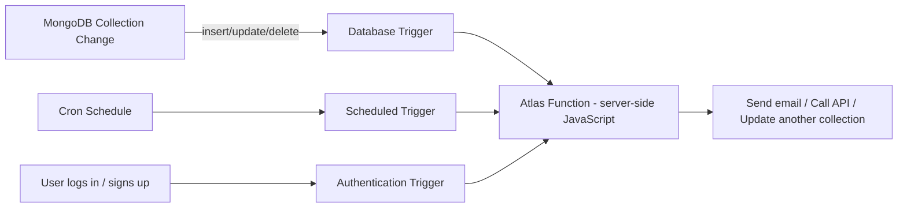

# How to Use MongoDB Atlas Triggers for Event-Driven Workflows

Author: [nawazdhandala](https://www.github.com/nawazdhandala)

Tags: MongoDB, Atlas, Triggers, Event-Driven, App Services

Description: Learn how to use MongoDB Atlas Triggers to automatically execute server-side logic in response to database changes, scheduled events, and authentication events.

---

## What are Atlas Triggers

MongoDB Atlas Triggers are server-side functions that run automatically in response to events. They remove the need to build polling or custom change stream consumers for reactive workflows.

Three types of triggers:

- **Database Triggers** - fire when documents are inserted, updated, deleted, or replaced.
- **Scheduled Triggers** - run on a cron schedule.
- **Authentication Triggers** - fire on user creation, deletion, or login events.



## Setting Up Database Triggers

### Via Atlas UI

1. Go to **App Services** in your Atlas project.
2. Select your App (or create one).
3. Click **Triggers** in the left sidebar.
4. Click **Add a Trigger**.
5. Choose **Database**.
6. Configure the trigger settings.

### Trigger Configuration Fields

```text
Field                   Description
---------------------------------------------------
Name                    Unique name for the trigger
Cluster                 Which Atlas cluster to watch
Database                Which database
Collection              Which collection
Operation Types         Insert, Update, Delete, Replace
Full Document           Include the full document in the event
Full Document Before    Include the document before the change
Event Ordering          Enable to process events in order
Function                The Atlas Function to execute
```

### Example: Send Notification on New Order

Create a trigger that fires on `orders` collection inserts:

**Trigger settings:**
- Operation Types: `Insert`
- Full Document: Enabled

**Atlas Function:**

```javascript
// Atlas Function: sendOrderNotification
exports = async function(changeEvent) {
  const fullDocument = changeEvent.fullDocument;

  // Skip if not a new order
  if (!fullDocument) return;

  const orderId = fullDocument._id;
  const customerId = fullDocument.customerId;
  const amount = fullDocument.amount;

  console.log(`New order ${orderId} from customer ${customerId} for $${amount}`);

  // Send notification via HTTP (e.g., Slack webhook)
  const webhookUrl = context.values.get("SLACK_WEBHOOK_URL");

  const response = await context.http.post({
    url: webhookUrl,
    headers: { "Content-Type": ["application/json"] },
    body: JSON.stringify({
      text: `New order! Customer: ${customerId}, Amount: $${amount}`
    })
  });

  if (response.statusCode !== 200) {
    console.error("Slack notification failed:", response.statusCode);
  }
};
```

### Example: Sync Data to Another Collection on Update

Trigger on user profile updates to sync denormalized data:

```javascript
// Atlas Function: syncUserToOrders
exports = async function(changeEvent) {
  // Only process updates that touch the "name" or "email" fields
  const updatedFields = changeEvent.updateDescription?.updatedFields || {};

  if (!updatedFields.name && !updatedFields.email) {
    return; // Not relevant, skip
  }

  const userId = changeEvent.documentKey._id;
  const fullDocument = changeEvent.fullDocument;

  // Get a MongoDB client
  const mongodb = context.services.get("mongodb-atlas");
  const ordersCollection = mongodb.db("myapp").collection("orders");

  // Denormalize updated user info into orders
  const result = await ordersCollection.updateMany(
    { customerId: userId.toString() },
    {
      $set: {
        customerName: fullDocument.name,
        customerEmail: fullDocument.email
      }
    }
  );

  console.log(`Updated ${result.modifiedCount} orders for user ${userId}`);
};
```

**Trigger settings for this function:**
- Collection: `users`
- Operation Types: `Update`
- Full Document: Enabled (to get the updated values)

## Setting Up Scheduled Triggers

### Example: Daily Cleanup Job

Run at 3 AM UTC every day to delete expired sessions:

**Trigger settings:**
- Schedule type: Basic
- Repeat once by: Day
- Time: 03:00 UTC

Or use a cron expression: `0 3 * * *`

**Atlas Function:**

```javascript
// Atlas Function: cleanupExpiredSessions
exports = async function() {
  const mongodb = context.services.get("mongodb-atlas");
  const sessions = mongodb.db("myapp").collection("sessions");

  const cutoff = new Date(Date.now() - 24 * 60 * 60 * 1000);  // 24 hours ago

  const result = await sessions.deleteMany({
    lastAccessedAt: { $lt: cutoff }
  });

  console.log(`Deleted ${result.deletedCount} expired sessions`);

  // Report metrics
  const reportCollection = mongodb.db("myapp").collection("cleanupReports");
  await reportCollection.insertOne({
    job: "cleanup_sessions",
    deletedCount: result.deletedCount,
    runAt: new Date()
  });
};
```

### Example: Generate Daily Summary Report

```javascript
exports = async function() {
  const mongodb = context.services.get("mongodb-atlas");
  const orders = mongodb.db("myapp").collection("orders");

  const today = new Date();
  today.setHours(0, 0, 0, 0);
  const yesterday = new Date(today);
  yesterday.setDate(yesterday.getDate() - 1);

  const summary = await orders.aggregate([
    { $match: { createdAt: { $gte: yesterday, $lt: today } } },
    {
      $group: {
        _id: null,
        totalOrders: { $sum: 1 },
        totalRevenue: { $sum: "$amount" },
        avgOrderValue: { $avg: "$amount" }
      }
    }
  ]).toArray();

  const report = summary[0] || { totalOrders: 0, totalRevenue: 0, avgOrderValue: 0 };

  console.log("Daily summary:", JSON.stringify(report));

  // Store report
  const reports = mongodb.db("myapp").collection("dailyReports");
  await reports.insertOne({
    date: yesterday,
    ...report,
    _id: undefined
  });
};
```

## Setting Up Authentication Triggers

Fire when a user registers or logs in:

**Trigger settings:**
- Action Type: Create (fires when a new user is created)

**Atlas Function:**

```javascript
// Atlas Function: onUserCreated
exports = async function({ user }) {
  const mongodb = context.services.get("mongodb-atlas");
  const users = mongodb.db("myapp").collection("users");

  // Create a profile document for the new user
  await users.insertOne({
    _id: user.id,
    email: user.data.email || null,
    name: user.data.name || "New User",
    createdAt: new Date(),
    plan: "free",
    preferences: {
      emailNotifications: true,
      theme: "light"
    }
  });

  console.log(`Created profile for new user: ${user.id}`);
};
```

## Accessing Atlas Function Context

Inside an Atlas Function, `context` provides access to:

```javascript
exports = async function() {
  // MongoDB service
  const mongodb = context.services.get("mongodb-atlas");
  const db = mongodb.db("myapp");

  // HTTP service for external requests
  const response = await context.http.get({ url: "https://api.example.com/data" });

  // Values (secrets stored in App Services)
  const apiKey = context.values.get("EXTERNAL_API_KEY");

  // Other functions
  const result = await context.functions.execute("helperFunction", arg1, arg2);

  // Current user (if triggered by auth event)
  const user = context.user;

  // Request info (if called via HTTP endpoint)
  const body = context.request.body.text();
};
```

## Error Handling and Retries

Atlas Functions for database triggers support automatic retries on failure:

1. Enable **Event Ordering** in trigger settings.
2. If the function throws an error, the trigger retries up to 3 times with exponential backoff.
3. Monitor failed trigger events in the App Services **Logs** section.

```javascript
exports = async function(changeEvent) {
  try {
    // Your logic here
    await processChange(changeEvent);
  } catch (error) {
    console.error("Trigger failed:", error.message);
    // Throwing re-triggers the retry mechanism (if event ordering is enabled)
    throw error;
  }
};
```

## Best Practices

- **Keep trigger functions short and idempotent** - they may be retried; handle duplicate events gracefully.
- **Use `context.values` for secrets** rather than hardcoding API keys in function code.
- **Filter early** - check `changeEvent.updateDescription.updatedFields` to skip irrelevant updates.
- **Monitor logs** - check App Services logs regularly for failed trigger executions.
- **Test with the built-in editor** - Atlas App Services has a function testing tool in the UI.
- **Avoid long-running functions** - Atlas Functions have a 120-second execution limit.
- **Use scheduled triggers for batch operations** instead of real-time triggers for high-volume collections to reduce function invocations.

## Summary

MongoDB Atlas Triggers run server-side JavaScript functions automatically in response to database changes (database triggers), cron schedules (scheduled triggers), or authentication events. Configure them in Atlas App Services by selecting trigger type, target collection and operations, and linking an Atlas Function. Use database triggers for real-time reactions to data changes, scheduled triggers for periodic batch jobs, and authentication triggers for user lifecycle management. Keep functions idempotent and monitor execution logs for failures.
