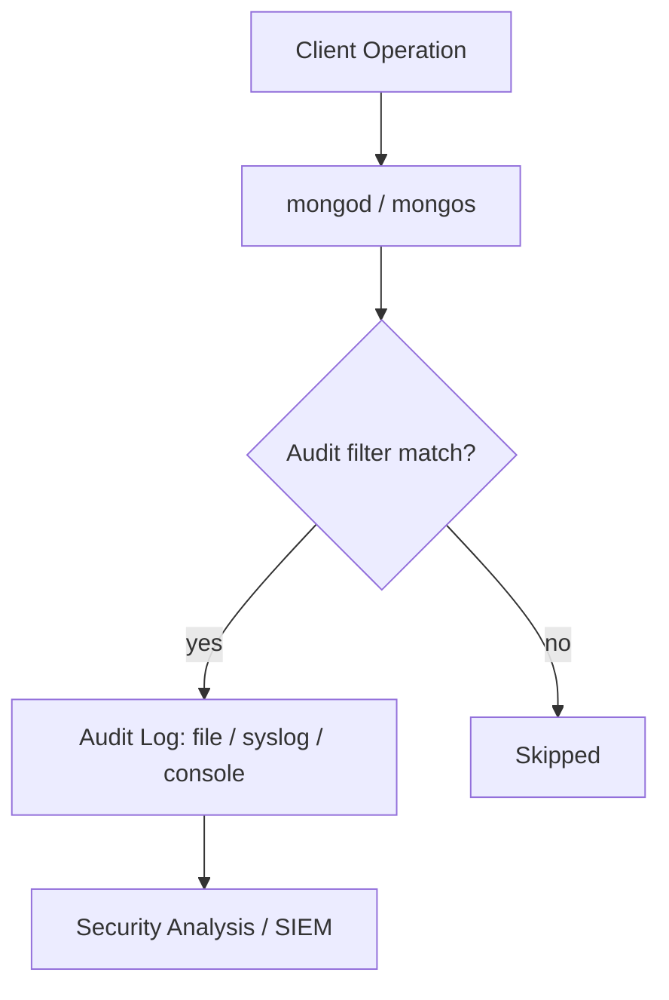

# How to Enable and Configure MongoDB Audit Logging

Author: [nawazdhandala](https://www.github.com/nawazdhandala)

Tags: MongoDB, Security, Audit, Logging, Compliance

Description: Learn how to enable and configure MongoDB audit logging to capture authentication, authorization, and data access events for security compliance and forensic analysis.

---

## Overview

MongoDB's audit log records server events such as logins, user creation, collection operations, and schema changes. Audit logging is available in:

- **MongoDB Enterprise** (on-premises)
- **MongoDB Atlas** (built-in, configurable per project)

It is not available in MongoDB Community Edition.



## Enabling Audit Logging in mongod.conf

Add the `auditLog` section to `/etc/mongod.conf`:

```yaml
auditLog:
  destination: file
  format: JSON
  path: /var/log/mongodb/auditLog.json
  filter: "{}"
```

Restart mongod after editing:

```bash
sudo systemctl restart mongod
```

### Destination Options

| Value | Description |
|---|---|
| `file` | Write to the path specified by `path` |
| `syslog` | Write to syslog (not available on Windows) |
| `console` | Write to stdout |

### Format Options

| Value | Description |
|---|---|
| `JSON` | One JSON document per line |
| `BSON` | Binary BSON format (more compact) |

## Audit Filter Syntax

The `filter` field is a JSON document that selects which events to record. An empty filter `"{}"` captures everything.

### Filter by Action Type

Record only authentication and authorization events:

```json
{
  "atype": {
    "$in": ["authenticate", "authCheck", "logout"]
  }
}
```

### Filter by User

Record all actions by a specific user:

```json
{
  "users": {
    "$elemMatch": {
      "user": "appUser",
      "db": "myDatabase"
    }
  }
}
```

### Filter by Namespace

Record all write operations against a specific collection:

```json
{
  "atype": {
    "$in": ["insert", "update", "delete", "drop"]
  },
  "param.ns": "mydb.customers"
}
```

### Combined Filter: Writes on Sensitive Collections

```json
{
  "$and": [
    {
      "atype": {
        "$in": ["insert", "update", "delete", "drop", "dropCollection"]
      }
    },
    {
      "param.ns": {
        "$in": ["mydb.payments", "mydb.users", "mydb.pii_data"]
      }
    }
  ]
}
```

## Configuring Audit Logging via Command Line

```bash
mongod \
  --auditDestination file \
  --auditFormat JSON \
  --auditPath /var/log/mongodb/audit.json \
  --auditFilter '{"atype": {"$in": ["authenticate","insert","update","delete"]}}'
```

## Audit Log Entry Structure

A typical audit log entry in JSON format:

```javascript
{
  "atype": "authenticate",
  "ts": { "$date": "2024-06-15T10:32:00.000Z" },
  "uuid": { "$binary": "...", "$type": "04" },
  "local": { "ip": "127.0.0.1", "port": 27017 },
  "remote": { "ip": "192.168.1.100", "port": 54321 },
  "users": [{ "user": "alice", "db": "admin" }],
  "roles": [{ "role": "readWrite", "db": "shop" }],
  "param": {
    "user": "alice",
    "db": "admin",
    "mechanism": "SCRAM-SHA-256"
  },
  "result": 0
}
```

The `result` field is `0` for success and a non-zero error code for failures.

## Common Action Types

| `atype` value | Meaning |
|---|---|
| `authenticate` | Login attempt |
| `logout` | User logout |
| `authCheck` | Authorization check |
| `createCollection` | Collection created |
| `dropCollection` | Collection dropped |
| `insert` | Document inserted |
| `update` | Document updated |
| `delete` | Document deleted |
| `find` | Query executed |
| `createIndex` | Index created |
| `createUser` | User account created |
| `dropUser` | User account deleted |
| `grantRolesToUser` | Roles granted |

## Rotating the Audit Log

Send `SIGUSR1` to the mongod process to close and reopen the audit log file (works alongside `logRotate`):

```bash
kill -SIGUSR1 $(pidof mongod)
```

Or use `mongosh`:

```javascript
db.adminCommand({ logRotate: 1 })
```

## MongoDB Atlas Audit Logging

In Atlas, audit logging is configured from the **Security** section of a project:

1. Navigate to your Atlas project
2. Click **Security** then **Database Auditing**
3. Toggle **Database Auditing** to enabled
4. Choose action filter categories (auth events, read, write, etc.)
5. Download audit logs from the **Activity** tab

Atlas stores audit logs for 30 days by default. Configure a log export destination (S3, Azure Blob, GCS) for longer retention.

## Summary

MongoDB audit logging captures authentication, authorization, and data operation events, providing a detailed trail for security investigations and compliance requirements such as PCI-DSS, HIPAA, and SOC 2. Enable it in Enterprise deployments via `mongod.conf` using the `auditLog` section with a JSON filter that targets only the events you need to minimize log volume. In Atlas, enable it through the Security console and configure log export for long-term retention.
