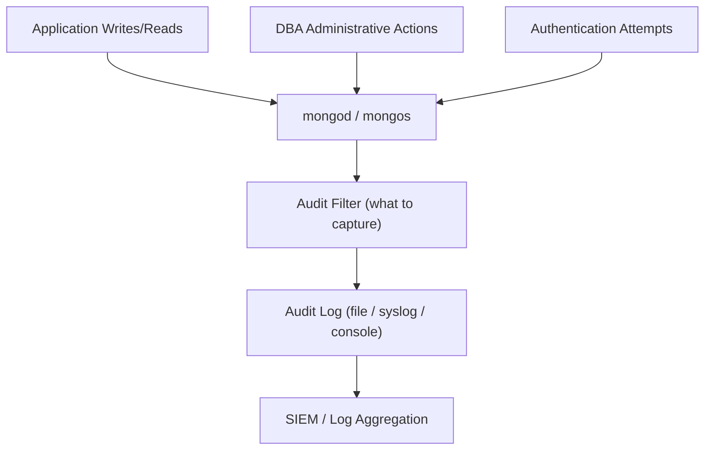

# How to Enable MongoDB Auditing for Compliance

Author: [OneUptime](https://www.github.com/oneuptime)

Tags: MongoDB, Auditing, Compliance, Security, Enterprise

Description: Learn how to configure MongoDB Enterprise auditing to capture authentication, authorization, and data access events for regulatory compliance and security investigations.

---

## Introduction

MongoDB Enterprise Auditing lets you track who did what and when on your database. Audit logs record authentication attempts, role changes, schema modifications, and data access events. This is required for compliance with PCI-DSS, HIPAA, SOX, and similar regulations that mandate access tracking for sensitive data.

## Audit Architecture



## Step 1: Configure Auditing in mongod.conf

```yaml
# /etc/mongod.conf
auditLog:
  destination: file           # Options: file, syslog, console
  format: JSON                # Options: JSON, BSON
  path: /var/log/mongodb/audit.json
  filter: |
    {
      atype: {
        $in: [
          "authenticate",
          "authCheck",
          "createCollection",
          "dropCollection",
          "createDatabase",
          "dropDatabase",
          "createUser",
          "dropUser",
          "updateUser",
          "grantRolesToUser",
          "revokeRolesFromUser",
          "createRole",
          "dropRole",
          "logout"
        ]
      }
    }
```

Restart:

```bash
sudo systemctl restart mongod
```

## Step 2: Understanding Audit Actions (atype)

Common `atype` values and what they capture:

| atype | Captured Event |
|---|---|
| authenticate | Login attempts (success and failure) |
| authCheck | Authorization checks for operations |
| createCollection | Collection creation |
| dropCollection | Collection deletion |
| createIndex | Index creation |
| dropIndex | Index deletion |
| createUser | New user created |
| dropUser | User deleted |
| updateUser | User modified (password, roles) |
| grantRolesToUser | Roles added to user |
| logout | Session logout |
| find | Read operations (high volume) |
| insert | Insert operations (high volume) |
| update | Update operations |
| delete | Delete operations |

## Step 3: Audit Filter Examples

### Capture All Authentication Events

```yaml
filter: '{ atype: { $in: ["authenticate", "logout"] } }'
```

### Capture Failed Logins Only

```yaml
filter: |
  {
    atype: "authenticate",
    "param.result": { $ne: 0 }
  }
```

### Capture DDL Operations (Schema Changes)

```yaml
filter: |
  {
    atype: {
      $in: [
        "createCollection", "dropCollection",
        "createDatabase", "dropDatabase",
        "createIndex", "dropIndex",
        "createUser", "dropUser", "updateUser",
        "createRole", "dropRole", "grantRolesToRole",
        "revokeRolesFromRole", "grantRolesToUser",
        "revokeRolesFromUser"
      ]
    }
  }
```

### Capture Access to a Specific Collection

```yaml
filter: |
  {
    atype: { $in: ["find", "insert", "update", "delete"] },
    "param.ns": "payments.transactions"
  }
```

### Capture Everything (High Volume - Use with Caution)

```yaml
filter: '{}'
```

## Step 4: Reading Audit Log Entries

Each JSON entry looks like:

```javascript
{
  "atype": "authenticate",
  "ts": { "$date": "2026-03-31T10:23:45.123Z" },
  "local": { "ip": "127.0.0.1", "port": 27017 },
  "remote": { "ip": "192.168.1.100", "port": 54321 },
  "users": [{ "user": "appUser", "db": "ecommerce" }],
  "roles": [{ "role": "readWrite", "db": "ecommerce" }],
  "param": {
    "user": "appUser",
    "db": "ecommerce",
    "mechanism": "SCRAM-SHA-256",
    "result": 0     // 0 = success, non-zero = failure code
  },
  "result": 0
}
```

Parse with jq:

```bash
# Show all failed login attempts
jq 'select(.atype == "authenticate" and .result != 0)' /var/log/mongodb/audit.json

# Show all DDL operations from the last hour
jq --arg since "$(date -u -d '1 hour ago' +%Y-%m-%dT%H:%M:%S)" \
  'select(.atype | IN("createCollection","dropCollection","createUser","dropUser"))
   | select(.ts["$date"] >= $since)' \
  /var/log/mongodb/audit.json

# Count events by type
jq -r '.atype' /var/log/mongodb/audit.json | sort | uniq -c | sort -rn
```

## Step 5: Audit Log Rotation

Configure logrotate for the audit log:

```bash
# /etc/logrotate.d/mongodb-audit
/var/log/mongodb/audit.json {
    daily
    rotate 90
    compress
    delaycompress
    missingok
    notifempty
    create 0640 mongod mongod
    postrotate
        /bin/kill -SIGUSR1 $(cat /var/run/mongodb/mongod.pid)
    endscript
}
```

Or trigger rotation via MongoDB:

```javascript
db.adminCommand({ logRotate: "audit" })
```

## Step 6: Verify Auditing Is Active

```javascript
// Check audit configuration
db.adminCommand({ getCmdLineOpts: 1 }).parsed.auditLog

// Check a test event appears in the log
db.getUsers()   // Should create an authCheck entry
```

```bash
tail -5 /var/log/mongodb/audit.json
```

## Step 7: Ship Audit Logs to a SIEM

Use Filebeat to forward audit logs to Elasticsearch or Splunk:

```yaml
# filebeat.yml
filebeat.inputs:
  - type: log
    paths:
      - /var/log/mongodb/audit.json
    json.keys_under_root: true
    json.add_error_key: true
    fields:
      service: mongodb-audit
      environment: production

output.elasticsearch:
  hosts: ["https://elasticsearch:9200"]
  index: "mongodb-audit-%{+yyyy.MM.dd}"
```

## Summary

MongoDB Enterprise auditing captures security-relevant events to a structured JSON log. Configure `auditLog.destination`, `format`, `path`, and `filter` in `mongod.conf`. Use targeted filters to capture only the events required for your compliance framework - authentication events, DDL changes, and privileged user management. Rotate audit logs daily, retain them for the period required by your regulations, and ship them to a SIEM for real-time alerting and historical investigation.
