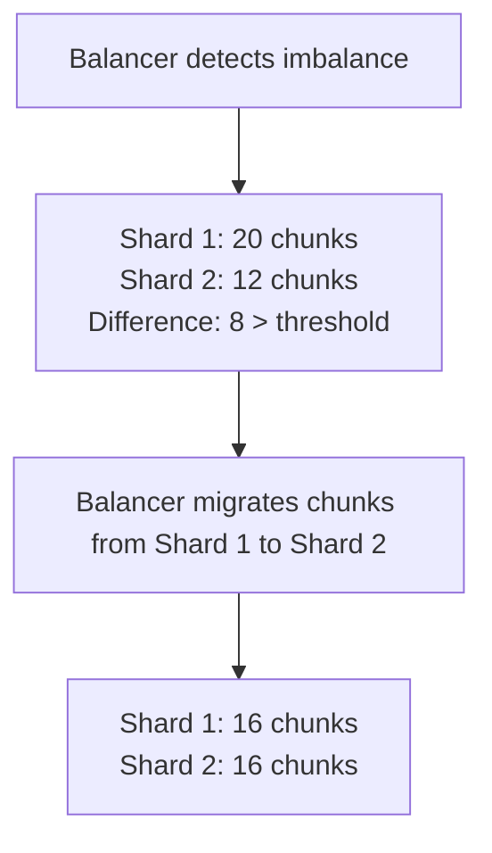

# How to Balance Chunks in a MongoDB Sharded Cluster

Author: [nawazdhandala](https://www.github.com/nawazdhandala)

Tags: MongoDB, Sharding, Chunk Balancing, Balancer, Performance

Description: Learn how MongoDB's chunk balancer works, how to monitor and control chunk distribution across shards, and how to manually balance a sharded cluster when needed.

---

## How Chunk Balancing Works

MongoDB divides the shard key space into chunks - contiguous ranges of shard key values. Each chunk is stored on a shard. As data grows, chunks split when they exceed the maximum chunk size (default 128 MB). The balancer process then migrates chunks between shards to equalize the chunk count.

The balancer runs on the primary config server and only moves chunks when the difference in chunk count between the shard with the most chunks and the shard with the fewest exceeds a migration threshold.



## Monitoring Chunk Distribution

### Check Overall Shard Status

```javascript
sh.status()
```

This shows chunk counts per shard:

```text
shards:
  { "_id" : "rs-shard1", "host" : "rs-shard1/host1:27018,host2:27018" }
  { "_id" : "rs-shard2", "host" : "rs-shard2/host3:27018,host4:27018" }
databases:
  { "_id" : "myapp", "primary" : "rs-shard1", "partitioned" : true }
    myapp.orders
      shard key: { "customerId" : "hashed" }
      chunks:
        rs-shard1  6
        rs-shard2  6
      Tag Ranges: none
```

### Check Chunk Distribution Per Collection

```javascript
// Detailed chunk distribution
db.getSiblingDB("config").collection("chunks").aggregate([
  { $match: { ns: "myapp.orders" } },
  { $group: { _id: "$shard", chunkCount: { $sum: 1 } } },
  { $sort: { chunkCount: -1 } }
]).toArray()
```

### Check Balancer Status

```javascript
// Is the balancer currently running?
sh.isBalancerRunning()

// Is the balancer enabled?
sh.getBalancerState()

// Get balancer configuration
db.getSiblingDB("config").collection("settings").findOne({ _id: "balancer" })
```

### Monitor Active Migrations

```javascript
// Check if any chunk migrations are in progress
db.adminCommand({ currentOp: true, desc: /moveChunk|migration/ })
```

## Controlling the Balancer

### Enable/Disable the Balancer

```javascript
// Disable globally (e.g., during backup or batch loading)
sh.stopBalancer()
// Wait for any ongoing migration to complete before returning

// Re-enable
sh.startBalancer()
```

### Schedule the Balancer (Off-Peak Window)

Configure the balancer to only run during off-peak hours to minimize impact on production traffic:

```javascript
db.getSiblingDB("config").collection("settings").updateOne(
  { _id: "balancer" },
  {
    $set: {
      activeWindow: {
        start: "01:00",   // 1 AM UTC
        stop: "06:00"     // 6 AM UTC
      }
    }
  },
  { upsert: true }
)
```

Remove the window to allow balancing at any time:

```javascript
db.getSiblingDB("config").collection("settings").updateOne(
  { _id: "balancer" },
  { $unset: { activeWindow: 1 } }
)
```

### Disable Balancer for a Specific Collection

```javascript
// Stop balancing only this collection
sh.disableBalancing("myapp.orders")

// Re-enable balancing for this collection
sh.enableBalancing("myapp.orders")
```

## Manually Moving Chunks

To manually migrate a chunk to a specific shard:

```javascript
// Move the chunk containing shard key value { customerId: "hashed-value" }
sh.moveChunk(
  "myapp.orders",
  { customerId: "cust_001" },   // a document within the chunk you want to move
  "rs-shard2"                   // destination shard name
)
```

## Manually Splitting Chunks

If a chunk is too large to migrate, split it first:

```javascript
// Split a chunk at a specific shard key value
sh.splitAt("myapp.orders", { customerId: "cust_500" })

// Let MongoDB auto-split at the midpoint
sh.splitFind("myapp.orders", { customerId: "cust_500" })
```

## Pre-splitting Chunks Before Data Load

When loading large datasets into a new sharded collection, pre-split to avoid hot-spotting:

```javascript
// Enable sharding
sh.shardCollection("myapp.events", { timestamp: 1 })

// Pre-split at expected data boundaries
const splitPoints = [
  ISODate("2026-01-01"),
  ISODate("2026-02-01"),
  ISODate("2026-03-01"),
  ISODate("2026-04-01")
];

for (const point of splitPoints) {
  sh.splitAt("myapp.events", { timestamp: point });
}

// Distribute pre-split chunks across shards
sh.moveChunk("myapp.events", { timestamp: ISODate("2026-01-01") }, "rs-shard2")
sh.moveChunk("myapp.events", { timestamp: ISODate("2026-02-01") }, "rs-shard3")
```

## Node.js: Monitoring Chunk Balance

```javascript
const { MongoClient } = require("mongodb");

async function monitorBalance() {
  const client = new MongoClient("mongodb://mongos:27017");
  await client.connect();

  const config = client.db("config");

  // Get chunk distribution
  const distribution = await config.collection("chunks").aggregate([
    { $match: { ns: "myapp.orders" } },
    { $group: { _id: "$shard", count: { $sum: 1 } } },
    { $sort: { count: -1 } }
  ]).toArray();

  const total = distribution.reduce((sum, d) => sum + d.count, 0);
  const max = distribution[0]?.count ?? 0;
  const min = distribution[distribution.length - 1]?.count ?? 0;

  console.log("Chunk Distribution for myapp.orders:");
  distribution.forEach(d => {
    const pct = ((d.count / total) * 100).toFixed(1);
    console.log(`  ${d._id}: ${d.count} chunks (${pct}%)`);
  });

  console.log(`\nImbalance: max=${max}, min=${min}, diff=${max - min}`);

  if (max - min > 8) {
    console.log("WARNING: Significant imbalance detected. Balancer may need attention.");
  }

  // Check balancer state
  const balancerState = await config.collection("settings").findOne({ _id: "balancer" });
  console.log("\nBalancer stopped:", balancerState?.stopped ?? false);

  await client.close();
}

monitorBalance().catch(console.error);
```

## Chunk Migration Impact on Performance

Chunk migrations transfer data between shards and can impact performance:

- **Source shard**: reads data to transfer.
- **Destination shard**: receives data and indexes it.
- **Config servers**: update chunk metadata.

During migration, the source shard serves queries for the migrating chunk until the migration commits. Minimize impact by:
- Scheduling migrations during off-peak hours using the active window.
- Limiting concurrent migrations (default: 1 migration per shard pair at a time).
- Using fast network between shards.

## Changing Maximum Chunk Size

The default chunk size is 128 MB. Smaller chunks migrate faster but create more metadata:

```javascript
db.getSiblingDB("config").collection("settings").updateOne(
  { _id: "chunksize" },
  { $set: { value: 64 } },   // 64 MB chunks
  { upsert: true }
)
```

Allowed range: 1 MB to 1024 MB.

## Best Practices

- **Monitor chunk distribution weekly** with `sh.status()` and the config.chunks collection.
- **Disable the balancer during bulk loads** with `sh.stopBalancer()` and re-enable after.
- **Schedule the balancer active window** to off-peak hours in production.
- **Pre-split chunks** before large imports to prevent hot-spots and immediate balancing activity.
- **Avoid manual chunk moves in production** unless you have a specific reason - let the balancer handle distribution.
- **Use hashed shard keys** to start with near-even distribution and minimize balancing work.

## Summary

MongoDB's chunk balancer automatically migrates chunks between shards to equalize the distribution of data. Monitor chunk distribution with `sh.status()` and the config.chunks collection. Control the balancer with `sh.startBalancer()`, `sh.stopBalancer()`, and a scheduled active window. For large data imports, disable the balancer during the load and pre-split chunks to distribute data evenly from the start. Manual chunk moves with `sh.moveChunk()` are available for targeted rebalancing but are rarely needed with a well-chosen shard key.
