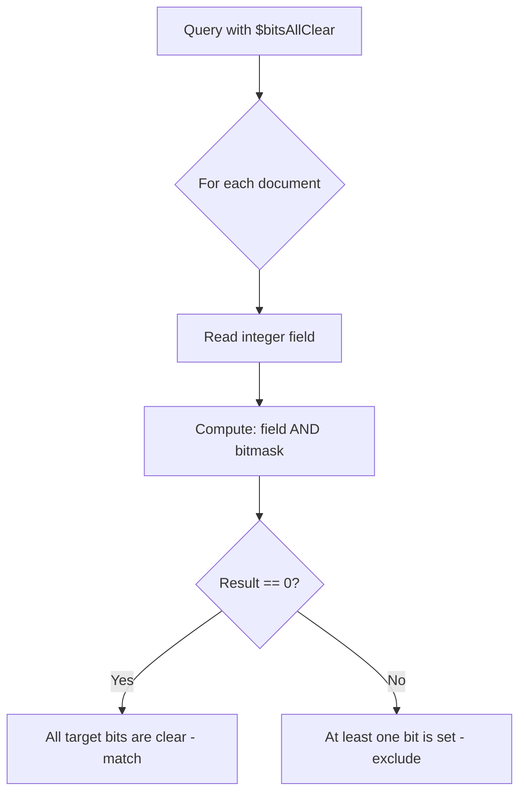
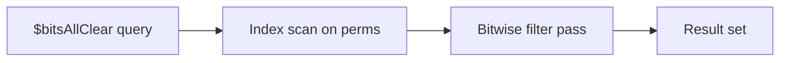

# How to Use $bitsAllClear in MongoDB Queries

Author: [nawazdhandala](https://www.github.com/nawazdhandala)

Tags: MongoDB, Bitwise, Query, Operator, Index

Description: Learn how to use MongoDB's $bitsAllClear operator to match documents where all specified bit positions are zero, perfect for querying permission masks and status flags.

---

## What is $bitsAllClear

The `$bitsAllClear` operator matches documents where all the bit positions specified in the query are clear (equal to 0) in the field value. It is the complement of `$bitsAllSet` and is used to find documents that explicitly lack certain flags.



## Syntax

```javascript
{ field: { $bitsAllClear: <bitmask> } }
```

The bitmask can be:
- A numeric integer (the bit positions of all 1-bits in this integer are checked)
- An array of zero-based bit positions
- A BinData value

## Setting Up Example Data

```javascript
// Permissions bitmask:
// Bit 0 = read, Bit 1 = write, Bit 2 = delete, Bit 3 = admin
db.accounts.insertMany([
  { user: "alice",  perms: 0  },  // 0000 - no permissions
  { user: "bob",    perms: 1  },  // 0001 - read only
  { user: "carol",  perms: 3  },  // 0011 - read + write
  { user: "dave",   perms: 7  },  // 0111 - read + write + delete
  { user: "eve",    perms: 15 },  // 1111 - all permissions
  { user: "frank",  perms: 4  }   // 0100 - delete only
]);
```

## Querying with a Numeric Bitmask

Find users who have neither write (bit 1) nor delete (bit 2) permissions. The bitmask is `6` (binary `0110`):

```javascript
db.accounts.find({ perms: { $bitsAllClear: 6 } });
// Returns: alice (0000) and bob (0001)
// carol has write set, dave has both, eve has both
```

## Querying with an Array of Bit Positions

```javascript
// Same query expressed as bit positions [1, 2]
db.accounts.find({ perms: { $bitsAllClear: [1, 2] } });
// Returns: alice, bob
```

## Checking a Single Bit is Clear

```javascript
// Find users without admin access (bit 3 is clear)
db.accounts.find({ perms: { $bitsAllClear: [3] } });
// Returns: alice, bob, carol, dave, frank
```

## Combining with $bitsAllSet

Use both operators together to find documents where specific bits are set and others are clear:

```javascript
// Users with read permission but without admin
db.accounts.find({
  perms: {
    $bitsAllSet:   [0],  // must have read
    $bitsAllClear: [3]   // must NOT have admin
  }
});
// Returns: bob (0001), carol (0011), dave (0111)
```

## Real-World: Notification Opt-Out System

```javascript
// Notification flags:
// Bit 0 = email_marketing, Bit 1 = sms_alerts, Bit 2 = push_notifications

db.preferences.insertMany([
  { userId: "u1", optedOut: 0 },   // opted into all
  { userId: "u2", optedOut: 1 },   // opted out of email
  { userId: "u3", optedOut: 3 },   // opted out of email + sms
  { userId: "u4", optedOut: 7 }    // opted out of everything
]);

// Find users who have NOT opted out of email (bit 0 is clear)
db.preferences.find({ optedOut: { $bitsAllClear: [0] } });
// Returns: u1 (0)

// Find users eligible for both email and sms campaigns
db.preferences.find({ optedOut: { $bitsAllClear: [0, 1] } });
// Returns: u1 (0)
```

## Real-World: Device Status Flags

```javascript
// Device error flags:
// Bit 0 = overheating, Bit 1 = low_battery, Bit 2 = connectivity_error
db.devices.insertMany([
  { deviceId: "d1", errorFlags: 0 },  // all clear
  { deviceId: "d2", errorFlags: 1 },  // overheating
  { deviceId: "d3", errorFlags: 2 },  // low battery
  { deviceId: "d4", errorFlags: 3 },  // overheating + low battery
  { deviceId: "d5", errorFlags: 5 }   // overheating + connectivity
]);

// Find healthy devices with no errors
db.devices.find({ errorFlags: { $bitsAllClear: 7 } });
// Returns: d1

// Find devices without connectivity errors (bit 2)
db.devices.find({ errorFlags: { $bitsAllClear: [2] } });
// Returns: d1, d2, d3, d4
```

## Using BinData

```javascript
// BinData(0, "AA==") is a zero byte (all bits clear)
db.sensors.find({
  statusFlags: { $bitsAllClear: BinData(0, "Zg==") }
});
```

## Aggregation with $bitsAllClear

```javascript
db.accounts.aggregate([
  {
    $match: { perms: { $bitsAllClear: [2, 3] } }  // no delete, no admin
  },
  {
    $group: {
      _id: null,
      count: { $sum: 1 },
      users: { $push: "$user" }
    }
  }
]);
```

## Indexing Considerations

An index on the bitmask field allows MongoDB to reduce the candidate document set before applying the bitwise filter:

```javascript
db.accounts.createIndex({ perms: 1 });

// Verify index usage
db.accounts.find(
  { perms: { $bitsAllClear: 6 } }
).explain("executionStats");
```



## Operator Comparison

| Operator | Meaning |
|---|---|
| `$bitsAllClear` | ALL checked bits must be 0 |
| `$bitsAnyClear` | AT LEAST ONE checked bit must be 0 |
| `$bitsAllSet` | ALL checked bits must be 1 |
| `$bitsAnySet` | AT LEAST ONE checked bit must be 1 |

## Limitations

- Field must be a non-negative integer or BinData. Negative integers are not supported.
- Zero (`0`) matches any bitmask with `$bitsAllClear` since all bits are already clear.
- Floating-point numbers are not matched even if their integer part satisfies the condition.

## Summary

`$bitsAllClear` finds documents where every bit in the specified bitmask is 0 in the stored field value. It is the right tool when you need to confirm the complete absence of certain flags, such as verifying a user has no admin or delete permissions, or finding devices with no active error flags. Combine it with `$bitsAllSet` for fine-grained permission checks, and index the bitmask field to keep queries efficient on large collections.
