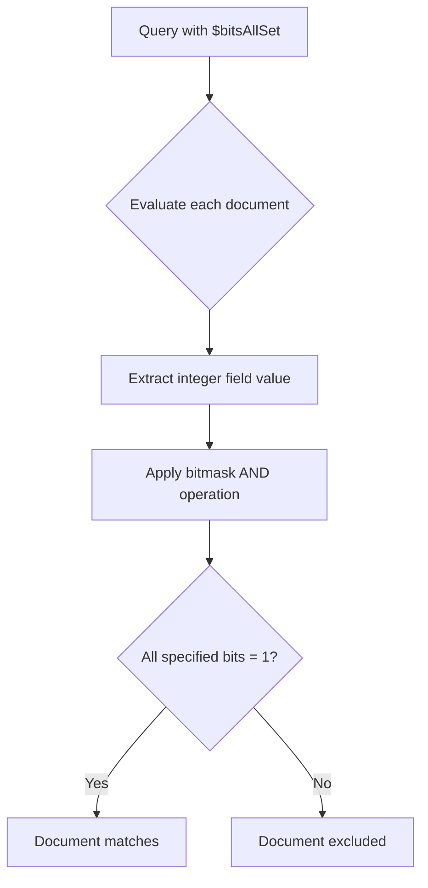
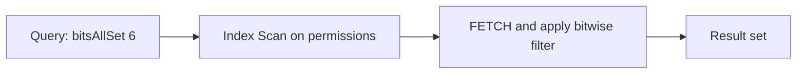

# How to Use $bitsAllSet for Bitwise Flag Queries in MongoDB

Author: [nawazdhandala](https://www.github.com/nawazdhandala)

Tags: MongoDB, Bitwise, Query, Operator, Index

Description: Learn how to use MongoDB's $bitsAllSet operator to query documents where all specified bits are set in a numeric or BinData field, ideal for permission and flag systems.

---

## What is $bitsAllSet

The `$bitsAllSet` operator matches documents where all the bit positions specified in the query are set (equal to 1) in the field value. It is useful for permission flags, feature toggles, and status bitmasks stored as integers.

A bitmask represents a combination of boolean flags packed into a single integer. Each bit position corresponds to one flag:

```
Bit position:  7  6  5  4  3  2  1  0
Permission:    -  -  -  -  D  W  R  E
Value:         0  0  0  0  1  1  0  1  = 13
```

Where E=execute(1), R=read(2), W=write(4), D=delete(8).



## Syntax

```javascript
{ field: { $bitsAllSet: <bitmask> } }
```

The `<bitmask>` can be:
- A numeric integer (e.g., `7` checks bits 0, 1, and 2)
- An array of bit positions (e.g., `[0, 1, 2]` checks the same bits)
- A BinData value

## Setting Up the Collection

```javascript
// Insert documents with bitmask permission flags
// Bit 0 = execute, Bit 1 = read, Bit 2 = write, Bit 3 = delete
db.users.insertMany([
  { name: "alice", permissions: 7 },   // 0111 = execute + read + write
  { name: "bob",   permissions: 5 },   // 0101 = execute + write
  { name: "carol", permissions: 3 },   // 0011 = execute + read
  { name: "dave",  permissions: 15 },  // 1111 = all permissions
  { name: "eve",   permissions: 1 },   // 0001 = execute only
  { name: "frank", permissions: 0 }    // 0000 = no permissions
]);
```

## Querying with a Numeric Bitmask

Find users who have both read (bit 1) and write (bit 2) permissions. The bitmask for bits 1 and 2 is `6` (binary `0110`):

```javascript
db.users.find({ permissions: { $bitsAllSet: 6 } });
// Returns: alice (7 = 0111) and dave (15 = 1111)
// bob has write but NOT read, so excluded
```

## Querying with an Array of Bit Positions

Use an array of zero-indexed bit positions instead of a precomputed mask:

```javascript
// Equivalent to the numeric bitmask 6 above
db.users.find({ permissions: { $bitsAllSet: [1, 2] } });
// Returns: alice, dave
```

## Querying with a Single Bit

Check if a single flag is set:

```javascript
// Find all users with execute permission (bit 0)
db.users.find({ permissions: { $bitsAllSet: [0] } });
// Returns: alice, bob, carol, dave, eve
```

## Combining $bitsAllSet with Other Operators

```javascript
// Find users with read + write, excluding those with delete
db.users.find({
  permissions: {
    $bitsAllSet: [1, 2],    // must have read AND write
    $bitsAllClear: [3]      // must NOT have delete
  }
});
// Returns: alice (7 = 0111)
```

```javascript
// Find active users with specific permissions
db.users.find({
  status: "active",
  permissions: { $bitsAllSet: 3 }  // must have execute AND read
});
```

## Using BinData for Binary Fields

`$bitsAllSet` also works on BinData fields. The operator checks against the raw bytes:

```javascript
// BinData(0, "Zg==") = binary 0110 0110
db.inventory.find({
  flags: { $bitsAllSet: BinData(0, "Zg==") }
});
```

## Real-World: Feature Flag System

```javascript
// Feature flags packed as bits
// Bit 0 = dark_mode, Bit 1 = beta_features, Bit 2 = analytics, Bit 3 = export

db.userSettings.insertMany([
  { userId: "u1", featureFlags: 3 },   // dark_mode + beta_features
  { userId: "u2", featureFlags: 7 },   // dark_mode + beta_features + analytics
  { userId: "u3", featureFlags: 15 },  // all features
  { userId: "u4", featureFlags: 1 }    // dark_mode only
]);

// Find all users enrolled in both beta_features and analytics
db.userSettings.find({
  featureFlags: { $bitsAllSet: [1, 2] }
});
// Returns: u2 (7), u3 (15)
```

## Indexing for $bitsAllSet Performance

Regular ascending indexes can speed up `$bitsAllSet` queries when combined with equality or range filters. MongoDB will use the index to narrow the candidate set, then apply the bitwise check:

```javascript
db.users.createIndex({ permissions: 1 });

// Check the query plan
db.users.find({ permissions: { $bitsAllSet: 6 } }).explain("executionStats");
```

For highly selective queries, an index on the field reduces the number of documents scanned:



## Aggregation Pipeline Usage

```javascript
db.users.aggregate([
  {
    $match: {
      permissions: { $bitsAllSet: [1, 2] }  // read + write
    }
  },
  {
    $addFields: {
      canDelete: {
        $cond: {
          if: { $eq: [{ $bitAnd: ["$permissions", 8] }, 8] },
          then: true,
          else: false
        }
      }
    }
  },
  {
    $project: { name: 1, permissions: 1, canDelete: 1, _id: 0 }
  }
]);
```

## Differences Between Bitwise Operators

| Operator | Behavior |
|---|---|
| `$bitsAllSet` | ALL specified bits must be 1 |
| `$bitsAnySet` | AT LEAST ONE specified bit must be 1 |
| `$bitsAllClear` | ALL specified bits must be 0 |
| `$bitsAnyClear` | AT LEAST ONE specified bit must be 0 |

## Limitations

- The field must be a non-negative integer or BinData type. Negative integers are not supported.
- Float values (e.g., `7.5`) are not matched even if the integer portion satisfies the condition.
- `$bitsAllSet` does not use indexes in a fully optimal way for all bitmask values; test with `explain()` for large collections.

```javascript
// Verify your query behavior with explain
db.users.find(
  { permissions: { $bitsAllSet: 6 } }
).explain("executionStats");
```

## Summary

`$bitsAllSet` queries documents where all the specified bits are set to 1 in a numeric or BinData field. It is the right operator when you need to enforce that multiple flags are simultaneously active, such as checking that a user has both read and write permissions. Pair it with `$bitsAllClear`, `$bitsAnySet`, or `$bitsAnyClear` for precise bitwise filtering, and create a regular index on the field to help MongoDB narrow the candidate set before applying the bitwise check.
