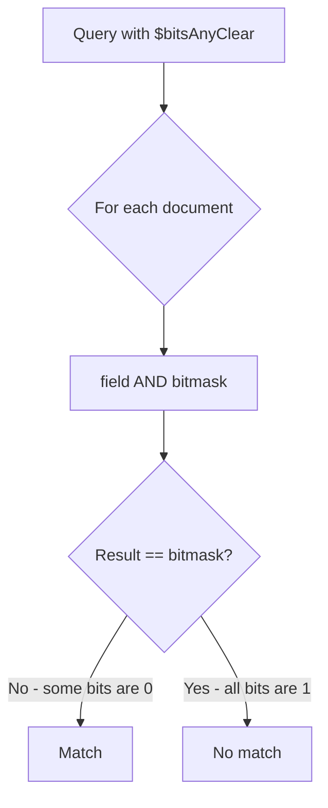
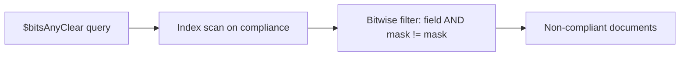

# How to Use $bitsAnyClear in MongoDB Queries

Author: [nawazdhandala](https://www.github.com/nawazdhandala)

Tags: MongoDB, Bitwise, Query, Operator, Index

Description: Learn how to use MongoDB's $bitsAnyClear operator to match documents where at least one specified bit position is zero, useful for detecting missing flags or permissions.

---

## What is $bitsAnyClear

The `$bitsAnyClear` operator matches documents where at least one of the bit positions specified in the query is clear (equal to 0). It applies OR logic across the checked positions, meaning a document matches if any single specified bit is 0, even if others are 1.

This is the complement of `$bitsAllSet`. A document that does not have all bits set will always satisfy `$bitsAnyClear` for the same bitmask.



## Syntax

```javascript
{ field: { $bitsAnyClear: <bitmask> } }
```

The bitmask can be:
- A numeric integer
- An array of zero-based bit positions
- A BinData value

## Setting Up Example Data

```javascript
// Access control flags:
// Bit 0 = read, Bit 1 = write, Bit 2 = execute, Bit 3 = audit
db.services.insertMany([
  { name: "api-gateway",  accessFlags: 15 },  // 1111 - all flags
  { name: "auth-service", accessFlags: 7  },  // 0111 - read+write+execute
  { name: "db-service",   accessFlags: 3  },  // 0011 - read+write
  { name: "log-service",  accessFlags: 1  },  // 0001 - read only
  { name: "cache",        accessFlags: 0  }   // 0000 - no access
]);
```

## Querying with a Numeric Bitmask

Find services where at least one of audit (bit 3) or execute (bit 2) is missing. Bitmask for bits 2 and 3 is `12` (binary `1100`):

```javascript
db.services.find({ accessFlags: { $bitsAnyClear: 12 } });
// Returns: auth-service (0111 - missing bit 3), db-service (0011 - missing 2,3),
//          log-service (0001 - missing 2,3), cache (0000 - missing all)
// api-gateway (1111) is excluded because both bits are set
```

## Querying with Bit Position Array

```javascript
db.services.find({ accessFlags: { $bitsAnyClear: [2, 3] } });
// Same result as above
```

## Single-Bit Check

```javascript
// Find services without audit logging enabled (bit 3 clear)
db.services.find({ accessFlags: { $bitsAnyClear: [3] } });
// Returns: auth-service, db-service, log-service, cache
```

## Real-World: Compliance Audit

```javascript
// Required compliance flags:
// Bit 0 = encryption_at_rest, Bit 1 = tls_enabled, Bit 2 = audit_logs, Bit 3 = mfa

db.tenants.insertMany([
  { tenant: "acme",   compliance: 15 },  // fully compliant
  { tenant: "beta",   compliance: 14 },  // missing encryption_at_rest
  { tenant: "gamma",  compliance: 9  },  // encryption + mfa, missing tls + audit
  { tenant: "delta",  compliance: 0  }   // non-compliant
]);

// Find tenants missing ANY required compliance control
db.tenants.find({ compliance: { $bitsAnyClear: 15 } });
// Returns: beta, gamma, delta

// Find tenants missing either TLS or audit logs
db.tenants.find({ compliance: { $bitsAnyClear: [1, 2] } });
// Returns: gamma (missing both), delta (missing all)
```

## Real-World: Incomplete Profile Detection

```javascript
// Profile completion flags:
// Bit 0 = avatar, Bit 1 = bio, Bit 2 = email_verified, Bit 3 = phone_verified

db.profiles.insertMany([
  { userId: "u1", completeness: 15 },  // fully complete
  { userId: "u2", completeness: 7  },  // missing phone
  { userId: "u3", completeness: 3  },  // missing email + phone verified
  { userId: "u4", completeness: 0  }   // nothing complete
]);

// Find users with any incomplete profile field
db.profiles.find({ completeness: { $bitsAnyClear: 15 } });
// Returns: u2, u3, u4 (anything not fully complete)

// Find users missing phone or email verification
db.profiles.find({ completeness: { $bitsAnyClear: [2, 3] } });
// Returns: u2 (missing phone), u3 (missing both), u4 (missing all)
```

## Combining with Other Operators

```javascript
// Find non-compliant tenants with at least encryption enabled
db.tenants.find({
  compliance: {
    $bitsAnyClear: [1, 2, 3],  // missing tls OR audit OR mfa
    $bitsAllSet:   [0]          // but must have encryption
  }
});
// Returns: beta (14=1110, has encryption but missing bit 0 only if 14&1=0)
```

## Aggregation Use Case

```javascript
// Count non-compliant tenants grouped by missing flags
db.tenants.aggregate([
  {
    $match: { compliance: { $bitsAnyClear: 15 } }
  },
  {
    $addFields: {
      missingEncryption: { $eq: [{ $bitAnd: ["$compliance", 1] }, 0] },
      missingTLS:        { $eq: [{ $bitAnd: ["$compliance", 2] }, 0] },
      missingAudit:      { $eq: [{ $bitAnd: ["$compliance", 4] }, 0] },
      missingMFA:        { $eq: [{ $bitAnd: ["$compliance", 8] }, 0] }
    }
  },
  {
    $project: { tenant: 1, compliance: 1, missingEncryption: 1, missingTLS: 1, missingAudit: 1, missingMFA: 1, _id: 0 }
  }
]);
```

## Indexing

```javascript
db.tenants.createIndex({ compliance: 1 });

// Verify plan
db.tenants.find(
  { compliance: { $bitsAnyClear: 15 } }
).explain("executionStats");
```



## Relationship to Other Bitwise Operators

`$bitsAnyClear` is the logical NOT of `$bitsAllSet`. These two queries are equivalent:

```javascript
// These return the same documents for non-negative integers:
db.services.find({ accessFlags: { $bitsAnyClear: 12 } });
db.services.find({ accessFlags: { $not: { $bitsAllSet: 12 } } });
```

## Operator Comparison Table

| Operator | Logic |
|---|---|
| `$bitsAnyClear` | OR across bits - at least one is 0 |
| `$bitsAllClear` | AND across bits - all must be 0 |
| `$bitsAnySet` | OR across bits - at least one is 1 |
| `$bitsAllSet` | AND across bits - all must be 1 |

## Limitations

- Negative integers are not supported.
- A bitmask of `0` never matches anything because you are checking zero bit positions.
- Float values are excluded even if their integer equivalent would match.

## Summary

`$bitsAnyClear` matches documents where at least one of the specified bit positions is 0. It is the right operator for finding records with any missing flag, such as non-compliant tenants, users with incomplete profiles, or services lacking certain access controls. Combine it with `$bitsAllSet` to narrow results further, and index the field to limit the number of documents that must be evaluated.
