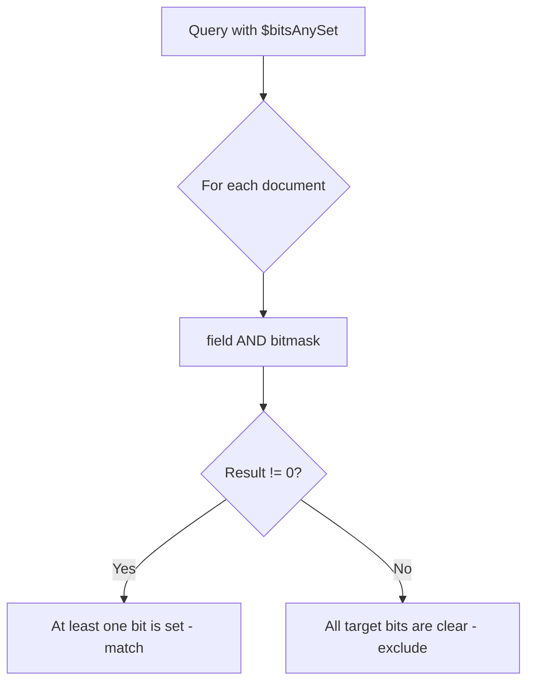
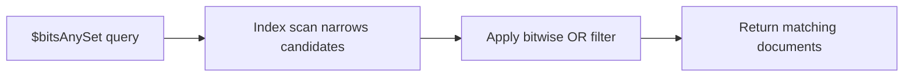

# How to Use $bitsAnySet in MongoDB Queries

Author: [nawazdhandala](https://www.github.com/nawazdhandala)

Tags: MongoDB, Bitwise, Query, Operator, Index

Description: Learn how to use MongoDB's $bitsAnySet operator to match documents where at least one of the specified bit positions is set, enabling flexible flag and permission queries.

---

## What is $bitsAnySet

The `$bitsAnySet` operator matches documents where at least one of the bit positions specified in the query is set to 1. It uses OR logic across bits, unlike `$bitsAllSet` which requires every specified bit to be 1.

This is useful when you want to find documents that have any one of several optional flags enabled.



## Syntax

```javascript
{ field: { $bitsAnySet: <bitmask> } }
```

The bitmask can be:
- A numeric integer
- An array of zero-based bit positions
- A BinData value

## Setting Up Example Data

```javascript
// Role flags - bit per role:
// Bit 0 = viewer, Bit 1 = editor, Bit 2 = reviewer, Bit 3 = approver
db.members.insertMany([
  { name: "alice", roles: 0  },  // 0000 - no role
  { name: "bob",   roles: 1  },  // 0001 - viewer only
  { name: "carol", roles: 2  },  // 0010 - editor only
  { name: "dave",  roles: 3  },  // 0011 - viewer + editor
  { name: "eve",   roles: 8  },  // 1000 - approver only
  { name: "frank", roles: 15 }   // 1111 - all roles
]);
```

## Querying with a Numeric Bitmask

Find members who have at least one editorial role (editor=bit1 or reviewer=bit2). Bitmask `6` covers bits 1 and 2:

```javascript
db.members.find({ roles: { $bitsAnySet: 6 } });
// Returns: carol (0010), dave (0011), frank (1111)
// bob has only viewer (bit 0), not included in bitmask 6
```

## Querying with an Array of Bit Positions

```javascript
// Equivalent using bit position array
db.members.find({ roles: { $bitsAnySet: [1, 2] } });
// Returns: carol, dave, frank
```

## Checking Any One of Multiple Flags

```javascript
// Find members with any elevated privilege (reviewer or approver)
db.members.find({ roles: { $bitsAnySet: [2, 3] } });
// Returns: eve (1000 - approver), frank (1111 - all)
```

## Real-World: Alert Routing System

```javascript
// Alert category flags:
// Bit 0 = security, Bit 1 = performance, Bit 2 = availability, Bit 3 = billing

db.alerts.insertMany([
  { id: "a1", categories: 1  },  // security
  { id: "a2", categories: 6  },  // performance + availability
  { id: "a3", categories: 8  },  // billing
  { id: "a4", categories: 15 },  // all categories
  { id: "a5", categories: 0  }   // unclassified
]);

// Find all alerts that affect performance or availability
db.alerts.find({ categories: { $bitsAnySet: [1, 2] } });
// Returns: a2, a4

// Find alerts for on-call team (security or availability)
db.alerts.find({ categories: { $bitsAnySet: [0, 2] } });
// Returns: a1 (security), a2 (availability), a4 (all)
```

## Real-World: Content Tag Flags

```javascript
// Content moderation flags stored as bitmask
// Bit 0 = contains_links, Bit 1 = contains_images, Bit 2 = contains_video

db.posts.insertMany([
  { title: "Post A", mediaFlags: 0 },  // text only
  { title: "Post B", mediaFlags: 1 },  // has links
  { title: "Post C", mediaFlags: 3 },  // links + images
  { title: "Post D", mediaFlags: 6 },  // images + video
  { title: "Post E", mediaFlags: 7 }   // all media types
]);

// Find posts with any media (image or video)
db.posts.find({ mediaFlags: { $bitsAnySet: [1, 2] } });
// Returns: Post C, Post D, Post E
```

## Combining with Other Operators

```javascript
// Find active members with any content moderation role
db.members.find({
  status: "active",
  roles: { $bitsAnySet: [2, 3] }  // reviewer or approver
});

// Find members who are viewers OR editors, but not approvers
db.members.find({
  roles: {
    $bitsAnySet:   [0, 1],  // viewer or editor
    $bitsAllClear: [3]       // must not be approver
  }
});
// Returns: bob, carol, dave
```

## Aggregation Usage

```javascript
// Categorize members by whether they have any write access
db.members.aggregate([
  {
    $addFields: {
      hasWriteAccess: {
        $cond: {
          if: {
            $gt: [{ $bitAnd: ["$roles", 6] }, 0]  // editor(2) or reviewer(4)
          },
          then: true,
          else: false
        }
      }
    }
  },
  {
    $match: { roles: { $bitsAnySet: [1, 2] } }
  },
  {
    $project: { name: 1, roles: 1, hasWriteAccess: 1, _id: 0 }
  }
]);
```

## Indexing for Performance

```javascript
db.members.createIndex({ roles: 1 });

// Analyze the query plan
db.members.find(
  { roles: { $bitsAnySet: [1, 2] } }
).explain("executionStats");
```



## Difference Between $bitsAnySet and $bitsAllSet

```javascript
// $bitsAnySet: returns docs with EITHER bit 1 OR bit 2 set
db.members.find({ roles: { $bitsAnySet: [1, 2] } });
// alice(0)=no, bob(1)=no, carol(2)=yes, dave(3)=yes, frank(15)=yes

// $bitsAllSet: returns docs with BOTH bit 1 AND bit 2 set
db.members.find({ roles: { $bitsAllSet: [1, 2] } });
// carol(0010)=no(only bit1), dave(0011)=no(only bits 0,1), frank(1111)=yes
```

## Operator Reference

| Operator | Logic |
|---|---|
| `$bitsAnySet` | OR - at least one bit is 1 |
| `$bitsAllSet` | AND - all specified bits are 1 |
| `$bitsAnyClear` | OR - at least one bit is 0 |
| `$bitsAllClear` | AND - all specified bits are 0 |

## Limitations

- The queried field must be a non-negative integer or BinData.
- A bitmask of `0` with `$bitsAnySet` will never match any document because checking for any bit set in zero always returns false.
- Float fields are not evaluated even if the truncated integer would match.

## Summary

`$bitsAnySet` matches documents where at least one of the specified bit positions is 1. It applies OR logic across bits, making it ideal for scenarios where any of several optional capabilities or categories is sufficient to qualify a document. Use it to find users with any elevated role, alerts belonging to any of several categories, or content with any embedded media type. Index the bitmask field and verify plans with `explain()` for best performance on large collections.
