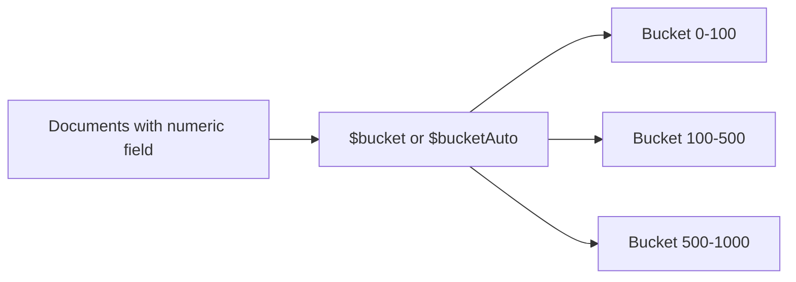

# How to Use $bucket and $bucketAuto in MongoDB Aggregation

Author: [nawazdhandala](https://www.github.com/nawazdhandala)

Tags: MongoDB, Aggregation, $bucket, $bucketAuto, Pipeline, Stage

Description: Learn how to use $bucket and $bucketAuto in MongoDB aggregation to group documents into defined or automatically calculated ranges.

---

## How $bucket and $bucketAuto Work

`$bucket` categorizes documents into user-defined ranges (buckets) based on a numeric field. `$bucketAuto` automatically determines the bucket boundaries by distributing documents as evenly as possible across a specified number of buckets.



## Syntax

### $bucket

```javascript
{
  $bucket: {
    groupBy: <expression>,         // field to group by
    boundaries: [<lower>, ...],    // sorted array defining bucket edges
    default: <literal>,            // optional: bucket name for out-of-range values
    output: {                      // optional: accumulator fields per bucket
      <field>: { <accumulator>: <expression> }
    }
  }
}
```

### $bucketAuto

```javascript
{
  $bucketAuto: {
    groupBy: <expression>,
    buckets: <number>,             // number of buckets to create
    output: {                      // optional: accumulator fields per bucket
      <field>: { <accumulator>: <expression> }
    },
    granularity: "<string>"        // optional: rounding scheme (R5, R10, POWERSOF2, etc.)
  }
}
```

## Examples

### Input Documents

```javascript
[
  { _id: 1, name: "Pen",     price: 5   },
  { _id: 2, name: "Book",    price: 25  },
  { _id: 3, name: "Bag",     price: 75  },
  { _id: 4, name: "Phone",   price: 450 },
  { _id: 5, name: "Laptop",  price: 1200},
  { _id: 6, name: "Monitor", price: 600 },
  { _id: 7, name: "Headset", price: 150 },
  { _id: 8, name: "Tablet",  price: 350 }
]
```

### Example 1 - $bucket with Defined Boundaries

Group products into price ranges. A document with a value less than the first boundary or greater than or equal to the last boundary must have a `default` bucket:

```javascript
db.products.aggregate([
  {
    $bucket: {
      groupBy: "$price",
      boundaries: [0, 100, 500, 1500],
      default: "Other",
      output: {
        count: { $sum: 1 },
        products: { $push: "$name" }
      }
    }
  }
])
```

Output:

```javascript
[
  { _id: 0,    count: 3, products: ["Pen", "Book", "Bag"]              },
  { _id: 100,  count: 3, products: ["Headset", "Tablet", "Phone"]      },
  { _id: 500,  count: 2, products: ["Monitor", "Laptop"]               }
]
```

Note: `_id` represents the lower bound of each bucket. Documents belong to bucket `[lower, upper)`.

### Example 2 - $bucket with a default

A product priced at `5000` would fall outside boundaries `[0, 1500]` and land in the default bucket:

```javascript
db.products.aggregate([
  {
    $bucket: {
      groupBy: "$price",
      boundaries: [100, 500, 1500],
      default: "Budget",     // catches values < 100 AND >= 1500
      output: { count: { $sum: 1 } }
    }
  }
])
```

### Example 3 - $bucketAuto

Automatically divide products into 3 equal-sized buckets:

```javascript
db.products.aggregate([
  {
    $bucketAuto: {
      groupBy: "$price",
      buckets: 3,
      output: {
        count: { $sum: 1 },
        avgPrice: { $avg: "$price" }
      }
    }
  }
])
```

Output (boundaries are computed automatically):

```javascript
[
  { _id: { min: 5,   max: 75  }, count: 3, avgPrice: 35   },
  { _id: { min: 75,  max: 450 }, count: 2, avgPrice: 262.5},
  { _id: { min: 450, max: 1200}, count: 3, avgPrice: 750  }
]
```

`$bucketAuto` output documents have an `_id` object with `min` and `max` instead of a single lower bound.

### Example 4 - $bucketAuto with granularity

Use a granularity scheme to round bucket boundaries to human-friendly numbers:

```javascript
db.products.aggregate([
  {
    $bucketAuto: {
      groupBy: "$price",
      buckets: 4,
      granularity: "POWERSOF2"
    }
  }
])
```

Available granularity values include: `R5`, `R10`, `R20`, `R40`, `R80`, `1-2-5`, `E6`, `E12`, `E24`, `E48`, `E96`, `E192`, `POWERSOF2`.

### Example 5 - $bucket Inside $facet

Combine `$bucket` for price ranges with a category count inside `$facet`:

```javascript
db.products.aggregate([
  {
    $facet: {
      priceDistribution: [
        {
          $bucket: {
            groupBy: "$price",
            boundaries: [0, 100, 500, 1500],
            default: "Other",
            output: { count: { $sum: 1 } }
          }
        }
      ],
      totalProducts: [{ $count: "count" }]
    }
  }
])
```

## $bucket vs $bucketAuto

| Feature | $bucket | $bucketAuto |
|---|---|---|
| Boundaries | Manually defined | Auto-computed |
| Even distribution | Not guaranteed | Attempts even distribution |
| Output `_id` | Lower bound value | `{ min, max }` object |
| `default` bucket | Supported | Not needed |
| Granularity rounding | Not supported | Supported |

## Use Cases

- Building price histograms for e-commerce product pages
- Distributing customers into age groups or salary bands
- Segmenting event data into time buckets
- Generating distribution charts for dashboards

## Summary

`$bucket` groups documents into explicitly defined numeric ranges, while `$bucketAuto` distributes documents into a specified number of auto-computed buckets. Use `$bucket` when you have meaningful business boundaries (price tiers, age groups) and `$bucketAuto` when you want even distribution without caring about exact boundary values. Both stages support accumulator expressions to calculate statistics per bucket.
