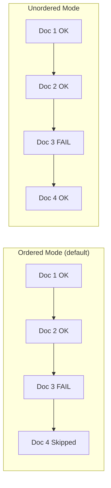

# How to Use Ordered and Unordered Bulk Inserts in MongoDB

Author: [nawazdhandala](https://www.github.com/nawazdhandala)

Tags: MongoDB, Bulk Insert, Insert, CRUD, Performance, Error Handling

Description: Understand the difference between ordered and unordered bulk inserts in MongoDB, when to use each mode, and how to handle partial failures effectively.

---

## How Bulk Insert Ordering Works

When inserting multiple documents with `insertMany()`, MongoDB operates in one of two modes:

- **Ordered mode (default)**: Documents are inserted sequentially. If any document fails (for example, a duplicate key error), MongoDB halts the operation and does not insert subsequent documents.
- **Unordered mode**: MongoDB attempts to insert all documents. If some fail, the operation continues with the remaining ones and reports all errors at the end.



## Ordered Bulk Insert

In ordered mode, a single error stops the entire batch at the point of failure. Documents before the failing document are persisted; those after are not.

```javascript
// Ordered insert - stops at first error
db.inventory.insertMany([
  { _id: 1, item: "Notebook", qty: 50 },
  { _id: 2, item: "Pen", qty: 200 },
  { _id: 2, item: "Pencil", qty: 100 },  // duplicate _id - causes error
  { _id: 4, item: "Eraser", qty: 75 }    // never inserted
])
```

After this operation, only documents with `_id: 1` and `_id: 2` (the first one) are in the collection. The document with `_id: 4` is skipped.

## Unordered Bulk Insert

In unordered mode, all non-failing documents are inserted regardless of position:

```javascript
// Unordered insert - continues past errors
db.inventory.insertMany(
  [
    { _id: 1, item: "Notebook", qty: 50 },
    { _id: 2, item: "Pen", qty: 200 },
    { _id: 2, item: "Pencil", qty: 100 },  // fails - duplicate _id
    { _id: 4, item: "Eraser", qty: 75 }    // inserted successfully
  ],
  { ordered: false }
)
```

After this operation, documents with `_id: 1`, `_id: 2` (Pen), and `_id: 4` are inserted. The duplicate document is skipped but does not block others.

## Handling Errors in Both Modes

Both modes throw a `BulkWriteError` when failures occur, but the error contains different information:

```javascript
try {
  db.records.insertMany(
    [
      { _id: 1, value: "A" },
      { _id: 1, value: "B" },  // duplicate
      { _id: 3, value: "C" }
    ],
    { ordered: false }
  )
} catch (err) {
  print("Write errors count:", err.writeErrors.length)
  err.writeErrors.forEach(writeError => {
    print(`Index ${writeError.index}: code ${writeError.code} - ${writeError.errmsg}`)
  })
  print("Inserted count:", err.result.nInserted)
}
```

## Comparing Performance

Unordered inserts are typically faster for large datasets because MongoDB can parallelize the work across shards and storage engines:

```javascript
// Seeding a large collection - use unordered for speed
const seedData = Array.from({ length: 10000 }, (_, i) => ({
  _id: i + 1,
  value: Math.random() * 1000,
  label: `item-${i + 1}`
}))

db.benchmarkCollection.insertMany(seedData, { ordered: false })
```

## Using bulkWrite() for Mixed Operations

For more control over bulk operations including mixed insert/update/delete, use `bulkWrite()`:

```javascript
db.products.bulkWrite(
  [
    {
      insertOne: {
        document: { _id: 10, name: "Widget A", price: 9.99 }
      }
    },
    {
      insertOne: {
        document: { _id: 11, name: "Widget B", price: 14.99 }
      }
    },
    {
      insertOne: {
        document: { _id: 10, name: "Duplicate Widget" }  // will fail
      }
    }
  ],
  { ordered: false }
)
```

## Choosing the Right Mode

```text
Use ORDERED when:
- Document insertion order matters for your application logic
- You want to stop processing on the first error
- Inserting related documents where later ones depend on earlier ones
- Running migrations where you need clear failure boundaries

Use UNORDERED when:
- Documents are independent of each other
- Maximum throughput is a priority
- You want to insert as many documents as possible despite partial failures
- Importing data where some duplicates are expected and acceptable
```

## Summary

Ordered and unordered bulk inserts give you fine-grained control over error handling behavior in MongoDB. Ordered mode (default) is safer when document order matters or you want a hard stop on the first error. Unordered mode maximizes throughput and resilience by continuing past failures. Always inspect the `BulkWriteError` object to understand which documents were inserted and which failed, especially in unordered mode where multiple errors may accumulate.
