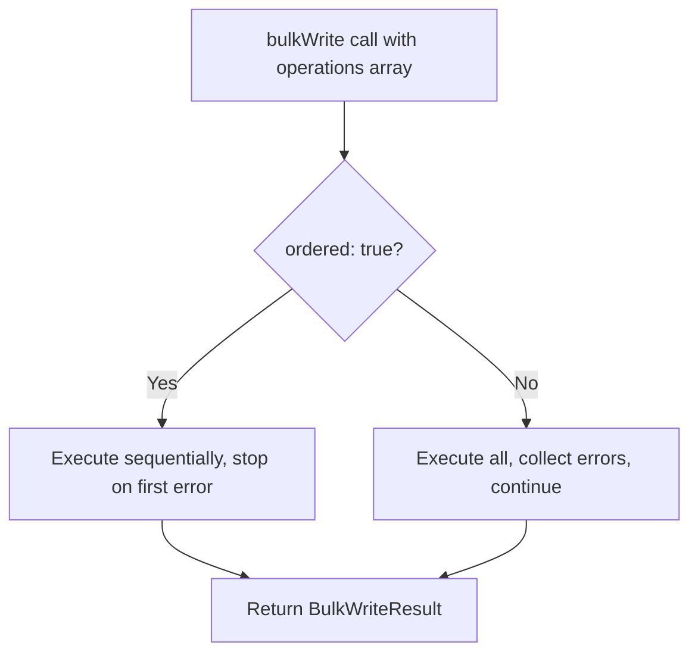

# How to Use bulkWrite() in MongoDB for Batch Operations

Author: [nawazdhandala](https://www.github.com/nawazdhandala)

Tags: MongoDB, BulkWrite, Bulk, CRUD, Performance, Batch

Description: Learn how to use MongoDB's bulkWrite() to execute mixed insert, update, and delete operations in a single efficient batch, with ordered and unordered execution modes.

---

## How bulkWrite() Works

`bulkWrite()` sends a batch of mixed write operations (inserts, updates, replaces, and deletes) to MongoDB in a single network round trip. This dramatically reduces latency compared to executing each operation individually. Like `insertMany()`, it supports both ordered and unordered execution.



## Syntax

```javascript
db.collection.bulkWrite(operations, options)
```

- `operations` - Array of write operation documents
- `options` - Optional settings including `ordered` (default `true`)

## Supported Operation Types

```text
insertOne     - Insert a single document
updateOne     - Update the first matching document
updateMany    - Update all matching documents
replaceOne    - Replace the first matching document
deleteOne     - Delete the first matching document
deleteMany    - Delete all matching documents
```

## Basic Example - Mixed Operations

```javascript
db.inventory.bulkWrite([
  // Insert a new product
  {
    insertOne: {
      document: { _id: 10, name: "Keyboard", price: 79.99, stock: 50 }
    }
  },

  // Update an existing product's price
  {
    updateOne: {
      filter: { _id: 1 },
      update: { $set: { price: 129.99 }, $inc: { updatedCount: 1 } }
    }
  },

  // Delete a discontinued product
  {
    deleteOne: {
      filter: { _id: 5 }
    }
  },

  // Update all products in a category
  {
    updateMany: {
      filter: { category: "Electronics" },
      update: { $inc: { stock: -1 } }
    }
  }
])
```

## insertOne Operation

```javascript
{
  insertOne: {
    document: { field1: value1, field2: value2 }
  }
}
```

## updateOne Operation

```javascript
{
  updateOne: {
    filter: { matchField: value },
    update: { $set: { updateField: newValue } },
    upsert: true  // optional
  }
}
```

## updateMany Operation

```javascript
{
  updateMany: {
    filter: { status: "pending" },
    update: { $set: { status: "processing" } }
  }
}
```

## replaceOne Operation

```javascript
{
  replaceOne: {
    filter: { _id: 3 },
    replacement: { _id: 3, name: "New Name", value: 42 },
    upsert: false  // optional
  }
}
```

## deleteOne and deleteMany Operations

```javascript
// Delete one
{
  deleteOne: {
    filter: { status: "expired" }
  }
}

// Delete all matching
{
  deleteMany: {
    filter: { createdAt: { $lt: new Date("2020-01-01") } }
  }
}
```

## Reading the BulkWriteResult

```javascript
const result = db.products.bulkWrite([
  { insertOne: { document: { name: "New Item", price: 5.99 } } },
  { updateOne: { filter: { _id: 1 }, update: { $inc: { stock: 10 } } } },
  { deleteOne: { filter: { _id: 99 } } }
])

print("Inserted:", result.insertedCount)
print("Matched:", result.matchedCount)
print("Modified:", result.modifiedCount)
print("Deleted:", result.deletedCount)
print("Upserted:", result.upsertedCount)
print("Inserted IDs:", JSON.stringify(result.insertedIds))
```

## Ordered vs Unordered Execution

By default, operations execute in order and stop on the first error:

```javascript
// Ordered (default) - stops at first error
db.collection.bulkWrite(operations, { ordered: true })

// Unordered - continues past errors, all non-failing ops execute
db.collection.bulkWrite(operations, { ordered: false })
```

## Error Handling

```javascript
try {
  db.users.bulkWrite([
    { insertOne: { document: { _id: 1, name: "Alice" } } },
    { insertOne: { document: { _id: 1, name: "Bob" } } },  // duplicate _id
    { insertOne: { document: { _id: 3, name: "Carol" } } }
  ], { ordered: false })
} catch (err) {
  print("Some operations failed:")
  err.writeErrors.forEach(e => {
    print(`  Index ${e.index}: ${e.errmsg}`)
  })
  print("Inserted count:", err.result.nInserted)
}
```

## Real-World Use Case - Sync Operations

Apply a batch of changes received from an external system:

```javascript
function applyChanges(changes) {
  const operations = changes.map(change => {
    if (change.type === "create") {
      return { insertOne: { document: change.data } }
    } else if (change.type === "update") {
      return {
        updateOne: {
          filter: { externalId: change.id },
          update: { $set: change.data },
          upsert: true
        }
      }
    } else if (change.type === "delete") {
      return { deleteOne: { filter: { externalId: change.id } } }
    }
  }).filter(Boolean)

  if (operations.length === 0) return

  return db.records.bulkWrite(operations, { ordered: false })
}
```

## Performance Benefit

```text
Individual operations (100 items): 100 network round trips
bulkWrite (100 items):             1 network round trip
```

For large batches, performance gains are significant. MongoDB still limits bulk operations to 100,000 operations per batch and 16 MB per operation.

## Use Cases

- Syncing data from an external source (insert new, update changed, delete removed)
- Applying a set of migration changes in a single batch
- Processing a batch of event-driven changes atomically
- Seeding or importing data with mixed operation types
- Applying configuration updates across multiple documents efficiently

## Summary

`bulkWrite()` is the most flexible and efficient way to execute multiple write operations against a MongoDB collection. It accepts any mix of insertOne, updateOne, updateMany, replaceOne, deleteOne, and deleteMany operations in a single call. Use ordered mode (default) when operation sequence matters, and unordered mode for maximum throughput when operations are independent. Always handle `BulkWriteError` for partial failure scenarios, especially in unordered mode. The `BulkWriteResult` provides detailed counts for each operation type.
