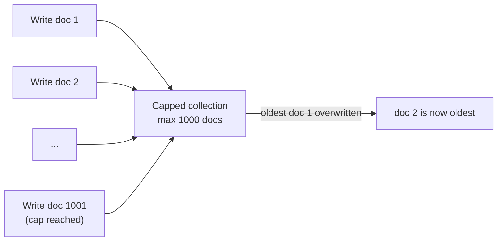

# How to Use MongoDB Capped Collections for Fixed-Size Queues

Author: [nawazdhandala](https://www.github.com/nawazdhandala)

Tags: MongoDB, Capped collection, Queue, Data modeling, Performance

Description: Learn how to use MongoDB capped collections as fixed-size FIFO queues for message buffers, circular event logs, and tailable cursor consumers.

---

## What Is a Capped Collection

A capped collection has a fixed maximum size (in bytes) and an optional maximum document count. When the limit is reached MongoDB automatically overwrites the oldest documents in insertion order without any manual cleanup. This makes capped collections natural FIFO circular buffers.



## Creating a Capped Collection

```javascript
// Create a capped collection: max 100 MB or 10,000 documents, whichever is reached first
db.createCollection("task_queue", {
  capped: true,
  size: 100 * 1024 * 1024,  // 100 MB in bytes (required)
  max:  10000               // max document count (optional)
});

// Verify
db.task_queue.isCapped();  // true
db.runCommand({ collStats: "task_queue" });
```

## Inserting Tasks into the Queue

```javascript
const { MongoClient } = require("mongodb");

const client = new MongoClient(process.env.MONGO_URI);
const db = client.db("jobs");

async function enqueue(task) {
  await db.collection("task_queue").insertOne({
    ...task,
    enqueuedAt: new Date(),
    status: "pending"
  });
}

// Producer: enqueue some work items
await enqueue({ type: "send_email", payload: { to: "alice@example.com" } });
await enqueue({ type: "resize_image", payload: { fileId: "img-42" } });
await enqueue({ type: "generate_report", payload: { reportId: "r-99" } });
```

## Reading from the Queue in Insertion Order

Capped collections maintain strict insertion order. A regular `find()` without a sort returns documents in insertion order.

```javascript
// Read the 20 most recently enqueued tasks
async function recentTasks(limit = 20) {
  return db.collection("task_queue")
    .find({})
    .sort({ $natural: -1 })  // $natural: -1 = reverse insertion order (newest first)
    .limit(limit)
    .toArray();
}

// Read tasks in FIFO order
async function oldestTasks(limit = 20) {
  return db.collection("task_queue")
    .find({})
    .sort({ $natural: 1 })  // $natural: 1 = insertion order (oldest first)
    .limit(limit)
    .toArray();
}
```

## Tailable Cursor: Real-Time Consumer

A tailable cursor blocks and waits for new documents instead of returning immediately when the result set is exhausted. This is the primary pattern for using a capped collection as a message queue.

```javascript
async function consumeQueue(db, processTask) {
  const collection = db.collection("task_queue");

  // tailable: true - cursor stays open when no more docs exist
  // awaitData: true - cursor blocks up to maxAwaitTimeMS waiting for new docs
  const cursor = collection.find(
    { status: "pending" },
    {
      tailable: true,
      awaitData: true,
      maxAwaitTimeMS: 5000
    }
  ).sort({ $natural: 1 });

  console.log("Consumer started, waiting for tasks...");

  for await (const doc of cursor) {
    try {
      await processTask(doc);
      console.log(`Processed task ${doc._id}: ${doc.type}`);
    } catch (err) {
      console.error(`Failed to process task ${doc._id}:`, err.message);
    }
  }
}

// Example task processor
async function processTask(task) {
  console.log(`Processing: ${task.type}`, task.payload);
  // ... actual task logic here
}

consumeQueue(db, processTask);
```

## Using a Resume Token to Continue After Reconnect

Tailable cursors do not survive connection drops. Save the last processed document's natural position using its `_id`.

```javascript
async function resumableConsumer(db, lastProcessedId, processTask) {
  const query = lastProcessedId
    ? { _id: { $gt: lastProcessedId }, status: "pending" }
    : { status: "pending" };

  const cursor = db.collection("task_queue").find(query, {
    tailable: true,
    awaitData: true,
    maxAwaitTimeMS: 3000
  }).sort({ $natural: 1 });

  for await (const doc of cursor) {
    await processTask(doc);
    lastProcessedId = doc._id;
    // Persist lastProcessedId to a checkpoint store so restart can resume
    await saveCheckpoint(db, lastProcessedId);
  }
}

async function saveCheckpoint(db, id) {
  await db.collection("consumer_checkpoints").updateOne(
    { consumerId: "worker-1" },
    { $set: { lastId: id, updatedAt: new Date() } },
    { upsert: true }
  );
}
```

## Limitations of Capped Collections

- Documents cannot be deleted individually; only the oldest documents are removed automatically when the cap is reached.
- Documents can be updated but the updated document size must not change (in-place updates only).
- Capped collections cannot be sharded.
- `$natural` is the only reliable sort order; non-natural sorts require creating an index.

```javascript
// Update is allowed if it doesn't change document size
db.task_queue.updateOne(
  { _id: taskId },
  { $set: { status: "done" } }  // same-size field update is fine
);

// Deleting individual documents is not allowed
// db.task_queue.deleteOne({ _id: taskId });  // throws an error
```

## Converting a Regular Collection to a Capped Collection

```javascript
// Convert an existing collection in-place (acquires a write lock)
db.runCommand({
  convertToCapped: "events",
  size: 50 * 1024 * 1024  // 50 MB
});
```

## Sizing a Capped Queue

```javascript
// Estimate required size:
// - average document size in bytes
// - target number of documents to retain

const avgDocBytes = 512;         // estimate your average document size
const targetDocs  = 50000;       // how many documents to keep

const sizeBytes = avgDocBytes * targetDocs * 1.2;  // 20% headroom
console.log(`Recommended size: ${sizeBytes} bytes`);

db.createCollection("sized_queue", {
  capped: true,
  size: sizeBytes,
  max:  targetDocs
});
```

## Summary

MongoDB capped collections act as fixed-size FIFO circular buffers. Create them with a `size` cap in bytes and an optional `max` document count, insert normally, and read in insertion order using `$natural` sort. The key feature for queue consumers is the tailable cursor with `awaitData: true`, which blocks and yields new documents in real time without polling. Save a checkpoint of the last processed `_id` to resume after reconnection.
