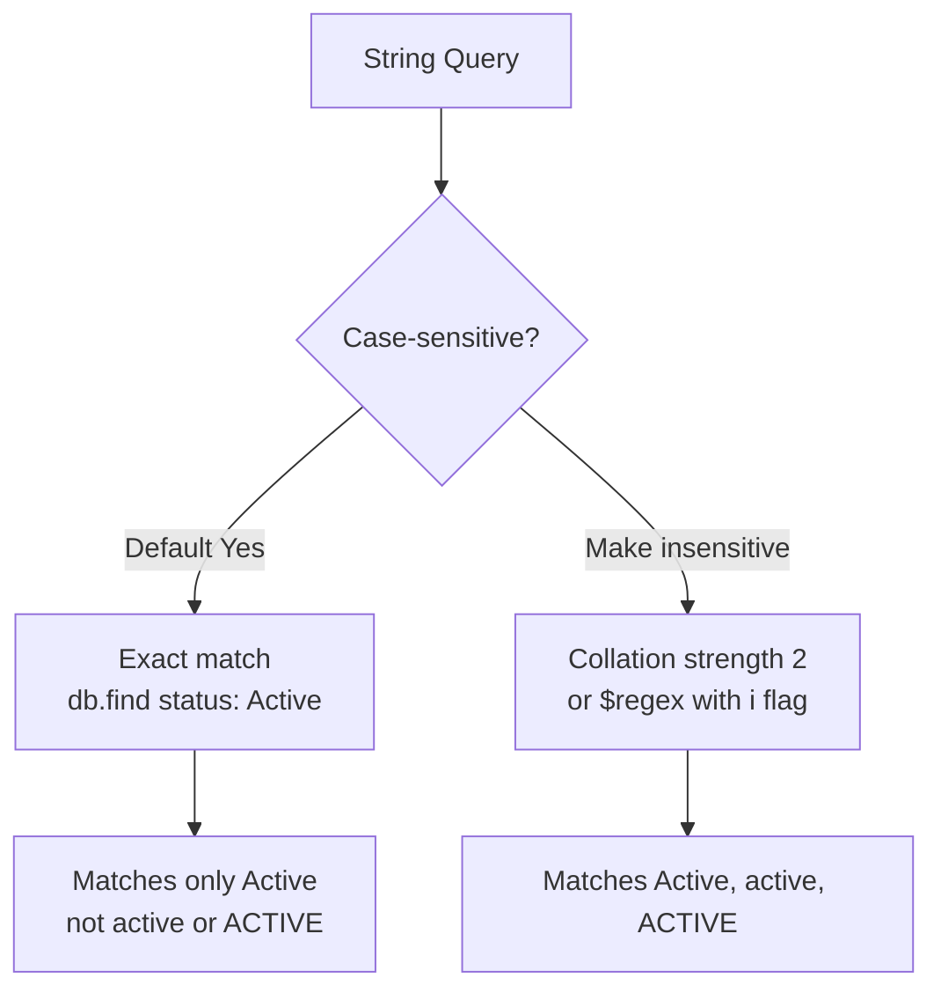
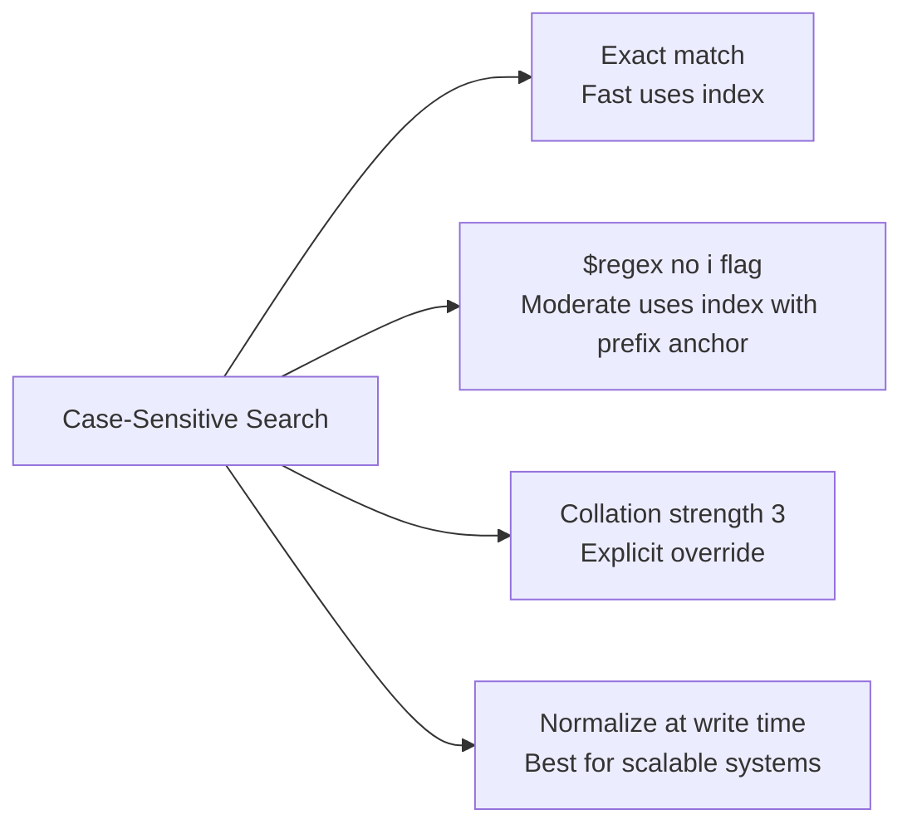

# How to Perform a Case-Sensitive Search in MongoDB

Author: [nawazdhandala](https://www.github.com/nawazdhandala)

Tags: MongoDB, Case-sensitive, Query, Collation, $regex

Description: Learn how MongoDB handles case sensitivity in queries by default, and how to explicitly enforce case-sensitive searches using exact match, $regex, and collation.

---

## Overview

MongoDB string queries are case-sensitive by default. An exact match query like `{ name: "Alice" }` will not match `"alice"` or `"ALICE"`. This guide explains the default behavior and the techniques available for enforcing or relaxing case sensitivity in your queries.



## Default Behavior: Case-Sensitive

By default, all field equality queries in MongoDB are case-sensitive:

```javascript
// Only matches documents where name is exactly "Alice"
db.users.find({ name: "Alice" })

// Does NOT match { name: "alice" } or { name: "ALICE" }
```

This default behavior is a feature - it means your queries are predictable and can use indexes efficiently.

## Enforcing Case-Sensitive Queries

### 1. Exact Match (Default)

The simplest case-sensitive query is an equality match:

```javascript
db.products.find({ category: "Electronics" })
```

This matches `"Electronics"` only. `"electronics"` and `"ELECTRONICS"` are not returned.

### 2. Case-Sensitive Regex

A `$regex` without the `i` flag is case-sensitive:

```javascript
// Case-sensitive pattern match
db.products.find({ name: { $regex: "^MacBook" } })
```

This matches names starting with `"MacBook"` but not `"macbook"` or `"MACBOOK"`.

```javascript
// Exact string match using anchored regex (case-sensitive)
db.users.find({ email: { $regex: "^john@example\\.com$" } })
```

### 3. Collation with strength: 3 (Explicit Case-Sensitive)

MongoDB's default collation is binary, which is already case-sensitive. However, if your collection was created with a case-insensitive collation, you can override it per query:

```javascript
db.users.find(
  { name: "Alice" },
  {},
  { collation: { locale: "en", strength: 3 } }
)
```

`strength: 3` enforces case and accent sensitivity. This is the default binary behavior.

Collation strength levels:

| Strength | Behavior |
|---|---|
| 1 | Base characters only (case and accents ignored) |
| 2 | Base + accents (case ignored) |
| 3 | Base + accents + case (fully sensitive) |

### 4. Normalizing Data at Write Time

The most reliable way to enforce case-sensitive searches is to store data in a canonical form and search using the same form:

```javascript
// Store email in lowercase
db.users.insertOne({
  email: "john@example.com",  // stored lowercase
  name: "John Doe"
})

// Search in lowercase
db.users.find({ email: "john@example.com" })
```

This approach is index-friendly and avoids runtime transformation.

## Case-Sensitive Text Search

MongoDB's `$text` full-text search is always case-insensitive for the languages it supports. If you need case-sensitive full-text search, use `$regex` with anchored patterns or a separate system like Elasticsearch.

## Index Behavior and Case Sensitivity

Standard ascending/descending indexes (`{ field: 1 }`) store values exactly as they are written. Case-sensitive queries on indexed fields use the index correctly:

```javascript
db.users.createIndex({ email: 1 })

// Uses the index and is case-sensitive
db.users.find({ email: "john@example.com" })
```

A case-insensitive collation index must be explicitly created:

```javascript
// This creates a case-insensitive index
db.users.createIndex(
  { name: 1 },
  { collation: { locale: "en", strength: 2 } }
)
```

If the collection has a case-insensitive collation index and you want a case-sensitive query, specify collation strength 3 in the query to override.

## Comparing Approaches



| Approach | Index Use | Performance | Flexibility |
|---|---|---|---|
| Exact equality match | Full index | Best | Exact only |
| `$regex` (anchored) | Partial index | Good | Pattern matching |
| Collation strength 3 | Full index | Good | Override insensitive index |
| Normalize at write | Full index | Best | Requires consistent transforms |

## Summary

MongoDB queries are case-sensitive by default - an equality match on a string field will only return documents with exactly matching case. To make a query explicitly case-sensitive when dealing with case-insensitive indexes or collations, use `collation: { locale: "en", strength: 3 }`. For pattern-based case-sensitive searches, use `$regex` without the `i` flag. For the best performance and predictability in large systems, normalize string data to a canonical case at write time and query using that same form.
