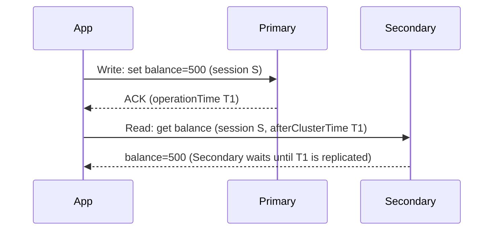

# How to Use Causally Consistent Sessions in MongoDB

Author: [nawazdhandala](https://www.github.com/nawazdhandala)

Tags: MongoDB, Session, Causal consistency, Replica set, Read

Description: Learn how MongoDB causally consistent sessions guarantee that reads always see the effects of previous writes in the same session, even across replica set members.

---

## What Is Causal Consistency

In a distributed system a client may write to the primary and then read from a secondary that has not yet replicated that write. The client sees a stale view of its own data. Causal consistency guarantees that within a session, reads always reflect writes that happened earlier in the same session, regardless of which replica serves the read.



Without causal consistency the secondary might return the old value if replication is lagging.

## Starting a Causally Consistent Session

```javascript
const { MongoClient } = require("mongodb");

const client = new MongoClient(process.env.MONGO_URI);
await client.connect();
const db = client.db("myapp");

// Start a causally consistent session
const session = client.startSession({
  causalConsistency: true  // default is true on MongoDB 3.6+
});
```

## Reading Your Own Writes

The classic use case: write a document and immediately read it back from a secondary.

```javascript
async function updateAndVerify(userId, newEmail) {
  const session = client.startSession({ causalConsistency: true });

  try {
    // Write to primary (w: majority ensures the write is durable on a majority of nodes)
    await db.collection("users").updateOne(
      { _id: userId },
      { $set: { email: newEmail, updatedAt: new Date() } },
      {
        session,
        writeConcern: { w: "majority" }
      }
    );

    // Read from a secondary - causal consistency guarantees we see the write above
    const user = await db.collection("users").findOne(
      { _id: userId },
      {
        session,
        readPreference: "secondaryPreferred",
        readConcern: { level: "majority" }
      }
    );

    console.log(`Email updated: ${user.email}`);  // will be newEmail, not stale
    return user;
  } finally {
    await session.endSession();
  }
}
```

## Chaining Multiple Operations Causally

All operations in the same session are ordered causally. Each write advances the session's `operationTime` and `clusterTime`, which are sent with subsequent reads.

```javascript
async function createAndEnrich(db, itemData) {
  const session = client.startSession({ causalConsistency: true });

  try {
    // Operation 1: insert the item
    const insertResult = await db.collection("items").insertOne(
      { ...itemData, createdAt: new Date() },
      { session, writeConcern: { w: "majority" } }
    );
    const itemId = insertResult.insertedId;

    // Operation 2: read it back (causally consistent - guaranteed to see the insert)
    const item = await db.collection("items").findOne(
      { _id: itemId },
      { session, readConcern: { level: "majority" } }
    );

    // Operation 3: create related document that references the item
    await db.collection("item_tags").insertOne(
      { itemId, tags: itemData.tags || [], createdAt: new Date() },
      { session, writeConcern: { w: "majority" } }
    );

    return item;
  } finally {
    await session.endSession();
  }
}
```

## Advancing Session Cluster Time Manually

You can advance a session's `clusterTime` to synchronise two separate sessions (across different clients).

```javascript
async function synchronisedRead(db, sourceSession) {
  // Get the current clusterTime and operationTime from a session that just wrote
  const clusterTime  = sourceSession.clusterTime;
  const operationTime = sourceSession.operationTime;

  // Start a new session on a different client and advance it
  const reader = client.startSession({ causalConsistency: true });
  reader.advanceClusterTime(clusterTime);
  reader.advanceOperationTime(operationTime);

  try {
    // This read is guaranteed to see everything sourceSession has written
    return db.collection("orders").find(
      {},
      { session: reader, readConcern: { level: "majority" } }
    ).toArray();
  } finally {
    await reader.endSession();
  }
}
```

## Causal Consistency with Transactions

Inside a multi-document transaction MongoDB already provides snapshot isolation (reads see a consistent snapshot of the data as of the transaction start). Causal consistency at the session level complements this by ensuring the snapshot is at least as recent as the session's last operation time.

```javascript
async function readThenWrite(db, userId) {
  const session = client.startSession({ causalConsistency: true });

  try {
    session.startTransaction({
      readConcern:  { level: "snapshot" },
      writeConcern: { w: "majority" }
    });

    const balance = await db.collection("accounts")
      .findOne({ _id: userId }, { session });

    if (!balance || balance.amount < 100) {
      throw new Error("Insufficient balance");
    }

    await db.collection("accounts").updateOne(
      { _id: userId },
      { $inc: { amount: -100 } },
      { session }
    );

    await session.commitTransaction();
    return balance.amount - 100;
  } catch (err) {
    await session.abortTransaction().catch(() => {});
    throw err;
  } finally {
    await session.endSession();
  }
}
```

## When Causal Consistency Applies

| Scenario | Causal consistency useful? |
|---|---|
| Write then read in same session | Yes |
| Read from secondary after writing to primary | Yes |
| Two independent clients sharing data | Use `advanceClusterTime` / `advanceOperationTime` |
| Read-only workload | No benefit |
| Sharded cluster | Yes, supported across shards |

## Performance Consideration

Causal consistency adds a small latency overhead to reads from secondaries because the secondary must wait until it has replicated up to the session's `operationTime`. Use `readPreference: "primary"` or `readPreference: "primaryPreferred"` when low latency is more important than read scaling, and `readPreference: "secondaryPreferred"` when read scaling is the priority and slight additional latency is acceptable.

## Summary

MongoDB causally consistent sessions ensure that within a single session, every read sees the effects of all preceding writes, even when the read is served by a secondary replica. Start a session with `causalConsistency: true`, pass the `session` object to every operation, and use `readConcern: "majority"` with `writeConcern: "majority"` for the strongest guarantee. Use `advanceClusterTime` to propagate causal ordering across independent client sessions.
