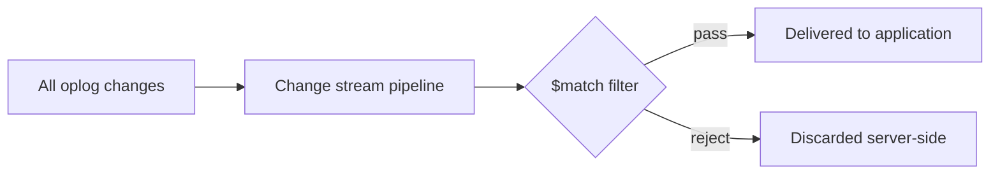

# How to Filter Change Stream Events by Operation Type in MongoDB

Author: [nawazdhandala](https://www.github.com/nawazdhandala)

Tags: MongoDB, Change Stream, Filter, Aggregation, Real-Time

Description: Learn how to filter MongoDB change stream events by operation type, namespace, field values, and complex conditions using aggregation pipeline stages.

---

MongoDB change streams accept an optional aggregation pipeline that filters which events are delivered to your application. Filtering server-side reduces network traffic and processing overhead compared to discarding unwanted events in application code.

## Available Operation Types

| operationType | Triggered when |
|---|---|
| `insert` | A new document is inserted |
| `update` | A document field is updated via `$set`, `$inc`, etc. |
| `replace` | A document is fully replaced with `replaceOne` |
| `delete` | A document is deleted |
| `drop` | The collection is dropped |
| `rename` | The collection is renamed |
| `dropDatabase` | The database is dropped |
| `invalidate` | The stream is invalidated (e.g., collection dropped) |

## How Filtering Works



The pipeline runs on the MongoDB server before events are sent to the driver. Only allowed stages are: `$match`, `$project`, `$addFields`, `$replaceRoot`, `$redact`.

## Filtering by Operation Type

### Only Inserts

```javascript
const insertStream = collection.watch([
  { $match: { operationType: "insert" } }
]);

insertStream.on("change", (change) => {
  console.log("New document:", change.fullDocument);
});
```

### Only Updates and Replaces

```javascript
const updateStream = collection.watch([
  { $match: { operationType: { $in: ["update", "replace"] } } }
]);
```

### Exclude Deletes

```javascript
const noDeleteStream = collection.watch([
  { $match: { operationType: { $nin: ["delete"] } } }
]);
```

### Only Deletes

```javascript
const deleteStream = collection.watch([
  { $match: { operationType: "delete" } }
]);

deleteStream.on("change", (change) => {
  const deletedId = change.documentKey._id;
  console.log("Deleted document ID:", deletedId);
});
```

## Filtering by Namespace

Watch a whole database but only process events from specific collections:

```javascript
const db = client.db("shop");

const dbStream = db.watch([
  {
    $match: {
      "ns.coll": { $in: ["orders", "payments"] }
    }
  }
]);

dbStream.on("change", (change) => {
  console.log(`Collection: ${change.ns.coll}, Op: ${change.operationType}`);
});
```

## Filtering by Document Fields (fullDocument)

Filter based on field values in the document. Note: `fullDocument` is only populated on `insert` and `replace` by default; use `updateLookup` for update events.

```javascript
// Only receive inserts of high-value orders
const highValueStream = collection.watch(
  [
    {
      $match: {
        operationType: "insert",
        "fullDocument.total": { $gte: 1000 }
      }
    }
  ]
);
```

### Filtering Updates that Touch Specific Fields

For update events, use `updateDescription.updatedFields`:

```javascript
// Only receive updates that change the "status" field
const statusStream = collection.watch([
  {
    $match: {
      operationType: "update",
      "updateDescription.updatedFields.status": { $exists: true }
    }
  }
]);

statusStream.on("change", (change) => {
  const newStatus = change.updateDescription.updatedFields.status;
  console.log("Order status changed to:", newStatus);
});
```

## Complex Filter: Multiple Conditions

```javascript
// Insert of orders in the "west" region with total >= 500
// OR any status update on orders
const complexStream = orders.watch([
  {
    $match: {
      $or: [
        {
          operationType: "insert",
          "fullDocument.region": "west",
          "fullDocument.total": { $gte: 500 }
        },
        {
          operationType: "update",
          "updateDescription.updatedFields.status": { $exists: true }
        }
      ]
    }
  }
]);
```

## Projecting Change Event Fields

Use `$project` to reduce the event payload sent to the driver:

```javascript
const projectedStream = orders.watch([
  { $match: { operationType: { $in: ["insert", "update"] } } },
  {
    $project: {
      _id: 1,                                    // keep resume token
      operationType: 1,
      documentKey: 1,
      "fullDocument._id": 1,
      "fullDocument.status": 1,
      "fullDocument.total": 1,
      "updateDescription.updatedFields.status": 1
    }
  }
]);
```

## Adding Computed Fields with $addFields

```javascript
const enrichedStream = orders.watch([
  { $match: { operationType: "insert" } },
  {
    $addFields: {
      receivedAt: "$$NOW",
      isLargeOrder: {
        $gte: ["$fullDocument.total", 500]
      }
    }
  }
]);

enrichedStream.on("change", (change) => {
  if (change.isLargeOrder) {
    triggerAlert(change.fullDocument);
  }
});
```

## Filter by Array Field in fullDocument

```javascript
// Receive inserts where items array contains a specific product
const productStream = orders.watch([
  {
    $match: {
      operationType: "insert",
      "fullDocument.items.sku": "NK-AIR-MAX-270"
    }
  }
]);
```

## Watching for Schema Violations

Detect documents with missing required fields on insert:

```javascript
// Flag inserts that are missing the required "email" field
const missingEmailStream = users.watch([
  {
    $match: {
      operationType: "insert",
      "fullDocument.email": { $exists: false }
    }
  }
]);

missingEmailStream.on("change", (change) => {
  console.warn("Insert missing email field:", change.fullDocument._id);
  // Trigger alerting or data quality pipeline
});
```

## Watching Multiple Conditions with $or

```javascript
// Track all deletes AND high-value order inserts
const alertStream = orders.watch([
  {
    $match: {
      $or: [
        { operationType: "delete" },
        {
          operationType: "insert",
          "fullDocument.total": { $gt: 5000 }
        }
      ]
    }
  }
]);
```

## Using fullDocument with updateLookup for Filtered Updates

When filtering updates by document field values, enable `updateLookup` so the full document is available in the filter:

```javascript
const activeOrderUpdates = orders.watch(
  [
    {
      $match: {
        operationType: "update",
        "fullDocument.status": { $in: ["shipped", "delivered"] }
      }
    }
  ],
  { fullDocument: "updateLookup" }   // required to filter on fullDocument for updates
);
```

## Complete Example: Order Notification Service

```javascript
const { MongoClient } = require("mongodb");

async function startNotificationService() {
  const client = new MongoClient(process.env.MONGODB_URI);
  await client.connect();

  const orders = client.db("shop").collection("orders");

  const stream = orders.watch(
    [
      {
        $match: {
          $or: [
            // New order placed
            { operationType: "insert" },
            // Order status changed to shipped or delivered
            {
              operationType: "update",
              "updateDescription.updatedFields.status": {
                $in: ["shipped", "delivered", "cancelled"]
              }
            }
          ]
        }
      }
    ],
    { fullDocument: "updateLookup" }
  );

  for await (const change of stream) {
    const orderId = change.documentKey._id;

    switch (change.operationType) {
      case "insert":
        await sendEmail(change.fullDocument.email, "Order Confirmed", orderId);
        break;
      case "update": {
        const status = change.updateDescription.updatedFields.status;
        await sendEmail(change.fullDocument.email, `Order ${status}`, orderId);
        break;
      }
    }
  }
}
```

## Summary

MongoDB change streams accept an aggregation pipeline for server-side filtering. Use `$match` with `operationType` to filter by operation, `ns.coll` to filter by collection, `updateDescription.updatedFields` to filter by which fields were changed, and `fullDocument.*` to filter by document values (with `updateLookup` enabled for updates). Use `$project` to trim the event payload and `$addFields` to enrich events with computed properties. Server-side filtering reduces driver-to-app traffic and eliminates the need for application-level conditional logic.
