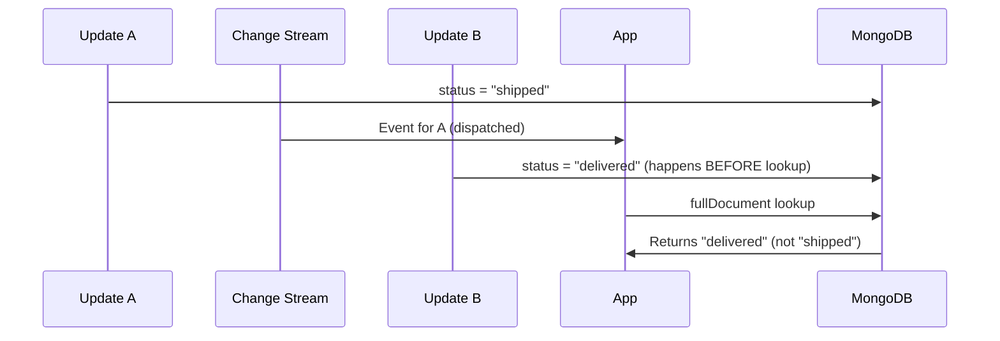

# How to Configure Full Document Updates in MongoDB Change Streams

Author: [nawazdhandala](https://www.github.com/nawazdhandala)

Tags: MongoDB, Change Stream, Full document, updateLookup, Real-Time

Description: Learn how to configure MongoDB change streams to return the full document on update events using fullDocument options, and understand the tradeoffs of each mode.

---

By default, MongoDB change stream update events include only the fields that changed, not the full document. The `fullDocument` option controls whether and how the complete document is fetched for each update event.

## Default Behavior: Partial Updates

Without any `fullDocument` configuration, an update event looks like this:

```javascript
// Default update event -- only changed fields
{
  _id: { _data: "82663fab..." },
  operationType: "update",
  documentKey: { _id: ObjectId("6601aaa000000000000000a1") },
  updateDescription: {
    updatedFields: { status: "shipped" },
    removedFields: [],
    truncatedArrays: []
  }
  // fullDocument is NOT included
}
```

For many use cases -- such as cache invalidation, triggering a downstream process, or logging a specific field change -- this is sufficient. But when downstream consumers need the full document context, the partial update is not enough.

## fullDocument Options

| Option | Behavior |
|---|---|
| `"default"` | No fullDocument on updates; same as not setting the option |
| `"updateLookup"` | Performs a second read to fetch the current document after the update |
| `"whenAvailable"` | Returns the full document if available from pre/post-image store (MongoDB 6.0+) |
| `"required"` | Same as `whenAvailable` but throws an error if not available (MongoDB 6.0+) |

## Using updateLookup

The `updateLookup` mode reads the current state of the document from the primary after the change is detected. This is the most common way to get a full document on updates for MongoDB versions below 6.0:

```javascript
const { MongoClient } = require("mongodb");

const client = new MongoClient(process.env.MONGODB_URI);
await client.connect();

const orders = client.db("shop").collection("orders");

const stream = orders.watch([], {
  fullDocument: "updateLookup"
});

stream.on("change", (change) => {
  if (change.operationType === "update") {
    // change.fullDocument now contains the complete document
    const order = change.fullDocument;
    console.log("Full order after update:", order);
  }
});
```

## What updateLookup Delivers

```javascript
// Update event with fullDocument: "updateLookup"
{
  _id: { _data: "82663fab..." },
  operationType: "update",
  documentKey: { _id: ObjectId("6601aaa000000000000000a1") },
  updateDescription: {
    updatedFields: { status: "shipped", shippedAt: ISODate("...") },
    removedFields: [],
    truncatedArrays: []
  },
  // Full document is now included
  fullDocument: {
    _id: ObjectId("6601aaa000000000000000a1"),
    customerId: ObjectId("..."),
    total: 150.00,
    status: "shipped",
    shippedAt: ISODate("2026-03-31T14:00:00Z"),
    createdAt: ISODate("2026-03-31T08:00:00Z")
  }
}
```

## Important Caveat with updateLookup

The document fetched by `updateLookup` is read *after* the change stream event is dispatched. If another update happens between the event and the lookup, the fetched document may reflect a newer state than the event that triggered the notification.



For applications where exact point-in-time accuracy matters, use post-images with MongoDB 6.0+ instead.

## Using whenAvailable and required (MongoDB 6.0+)

When the collection has `changeStreamPreAndPostImages` enabled, post-images are stored atomically with the write, eliminating the race condition:

```javascript
// First enable post-images on the collection
await db.command({
  collMod: "orders",
  changeStreamPreAndPostImages: { enabled: true }
});

// Then request the post-image
const stream = orders.watch([], {
  fullDocument: "whenAvailable"
});

stream.on("change", (change) => {
  if (change.operationType === "update") {
    // change.fullDocument reflects the document exactly at the time of the update
    console.log("Exact post-update document:", change.fullDocument);
  }
});
```

## Comparing the Modes

```javascript
// Mode 1: default (no fullDocument on updates)
const streamDefault = col.watch([]);
// Use when: you only need changed fields; minimal overhead

// Mode 2: updateLookup (eventual consistency, may reflect later state)
const streamLookup = col.watch([], { fullDocument: "updateLookup" });
// Use when: you need full context; MongoDB < 6.0; slight staleness is acceptable

// Mode 3: whenAvailable (exact post-image; requires collection config)
const streamExact = col.watch([], { fullDocument: "whenAvailable" });
// Use when: you need exact point-in-time accuracy; MongoDB 6.0+

// Mode 4: required (like whenAvailable but errors if image missing)
const streamRequired = col.watch([], { fullDocument: "required" });
// Use when: missing a post-image is unacceptable (audit, finance)
```

## Filtering with fullDocument

With `updateLookup` enabled, you can filter by the current value of fullDocument fields:

```javascript
const stream = orders.watch(
  [
    {
      $match: {
        operationType: "update",
        "fullDocument.status": { $in: ["shipped", "delivered"] }
      }
    }
  ],
  { fullDocument: "updateLookup" }
);
```

Note: because `updateLookup` fetches the current document, not the state at the time of the event, filters on `fullDocument` fields may behave unexpectedly under high write concurrency.

## Projecting fullDocument Fields

After requesting the full document, use `$project` to deliver only the fields your application needs:

```javascript
const stream = orders.watch(
  [
    { $match: { operationType: { $in: ["insert", "update"] } } },
    {
      $project: {
        _id: 1,
        operationType: 1,
        documentKey: 1,
        "fullDocument._id": 1,
        "fullDocument.status": 1,
        "fullDocument.total": 1,
        "fullDocument.customerId": 1,
        "updateDescription.updatedFields": 1
      }
    }
  ],
  { fullDocument: "updateLookup" }
);
```

## Real-World: Keeping a Read Model in Sync

```javascript
async function syncReadModel() {
  const writeDb = client.db("shop");
  const readDb = client.db("shopRead");

  const stream = writeDb.collection("products").watch(
    [{ $match: { operationType: { $in: ["insert", "update", "replace", "delete"] } } }],
    { fullDocument: "updateLookup" }
  );

  for await (const change of stream) {
    const id = change.documentKey._id;

    switch (change.operationType) {
      case "insert":
      case "replace":
        await readDb.collection("productsSummary").replaceOne(
          { _id: id },
          {
            _id: id,
            name: change.fullDocument.name,
            price: change.fullDocument.basePrice,
            inStock: change.fullDocument.inStock,
            rating: change.fullDocument.rating
          },
          { upsert: true }
        );
        break;

      case "update":
        // Apply only the changed fields to the read model
        const setFields = {};
        const changed = change.updateDescription.updatedFields;
        if ("name" in changed) setFields.name = changed.name;
        if ("basePrice" in changed) setFields.price = changed.basePrice;
        if ("inStock" in changed) setFields.inStock = changed.inStock;
        if ("rating" in changed) setFields.rating = changed.rating;

        if (Object.keys(setFields).length > 0) {
          await readDb.collection("productsSummary").updateOne(
            { _id: id },
            { $set: setFields }
          );
        }
        break;

      case "delete":
        await readDb.collection("productsSummary").deleteOne({ _id: id });
        break;
    }
  }
}
```

## fullDocument for Replace Operations

Replace operations always include the full document even without any special configuration, because a replace replaces the entire document:

```javascript
// replaceOne always provides fullDocument
{
  operationType: "replace",
  documentKey: { _id: ObjectId("...") },
  fullDocument: { /* the new complete document */ }
}
```

## fullDocument for Insert Operations

Insert operations always include the full document in the change event regardless of the `fullDocument` setting:

```javascript
// insert always provides fullDocument
{
  operationType: "insert",
  documentKey: { _id: ObjectId("...") },
  fullDocument: { /* the newly inserted document */ }
}
```

## Summary

The `fullDocument` option controls how MongoDB provides the complete document on update events. Use `"updateLookup"` to get the current document state with a post-change read -- be aware it may reflect later writes. Use `"whenAvailable"` or `"required"` with MongoDB 6.0+ and `changeStreamPreAndPostImages` enabled on the collection to get the exact post-update snapshot atomically stored with the write. For insert and replace events, the full document is always included. Pair `fullDocument: "updateLookup"` with `$project` to reduce payload size and with `$match` on `fullDocument` fields to filter events server-side.
