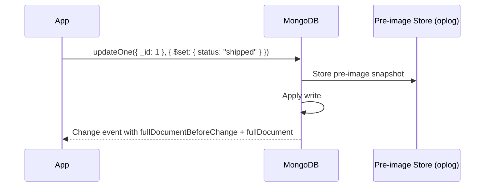

# How to Use Pre-Image and Post-Image in MongoDB Change Streams

Author: [nawazdhandala](https://www.github.com/nawazdhandala)

Tags: MongoDB, Change Stream, Pre-Image, Post-Image, Real-Time

Description: Learn how to configure MongoDB change streams to receive the full document state before and after a change using pre-image and post-image change stream options.

---

By default, update events in a MongoDB change stream include only the changed fields, not the full document before or after the change. Pre-images and post-images change that -- they give you the complete document snapshot before and after every write operation.

## Pre-Image vs. Post-Image

| Feature | What it provides |
|---|---|
| Pre-image | The full document as it existed *before* the write |
| Post-image | The full document as it exists *after* the write |

This is essential for audit logging, diff computation, event sourcing, and CDC (Change Data Capture) pipelines.

## Enabling Pre-Image and Post-Image on a Collection

Pre-images and post-images must be enabled at the collection level first. This requires MongoDB 6.0+ or MongoDB Atlas with the feature enabled.

```javascript
// Enable both pre-image and post-image on the collection
await db.command({
  collMod: "orders",
  changeStreamPreAndPostImages: { enabled: true }
});
```

Or when creating the collection:

```javascript
await db.createCollection("orders", {
  changeStreamPreAndPostImages: { enabled: true }
});
```

## Architecture



Pre-images are stored in a special system collection (`config.system.preimages`) and are automatically purged based on the oplog window.

## Requesting Pre-Image in a Change Stream

```javascript
const changeStream = db.collection("orders").watch([], {
  fullDocumentBeforeChange: "whenAvailable"
  // options: "off" | "whenAvailable" | "required"
});

changeStream.on("change", (change) => {
  if (change.operationType === "update") {
    console.log("Before:", change.fullDocumentBeforeChange);
    console.log("After (updated fields only):", change.updateDescription.updatedFields);
  }
});
```

## Requesting Post-Image in a Change Stream

```javascript
const changeStream = db.collection("orders").watch([], {
  fullDocument: "whenAvailable"
  // options: "default" | "updateLookup" | "whenAvailable" | "required"
});

changeStream.on("change", (change) => {
  if (change.operationType === "update") {
    console.log("After:", change.fullDocument);
  }
});
```

## Requesting Both Pre-Image and Post-Image

```javascript
const changeStream = db.collection("orders").watch([], {
  fullDocumentBeforeChange: "whenAvailable",
  fullDocument: "whenAvailable"
});

changeStream.on("change", (change) => {
  const before = change.fullDocumentBeforeChange;
  const after = change.fullDocument;
  console.log("Before:", before);
  console.log("After:", after);
});
```

## whenAvailable vs. required

| Option | Behavior when pre/post-image is not available |
|---|---|
| `whenAvailable` | Returns `null` -- stream continues |
| `required` | Throws an error -- fails fast |

Use `required` when your pipeline cannot proceed without the full document (e.g., audit logging where missing a pre-state is unacceptable).

## Full Change Event with Pre and Post Images

```javascript
// What an update event looks like with both images enabled
{
  _id: { _data: "82663fab..." },
  operationType: "update",
  clusterTime: Timestamp,
  ns: { db: "shop", coll: "orders" },
  documentKey: { _id: ObjectId("6601aaa000000000000000a1") },

  // Pre-image: complete document before the update
  fullDocumentBeforeChange: {
    _id: ObjectId("6601aaa000000000000000a1"),
    customerId: ObjectId("..."),
    total: 150.00,
    status: "pending",
    createdAt: ISODate("2026-03-31T08:00:00Z")
  },

  // Post-image: complete document after the update
  fullDocument: {
    _id: ObjectId("6601aaa000000000000000a1"),
    customerId: ObjectId("..."),
    total: 150.00,
    status: "shipped",
    shippedAt: ISODate("2026-03-31T14:00:00Z"),
    createdAt: ISODate("2026-03-31T08:00:00Z")
  },

  // Standard update description still included
  updateDescription: {
    updatedFields: { status: "shipped", shippedAt: ISODate("2026-03-31T14:00:00Z") },
    removedFields: [],
    truncatedArrays: []
  }
}
```

## Use Case: Audit Log with Before/After

```javascript
const changeStream = db.collection("accounts").watch(
  [{ $match: { operationType: { $in: ["update", "replace", "delete"] } } }],
  {
    fullDocumentBeforeChange: "required",
    fullDocument: "whenAvailable"
  }
);

for await (const change of changeStream) {
  await db.collection("auditLog").insertOne({
    entityType: "account",
    entityId: change.documentKey._id,
    operation: change.operationType,
    before: change.fullDocumentBeforeChange,
    after: change.fullDocument || null,
    changedFields: change.updateDescription?.updatedFields || null,
    timestamp: new Date(),
    clusterTime: change.clusterTime
  });
}
```

## Use Case: Computing a Diff

```javascript
function computeDiff(before, after) {
  const diff = {};
  const allKeys = new Set([
    ...Object.keys(before || {}),
    ...Object.keys(after || {})
  ]);

  for (const key of allKeys) {
    if (key === "_id") continue;
    const beforeVal = before?.[key];
    const afterVal = after?.[key];
    if (JSON.stringify(beforeVal) !== JSON.stringify(afterVal)) {
      diff[key] = { before: beforeVal, after: afterVal };
    }
  }

  return diff;
}

const stream = db.collection("products").watch(
  [{ $match: { operationType: "update" } }],
  { fullDocumentBeforeChange: "whenAvailable", fullDocument: "whenAvailable" }
);

for await (const change of stream) {
  const diff = computeDiff(change.fullDocumentBeforeChange, change.fullDocument);
  console.log("Fields changed:", diff);
}
```

## Use Case: Event Sourcing

```javascript
const stream = db.collection("inventory").watch(
  [],
  {
    fullDocumentBeforeChange: "whenAvailable",
    fullDocument: "whenAvailable"
  }
);

for await (const change of stream) {
  // Publish an event for every write
  await eventBus.publish("inventory.changed", {
    eventType: change.operationType,
    entityId: change.documentKey._id,
    before: change.fullDocumentBeforeChange,
    after: change.fullDocument,
    timestamp: new Date()
  });
}
```

## Use Case: Rollback Detection

Detect when a numeric field decreased unexpectedly:

```javascript
const stream = db.collection("accounts").watch(
  [{ $match: { operationType: "update" } }],
  { fullDocumentBeforeChange: "required", fullDocument: "required" }
);

for await (const change of stream) {
  const balanceBefore = change.fullDocumentBeforeChange.balance;
  const balanceAfter = change.fullDocument.balance;

  if (balanceBefore !== undefined && balanceAfter < balanceBefore - 1000) {
    await sendAlert({
      accountId: change.documentKey._id,
      message: `Large balance decrease: ${balanceBefore} -> ${balanceAfter}`
    });
  }
}
```

## Storage and Retention

Pre-images are stored in `config.system.preimages`. Their retention is tied to the oplog window. When the oplog entry for a write is removed, the corresponding pre-image is also removed. On Atlas, you can configure a longer pre-image retention window.

```javascript
// Check collection pre-image configuration
const info = await db.listCollections({ name: "orders" }).next();
console.log(info.options.changeStreamPreAndPostImages);
// { enabled: true }
```

## Disabling Pre/Post Images

```javascript
await db.command({
  collMod: "orders",
  changeStreamPreAndPostImages: { enabled: false }
});
```

## Summary

Pre-images and post-images in MongoDB change streams provide full document snapshots before and after every write operation. Enable them on the collection with `changeStreamPreAndPostImages: { enabled: true }`, then request them in the stream options using `fullDocumentBeforeChange` and `fullDocument` set to `"whenAvailable"` or `"required"`. Use pre-images for audit logs, diff computation, and rollback detection. Use post-images when you need the full document state on update events rather than only the changed fields. Both images are subject to the same oplog retention window as the change events themselves.
