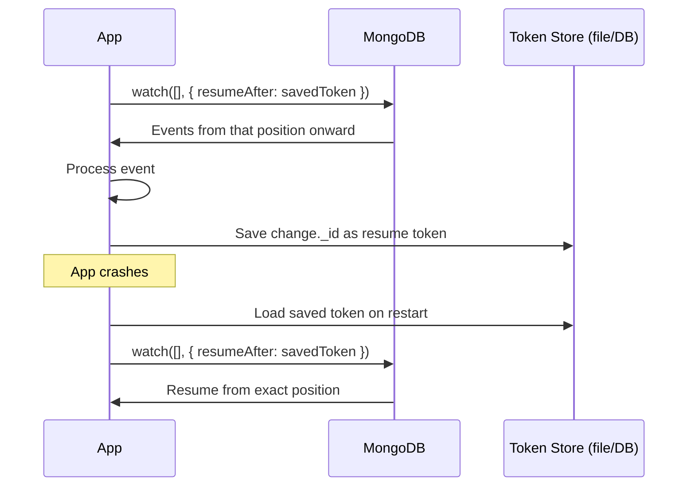

# How to Resume a Change Stream from a Resume Token in MongoDB

Author: OneUptime Team

Tags: MongoDB, Change stream, Resume token, Fault tolerance, Real-time

Description: Learn how to save and use MongoDB change stream resume tokens to reliably restart a stream from the last processed position after a restart or failure.

---

A resume token is a unique identifier attached to every change stream event. By saving this token and passing it back when reopening a stream, your application can pick up exactly where it left off after a crash, restart, or deployment without missing or duplicating events.

## What Is a Resume Token?

Every change event contains an `_id` field that serves as the resume token:

```javascript
{
  _id: {
    _data: "82663FAB120000000229295A1004..."   // opaque hex string
  },
  operationType: "insert",
  // ... rest of the change event
}
```

The token encodes the position in the replica set oplog. MongoDB guarantees that resuming from this token will deliver all subsequent events in order.

## Resume Token Mechanics



## Basic Token Save and Resume

```javascript
const { MongoClient } = require("mongodb");
const fs = require("fs");

const TOKEN_PATH = "/var/data/change-stream-token.json";

function saveToken(token) {
  fs.writeFileSync(TOKEN_PATH, JSON.stringify(token), "utf8");
}

function loadToken() {
  if (!fs.existsSync(TOKEN_PATH)) return null;
  try {
    return JSON.parse(fs.readFileSync(TOKEN_PATH, "utf8"));
  } catch {
    return null;
  }
}

async function runStream() {
  const client = new MongoClient(process.env.MONGODB_URI);
  await client.connect();

  const col = client.db("shop").collection("orders");

  const savedToken = loadToken();
  const options = savedToken ? { resumeAfter: savedToken } : {};

  console.log(savedToken ? "Resuming from saved token" : "Starting fresh stream");

  const stream = col.watch([], options);

  for await (const change of stream) {
    // Process the event BEFORE saving the token
    await processChange(change);

    // Save token AFTER successful processing
    saveToken(change._id);
  }
}
```

## Storing Tokens in MongoDB

For distributed or multi-process consumers, store the token in a MongoDB collection instead of a local file:

```javascript
async function saveTokenToMongo(db, streamName, token) {
  await db.collection("streamTokens").updateOne(
    { streamName },
    { $set: { token, updatedAt: new Date() } },
    { upsert: true }
  );
}

async function loadTokenFromMongo(db, streamName) {
  const doc = await db.collection("streamTokens").findOne({ streamName });
  return doc?.token || null;
}

async function runStreamWithMongoToken(streamName) {
  const client = new MongoClient(process.env.MONGODB_URI);
  await client.connect();

  const db = client.db("shop");
  const col = db.collection("orders");

  const savedToken = await loadTokenFromMongo(db, streamName);
  const options = savedToken ? { resumeAfter: savedToken } : {};

  const stream = col.watch([], options);

  for await (const change of stream) {
    await processChange(change);
    await saveTokenToMongo(db, streamName, change._id);
  }
}
```

## resumeAfter vs. startAfter

| Option | Behavior |
|---|---|
| `resumeAfter` | Resumes *after* the given token. Will error if the token is for an `invalidate` event. |
| `startAfter` | Resumes *after* the given token. Works even if the token is for an `invalidate` event. Preferred for robust resume logic. |

```javascript
// Preferred: startAfter is more resilient
const stream = col.watch([], { startAfter: savedToken });
```

## startAtOperationTime

If you do not have a token but want to start from a specific point in time, use `startAtOperationTime`:

```javascript
const { Timestamp } = require("mongodb");

// Start from 1 hour ago
const oneHourAgo = new Date(Date.now() - 60 * 60 * 1000);
const timestamp = Timestamp.fromNumber(Math.floor(oneHourAgo.getTime() / 1000));

const stream = col.watch([], { startAtOperationTime: timestamp });
```

## Handling Expired Tokens (ChangeStreamHistoryLost)

Resume tokens are only valid while the underlying oplog entry is still on the server. If the application was down longer than the oplog window (default ~24 hours on Atlas), the token is no longer valid:

```javascript
async function resilientStream(col, streamName) {
  const db = col.s.db;
  let token = await loadTokenFromMongo(db, streamName);
  let running = true;

  while (running) {
    const options = token ? { startAfter: token } : {};

    try {
      const stream = col.watch([], options);

      for await (const change of stream) {
        await processChange(change);
        token = change._id;
        await saveTokenToMongo(db, streamName, token);
      }
    } catch (err) {
      if (err.codeName === "ChangeStreamHistoryLost" || err.code === 286) {
        console.warn("Resume token expired. Restarting from now.");
        token = null;
        await saveTokenToMongo(db, streamName, null);
      } else if (err.codeName === "CursorNotFound") {
        console.warn("Cursor lost, reconnecting with last token.");
        // token is still valid, just reconnect
      } else {
        console.error("Unexpected error:", err.message);
        await new Promise(r => setTimeout(r, 2000));
      }
    }
  }
}
```

## Guaranteeing At-Least-Once Processing

Save the token *after* successful processing, not before. This ensures that if the process crashes during event handling, the event will be redelivered:

```javascript
for await (const change of stream) {
  try {
    // 1. Process the event
    await processChange(change);

    // 2. Only save the token after processing succeeds
    await saveToken(change._id);
  } catch (err) {
    console.error("Processing failed:", err);
    // Do NOT save the token -- the event will be redelivered on next start
    throw err;
  }
}
```

## Token Batching for High-Throughput Streams

For high-throughput streams, saving the token after every event may be too slow. Batch the token saves:

```javascript
let pendingToken = null;
let batchCount = 0;
const SAVE_INTERVAL = 100;   // save every 100 events

for await (const change of stream) {
  await processChange(change);
  pendingToken = change._id;
  batchCount++;

  if (batchCount >= SAVE_INTERVAL) {
    await saveToken(pendingToken);
    batchCount = 0;
  }
}

// Always save on clean shutdown
if (pendingToken) await saveToken(pendingToken);
```

Note: batching increases the potential redelivery window at the cost of fewer token writes.

## Complete Production-Ready Example

```javascript
const { MongoClient } = require("mongodb");

async function startChangeConsumer({ uri, database, collection, streamName, handler }) {
  const client = new MongoClient(uri, {
    serverSelectionTimeoutMS: 5000,
    heartbeatFrequencyMS: 10000
  });
  await client.connect();

  const db = client.db(database);
  const col = db.collection(collection);
  const tokens = db.collection("streamTokens");

  async function getToken() {
    const doc = await tokens.findOne({ streamName });
    return doc?.token || null;
  }

  async function setToken(token) {
    await tokens.updateOne(
      { streamName },
      { $set: { token, savedAt: new Date() } },
      { upsert: true }
    );
  }

  let token = await getToken();

  while (true) {
    const options = token ? { startAfter: token } : {};
    const stream = col.watch([], options);

    try {
      for await (const change of stream) {
        await handler(change);
        token = change._id;
        await setToken(token);
      }
    } catch (err) {
      await stream.close().catch(() => {});

      if (err.code === 286) {
        console.warn(`[${streamName}] Token expired, restarting from now`);
        token = null;
        await setToken(null);
      } else {
        console.error(`[${streamName}] Stream error:`, err.message);
        await new Promise(r => setTimeout(r, 2000));
      }
    }
  }
}
```

## Summary

Resume tokens make MongoDB change streams fault-tolerant. Every change event carries an `_id` token that encodes its oplog position. Save this token to durable storage (file, MongoDB collection, Redis) after successfully processing each event, then pass it back via `startAfter` when reopening the stream. Use `startAfter` over `resumeAfter` for broader compatibility. Handle `ChangeStreamHistoryLost` (error code 286) by resetting the token and restarting from the current position when the application was offline longer than the oplog retention window.
