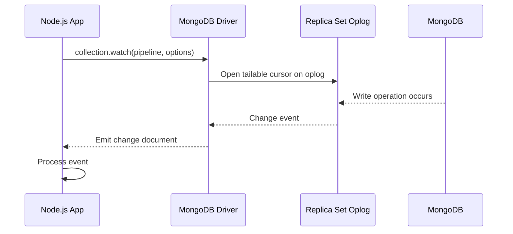

# How to Use Change Streams with MongoDB Node.js Driver

Author: OneUptime Team

Tags: MongoDB, Change stream, Node.js, Real-time, Event-driven

Description: Learn how to open, consume, and manage MongoDB change streams in Node.js, including error handling, resume tokens, and patterns for building reliable real-time applications.

---

MongoDB change streams let you subscribe to a collection, database, or entire deployment and receive events whenever documents are inserted, updated, replaced, or deleted. This guide covers using change streams with the official MongoDB Node.js driver.

## How Change Streams Work



Change streams require a replica set or sharded cluster. Single-node standalone instances do not support them.

## Basic Setup

```javascript
const { MongoClient } = require("mongodb");

const client = new MongoClient(process.env.MONGODB_URI);

async function main() {
  await client.connect();
  const db = client.db("shop");
  const orders = db.collection("orders");

  // Open a change stream on the orders collection
  const changeStream = orders.watch();

  changeStream.on("change", (change) => {
    console.log("Change detected:", JSON.stringify(change, null, 2));
  });

  changeStream.on("error", (err) => {
    console.error("Change stream error:", err);
  });
}

main().catch(console.error);
```

## Understanding the Change Event Document

```javascript
// Insert event
{
  _id: { _data: "82663f1234..." },       // resume token
  operationType: "insert",
  clusterTime: Timestamp,
  ns: { db: "shop", coll: "orders" },
  documentKey: { _id: ObjectId("...") },
  fullDocument: {
    _id: ObjectId("..."),
    customerId: ObjectId("..."),
    total: 150.00,
    status: "pending"
  }
}

// Update event (default -- no fullDocument unless configured)
{
  _id: { _data: "82663f5678..." },
  operationType: "update",
  clusterTime: Timestamp,
  ns: { db: "shop", coll: "orders" },
  documentKey: { _id: ObjectId("...") },
  updateDescription: {
    updatedFields: { status: "shipped", shippedAt: ISODate("...") },
    removedFields: [],
    truncatedArrays: []
  }
}
```

## Listening for Specific Operations

Filter to only receive inserts and updates using an aggregation pipeline:

```javascript
const pipeline = [
  {
    $match: {
      operationType: { $in: ["insert", "update"] }
    }
  }
];

const changeStream = orders.watch(pipeline);

changeStream.on("change", (change) => {
  if (change.operationType === "insert") {
    handleNewOrder(change.fullDocument);
  } else if (change.operationType === "update") {
    handleOrderUpdate(change.documentKey._id, change.updateDescription);
  }
});
```

## Watching a Whole Database

```javascript
const db = client.db("shop");
const changeStream = db.watch();

changeStream.on("change", (change) => {
  const collection = change.ns.coll;
  console.log(`Change in collection: ${collection}`, change.operationType);
});
```

## Requesting Full Document on Update

By default, update events only include the changed fields. Request the full post-update document:

```javascript
const changeStream = orders.watch([], {
  fullDocument: "updateLookup"   // fetch full document on update/replace
});

changeStream.on("change", (change) => {
  if (change.operationType === "update") {
    // change.fullDocument is now the complete document after update
    console.log("Updated order:", change.fullDocument);
  }
});
```

## Resuming from a Token

Save the resume token after processing each event so you can resume from that point if the app restarts:

```javascript
const { MongoClient } = require("mongodb");
const fs = require("fs");
const TOKEN_FILE = "/var/data/resume-token.json";

async function watchWithResume() {
  const client = new MongoClient(process.env.MONGODB_URI);
  await client.connect();

  const orders = client.db("shop").collection("orders");

  // Load saved token if it exists
  let resumeToken = null;
  if (fs.existsSync(TOKEN_FILE)) {
    resumeToken = JSON.parse(fs.readFileSync(TOKEN_FILE, "utf8"));
    console.log("Resuming from saved token");
  }

  const options = resumeToken ? { resumeAfter: resumeToken } : {};
  const changeStream = orders.watch([], options);

  changeStream.on("change", async (change) => {
    try {
      await processChange(change);
      // Persist the token AFTER successful processing
      fs.writeFileSync(TOKEN_FILE, JSON.stringify(change._id), "utf8");
    } catch (err) {
      console.error("Failed to process change:", err);
    }
  });

  changeStream.on("error", (err) => {
    console.error("Change stream error, will restart:", err);
    changeStream.close().then(() => watchWithResume());
  });
}
```

## Async Iterator Pattern

The change stream supports the async iterator protocol, which works well with `for await`:

```javascript
async function processChanges() {
  const client = new MongoClient(process.env.MONGODB_URI);
  await client.connect();

  const changeStream = client.db("shop").collection("orders").watch();

  try {
    for await (const change of changeStream) {
      console.log("Processing:", change.operationType);
      await handleChange(change);
    }
  } catch (err) {
    console.error("Stream error:", err);
  } finally {
    await changeStream.close();
    await client.close();
  }
}
```

## Handling Reconnects and Errors

```javascript
async function reliableChangeStream(collection, pipeline, handler) {
  let resumeToken = null;
  let running = true;

  process.on("SIGINT", () => { running = false; });
  process.on("SIGTERM", () => { running = false; });

  while (running) {
    const options = {};
    if (resumeToken) options.resumeAfter = resumeToken;

    const stream = collection.watch(pipeline, options);

    try {
      for await (const change of stream) {
        if (!running) break;
        await handler(change);
        resumeToken = change._id;
      }
    } catch (err) {
      if (err.code === 286 || err.codeName === "ChangeStreamHistoryLost") {
        // Resume token expired from oplog -- start from now
        console.warn("Resume token expired, starting fresh");
        resumeToken = null;
      } else {
        console.error("Change stream error:", err.message);
        await new Promise(r => setTimeout(r, 1000));   // brief backoff
      }
    } finally {
      await stream.close().catch(() => {});
    }
  }
}

// Usage
await reliableChangeStream(
  client.db("shop").collection("orders"),
  [{ $match: { operationType: "insert" } }],
  async (change) => {
    await sendOrderConfirmationEmail(change.fullDocument);
  }
);
```

## Real-World Example: Cache Invalidation

```javascript
async function watchForCacheInvalidation(redisClient) {
  const products = client.db("shop").collection("products");

  const stream = products.watch([
    { $match: { operationType: { $in: ["update", "replace", "delete"] } } }
  ]);

  for await (const change of stream) {
    const productId = change.documentKey._id.toString();
    const cacheKey = `product:${productId}`;

    await redisClient.del(cacheKey);
    console.log(`Invalidated cache for product ${productId}`);
  }
}
```

## Real-World Example: Audit Log

```javascript
async function auditWatcher() {
  const stream = client.db("crm").watch([
    { $match: { operationType: { $in: ["insert", "update", "delete"] } } }
  ]);

  for await (const change of stream) {
    await db.collection("auditLog").insertOne({
      collection: change.ns.coll,
      operation: change.operationType,
      documentId: change.documentKey._id,
      changes: change.updateDescription || change.fullDocument || null,
      timestamp: new Date(),
      clusterTime: change.clusterTime
    });
  }
}
```

## Closing a Change Stream

Always close the stream when it is no longer needed to free server-side cursors:

```javascript
const changeStream = collection.watch();

// Close after 60 seconds
setTimeout(async () => {
  await changeStream.close();
  console.log("Change stream closed");
}, 60000);

// Or close on application shutdown
process.on("SIGTERM", async () => {
  await changeStream.close();
  await client.close();
  process.exit(0);
});
```

## Summary

Change streams in the MongoDB Node.js driver are opened with `collection.watch()` and consumed via event listeners or the async iterator protocol. Use an aggregation pipeline argument to filter by `operationType` or document fields. Enable `fullDocument: "updateLookup"` to receive the complete document on updates. Persist the `change._id` resume token after each successful event to support reliable restarts without reprocessing. Wrap the stream in a retry loop to handle transient errors, and handle `ChangeStreamHistoryLost` by restarting without a token when the oplog window has been exceeded.
