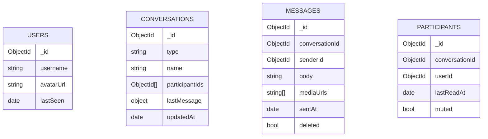

# How to Model a Chat Application Schema in MongoDB

A chat application requires fast reads for loading conversation histories, efficient queries for listing unread messages, and the ability to support both one-on-one and group conversations. MongoDB's document model is well-suited to this use case, especially for embedding participant metadata and recent message previews.

## Core Collections

A chat schema typically involves four collections:

- `users` -- registered users
- `conversations` -- direct message or group chat metadata
- `messages` -- individual messages with conversation reference
- `participants` -- membership and read state per conversation



## Users Collection

```javascript
db.users.insertOne({
  _id: ObjectId("64a1b2c3d4e5f6789abc0001"),
  username: "alice",
  displayName: "Alice Johnson",
  email: "alice@example.com",
  avatarUrl: "https://cdn.example.com/avatars/alice.jpg",
  status: "online",
  lastSeen: new Date()
});

db.users.createIndex({ username: 1 }, { unique: true });
db.users.createIndex({ email: 1 }, { unique: true });
```

## Conversations Collection

Each conversation stores its type (`direct` or `group`), an array of participant IDs, and a denormalized `lastMessage` preview for the conversation list view.

```javascript
// Direct message conversation
db.conversations.insertOne({
  _id: ObjectId("64a1b2c3d4e5f6789abc2001"),
  type: "direct",
  participantIds: [
    ObjectId("64a1b2c3d4e5f6789abc0001"),  // alice
    ObjectId("64a1b2c3d4e5f6789abc0002")   // bob
  ],
  lastMessage: {
    senderId: ObjectId("64a1b2c3d4e5f6789abc0001"),
    body: "Hey, how are you?",
    sentAt: new Date("2024-06-15T14:23:00Z")
  },
  createdAt: new Date("2024-06-01"),
  updatedAt: new Date("2024-06-15T14:23:00Z")
});

// Group chat
db.conversations.insertOne({
  _id: ObjectId("64a1b2c3d4e5f6789abc2002"),
  type: "group",
  name: "Team Alpha",
  avatarUrl: null,
  participantIds: [
    ObjectId("64a1b2c3d4e5f6789abc0001"),
    ObjectId("64a1b2c3d4e5f6789abc0002"),
    ObjectId("64a1b2c3d4e5f6789abc0003")
  ],
  adminIds: [ObjectId("64a1b2c3d4e5f6789abc0001")],
  lastMessage: {
    senderId: ObjectId("64a1b2c3d4e5f6789abc0003"),
    body: "Meeting at 3pm?",
    sentAt: new Date("2024-06-15T15:00:00Z")
  },
  createdAt: new Date("2024-06-01"),
  updatedAt: new Date("2024-06-15T15:00:00Z")
});

db.conversations.createIndex({ participantIds: 1, updatedAt: -1 });
```

## Messages Collection

```javascript
db.messages.insertOne({
  _id: ObjectId("64a1b2c3d4e5f6789abc3001"),
  conversationId: ObjectId("64a1b2c3d4e5f6789abc2001"),
  senderId: ObjectId("64a1b2c3d4e5f6789abc0001"),
  body: "Hey, how are you?",
  mediaUrls: [],
  replyToId: null,      // null if not a reply
  deleted: false,
  editedAt: null,
  sentAt: new Date("2024-06-15T14:23:00Z")
});

db.messages.createIndex({ conversationId: 1, sentAt: -1 });
db.messages.createIndex({ senderId: 1, sentAt: -1 });
```

## Participants Collection (Read Receipts)

Track per-user read state separately to avoid embedding per-user data in each message.

```javascript
db.participants.insertMany([
  {
    _id: ObjectId(),
    conversationId: ObjectId("64a1b2c3d4e5f6789abc2001"),
    userId: ObjectId("64a1b2c3d4e5f6789abc0001"),
    lastReadAt: new Date("2024-06-15T14:25:00Z"),
    muted: false,
    notificationsEnabled: true
  },
  {
    _id: ObjectId(),
    conversationId: ObjectId("64a1b2c3d4e5f6789abc2001"),
    userId: ObjectId("64a1b2c3d4e5f6789abc0002"),
    lastReadAt: new Date("2024-06-15T14:20:00Z"),  // Has unread messages
    muted: false,
    notificationsEnabled: true
  }
]);

db.participants.createIndex({ userId: 1, conversationId: 1 }, { unique: true });
db.participants.createIndex({ conversationId: 1 });
```

## Loading the Conversation List

Fetch all conversations for a user with the latest message preview, sorted by most recent activity.

```javascript
async function getConversationList(db, userId) {
  return db.collection("conversations").aggregate([
    { $match: { participantIds: userId } },
    { $sort: { updatedAt: -1 } },
    { $limit: 50 },
    {
      $lookup: {
        from: "participants",
        let: { convId: "$_id" },
        pipeline: [
          {
            $match: {
              $expr: {
                $and: [
                  { $eq: ["$conversationId", "$$convId"] },
                  { $eq: ["$userId", userId] }
                ]
              }
            }
          }
        ],
        as: "myParticipant"
      }
    },
    { $unwind: { path: "$myParticipant", preserveNullAndEmptyArrays: true } },
    {
      $addFields: {
        hasUnread: {
          $cond: {
            if: { $gt: ["$lastMessage.sentAt", "$myParticipant.lastReadAt"] },
            then: true,
            else: false
          }
        }
      }
    }
  ]).toArray();
}
```

## Sending a Message

When a message is sent, insert it and update the conversation's `lastMessage` denormalized field.

```javascript
async function sendMessage(db, conversationId, senderId, body) {
  const message = {
    _id: ObjectId(),
    conversationId,
    senderId,
    body,
    mediaUrls: [],
    deleted: false,
    sentAt: new Date()
  };

  await db.collection("messages").insertOne(message);

  await db.collection("conversations").updateOne(
    { _id: conversationId },
    {
      $set: {
        lastMessage: { senderId, body, sentAt: message.sentAt },
        updatedAt: message.sentAt
      }
    }
  );

  return message;
}
```

## Counting Unread Messages

```javascript
async function getUnreadCount(db, userId, conversationId) {
  const participant = await db.collection("participants").findOne(
    { userId, conversationId }
  );

  const lastReadAt = participant?.lastReadAt || new Date(0);

  return db.collection("messages").countDocuments({
    conversationId,
    senderId: { $ne: userId },
    sentAt: { $gt: lastReadAt },
    deleted: false
  });
}
```

## Summary

A MongoDB chat schema uses four collections: `users`, `conversations`, `messages`, and `participants`. Store participant IDs as an array in conversations for efficient multikey index lookups. Denormalize the `lastMessage` preview into the conversation document to avoid a join on the conversation list view. Use a separate `participants` collection to track per-user read state and notification preferences. Index `conversationId + sentAt` on messages for fast history pagination and `participantIds + updatedAt` on conversations for the user's inbox view.
