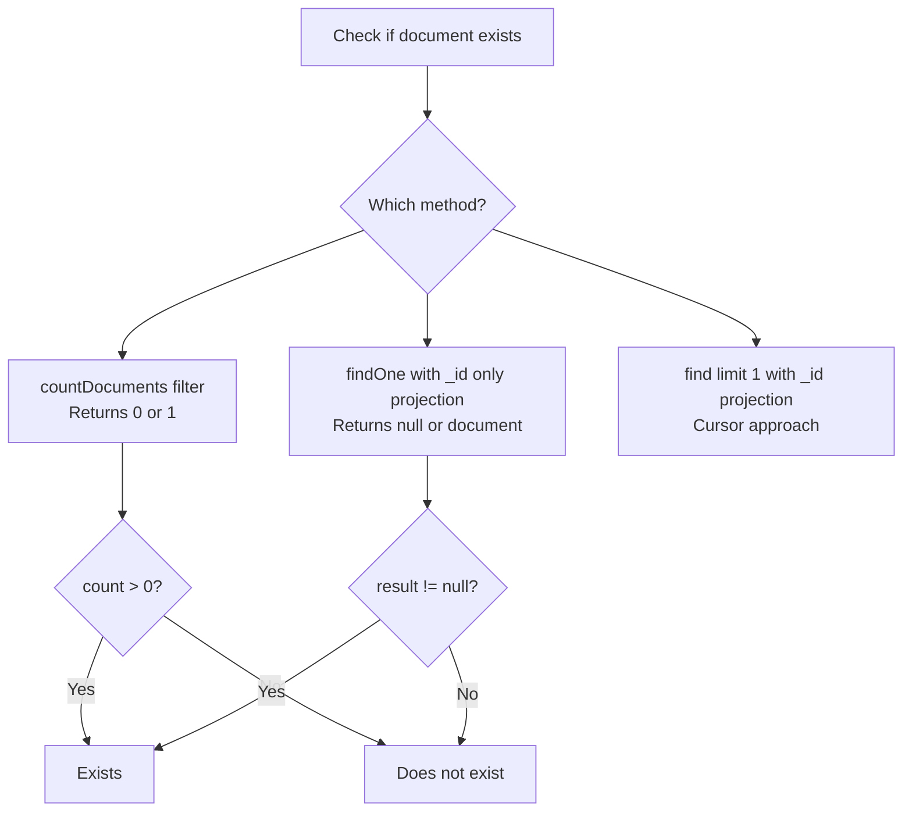

# How to Check if a Document Exists in MongoDB Without Fetching It

Author: [nawazdhandala](https://www.github.com/nawazdhandala)

Tags: MongoDB, countDocuments, findOne, Query, Existence

Description: Learn efficient ways to check if a document exists in MongoDB without transferring the full document, using countDocuments, findOne with projection, and hint.

---

## Overview

Checking whether a document exists is a common operation. Fetching the entire document just to confirm existence wastes bandwidth and memory. MongoDB provides several lightweight approaches to perform an existence check without returning unnecessary data.



## Method 1: countDocuments() with a Limit

The most explicit approach is to use `countDocuments()` with `limit: 1`. The limit prevents MongoDB from scanning beyond the first matching document.

```javascript
const exists = db.users.countDocuments(
  { email: "alice@example.com" },
  { limit: 1 }
) > 0

if (exists) {
  print("User exists")
} else {
  print("User not found")
}
```

Using `limit: 1` is important for performance - it tells MongoDB to stop scanning as soon as one match is found.

## Method 2: findOne() with _id-Only Projection

`findOne()` returns the first matching document or `null`. By projecting only `_id`, you minimize the data transferred from the server:

```javascript
const doc = db.users.findOne(
  { email: "alice@example.com" },
  { _id: 1 }
)

if (doc !== null) {
  print("User exists, id:", doc._id)
} else {
  print("User not found")
}
```

This is often the most practical approach because it also returns the document `_id` if you need it for a follow-up operation.

## Method 3: find() with limit(1) and Projection

An alternative using an explicit cursor:

```javascript
const cursor = db.users.find(
  { email: "alice@example.com" },
  { _id: 1 }
).limit(1)

const exists = cursor.hasNext()
print("Exists:", exists)
```

## Comparing Methods

| Method | Returns | Network Transfer | Use When |
|---|---|---|---|
| `countDocuments({...}, {limit:1})` | `0` or `1` | Count only | Just need boolean result |
| `findOne({...}, {_id: 1})` | Document or `null` | `_id` only | Need `_id` for follow-up |
| `find({...}, {_id:1}).limit(1)` | Cursor | `_id` only | Explicit cursor control |

## Performance Tips

### Always Index the Query Fields

Any existence check is only fast if the filter fields are indexed:

```javascript
db.users.createIndex({ email: 1 }, { unique: true })

// Now this check is an index lookup, not a collection scan
db.users.countDocuments({ email: "alice@example.com" }, { limit: 1 })
```

### Avoid Fetching Unnecessary Fields

Never fetch the full document when only checking existence:

```javascript
// Inefficient - transfers full document
const doc = db.users.findOne({ email: "alice@example.com" })
const exists = doc !== null

// Efficient - transfers only _id
const doc = db.users.findOne(
  { email: "alice@example.com" },
  { _id: 1 }
)
const exists = doc !== null
```

## Example: Conditional Insert (Check Before Insert)

```javascript
const exists = db.users.countDocuments(
  { email: "alice@example.com" },
  { limit: 1 }
) > 0

if (!exists) {
  db.users.insertOne({
    email: "alice@example.com",
    name: "Alice",
    createdAt: new Date()
  })
  print("User created")
} else {
  print("User already exists")
}
```

Note: For atomic insert-or-skip semantics, use an upsert with `updateOne` and `$setOnInsert`, which avoids the race condition between check and insert:

```javascript
db.users.updateOne(
  { email: "alice@example.com" },
  {
    $setOnInsert: {
      email: "alice@example.com",
      name: "Alice",
      createdAt: new Date()
    }
  },
  { upsert: true }
)
```

## In Node.js Driver

```javascript
const { MongoClient } = require("mongodb")

async function userExists(client, email) {
  const collection = client.db("app").collection("users")
  const count = await collection.countDocuments(
    { email: email },
    { limit: 1 }
  )
  return count > 0
}
```

## Summary

To check if a document exists without fetching it, use `countDocuments(filter, { limit: 1 })` for a pure boolean check, or `findOne(filter, { _id: 1 })` when you also need the document `_id`. Always index the filter fields to keep existence checks fast. Avoid fetching full documents just for existence checks. For atomic insert-if-not-exists semantics, use an upsert with `$setOnInsert` instead of a check-then-insert pattern.
