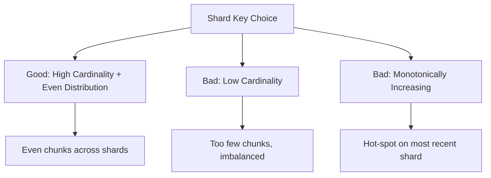

# How to Choose a Shard Key in MongoDB

Author: [nawazdhandala](https://www.github.com/nawazdhandala)

Tags: MongoDB, Sharding, Shard Key, Performance, Data Distribution

Description: Learn how to choose the right shard key in MongoDB to ensure even data distribution, efficient queries, and avoid common pitfalls like hot-spotting and scatter-gather.

---

## Why Shard Key Choice is Critical

The shard key is the field (or compound of fields) that MongoDB uses to distribute data across shards. Once set, a shard key cannot be changed (prior to MongoDB 5.0) without resharding. A poor shard key causes:

- **Hot-spots** - all writes going to one shard.
- **Scatter-gather queries** - every read hitting all shards.
- **Uneven data distribution** - one shard storing much more data than others.

A good shard key provides:
- Even data distribution across shards.
- Targeted (single-shard) queries for most read patterns.
- Monotonic write distribution (for hashed keys).



## Shard Key Properties to Evaluate

### 1. Cardinality

Cardinality is the number of distinct values the shard key can have. MongoDB creates at most one chunk per unique shard key value.

- **High cardinality** (e.g., userId, email, UUID): many chunks, even distribution.
- **Low cardinality** (e.g., boolean, status with 3 values): few chunks, cannot split further.

### 2. Write Distribution

- **Monotonically increasing** values (timestamps, ObjectIDs, auto-incremented integers) route all new inserts to the highest-valued shard, creating a write hot-spot.
- **Hashed shard keys** randomize the distribution of monotonic values.

### 3. Query Targeting

- **Targeted query**: includes the shard key, goes to exactly one shard.
- **Scatter-gather query**: does not include the shard key, hits all shards.

Most reads should be targeted to keep query performance predictable.

## Shard Key Examples

### Good: UUID / Random ID (Hashed)

```javascript
// High cardinality, hash to distribute evenly
sh.shardCollection("myapp.orders", { orderId: "hashed" })
```

Best for: Write-heavy collections where you query by ID.

### Good: Compound (userId + timestamp)

```javascript
sh.shardCollection("myapp.events", { userId: 1, timestamp: 1 })
```

Best for: Multi-tenant apps where queries always filter by userId. The userId provides distribution, timestamp allows range queries within a user's data.

### Good: Geographical Field for Zoned Sharding

```javascript
sh.shardCollection("myapp.users", { region: 1, userId: 1 })
```

Best for: Multi-region apps with zone sharding to keep regional data on regional shards.

### Bad: Timestamp / ObjectID (Range Sharding)

```javascript
// Anti-pattern: monotonically increasing key causes write hot-spot
sh.shardCollection("myapp.events", { timestamp: 1 })
```

Fix: Use a hashed shard key or a compound key that includes a high-cardinality field alongside the timestamp.

### Bad: Boolean or Low-Cardinality Status

```javascript
// Anti-pattern: only 2-3 distinct values, cannot distribute evenly
sh.shardCollection("myapp.orders", { status: 1 })
// status can only be: "active", "completed", "cancelled" = 3 chunks max
```

### Bad: Monotonically Increasing Auto-Increment

```javascript
// Anti-pattern: sequential inserts always go to the last shard
sh.shardCollection("myapp.items", { sequentialId: 1 })
```

Fix: Use hashed sharding on the field: `{ sequentialId: "hashed" }`.

## Evaluating Your Shard Key

Before sharding a collection, test the candidate shard key:

```javascript
// Check cardinality
db.orders.aggregate([
  { $group: { _id: "$customerId" } },
  { $count: "distinctValues" }
])
// Should be >> number of target shards

// Check distribution of top values
db.orders.aggregate([
  { $group: { _id: "$customerId", count: { $sum: 1 } } },
  { $sort: { count: -1 } },
  { $limit: 20 }
])
// Look for concentration - if top 10 values account for 80%+ of documents, distribution will be uneven
```

## Resharding (MongoDB 5.0+)

Starting with MongoDB 5.0, you can reshard a collection online without downtime:

```javascript
db.adminCommand({
  reshardCollection: "myapp.orders",
  key: { customerId: "hashed" }  // new shard key
})
```

Resharding reads all data and redistributes it, which is an intensive operation. Monitor with:

```javascript
db.getSiblingDB("admin").currentOp(
  { type: "op", op: "command", "command.reshardCollection": { $exists: true } }
)
```

## Shard Key Selection Checklist

Work through these questions for each candidate shard key:

```text
Question                                      Target Answer
---------------------------------------------------------------
Cardinality >> number of shards?              Yes
Even distribution across values?              Yes
Queries include this key?                     Yes (for targeting)
Values monotonically increasing?              No (or use hashed)
Values change frequently after insert?        No (shard key immutable until 4.2)
Can handle growth without re-sharding?        Yes
Compound key needed for targeting?            Consider if single key isn't selective
```

## Best Practices

- **Prefer hashed shard keys for monotonic fields** (timestamps, ObjectIDs) to avoid write hot-spots.
- **Include the shard key in your most common query filters** to avoid scatter-gather.
- **Use compound shard keys** when a single field lacks sufficient cardinality or does not match your query patterns.
- **Test with realistic data distributions** before production sharding.
- **Avoid changing shard keys post-deployment** - prefer getting the shard key right before sharding.
- **Use zone sharding** to pin certain key ranges to specific shards (e.g., data residency requirements).
- **Pre-split and pre-populate chunks** for anticipated key ranges before loading large datasets.

## Summary

The shard key determines how MongoDB distributes data across shards. Choose a field with high cardinality, even value distribution, and one that appears in your most common query filters. Avoid monotonically increasing fields for range sharding - use hashed sharding instead. Compound shard keys can combine a coarse distribution field with a range field for query targeting. Test distribution with aggregation queries before committing, as changing a shard key is costly.
