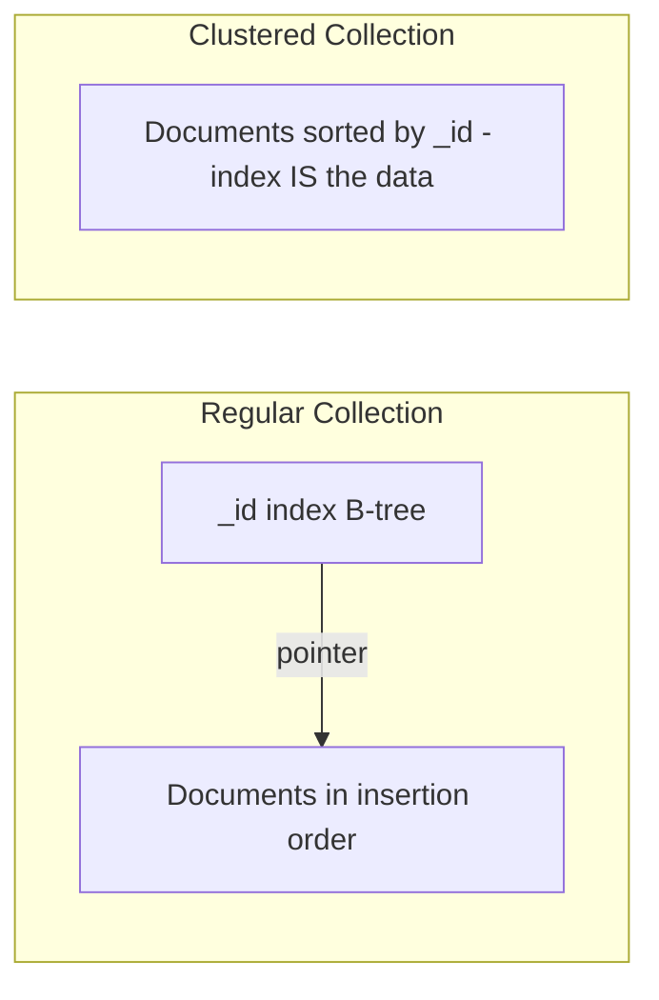

# How to Use Clustered Collections in MongoDB

Author: [nawazdhandala](https://www.github.com/nawazdhandala)

Tags: MongoDB, Clustered Collection, Performance, Storage, Administration

Description: Learn how to create and use MongoDB clustered collections to store documents physically sorted by the _id field, improving range query and TTL performance.

---

## What are Clustered Collections

Introduced in MongoDB 5.3, a clustered collection stores documents in the collection file physically sorted by the `_id` field (the cluster key). In a regular collection, documents are stored in insertion order, and the `_id` index is a separate B-tree structure. In a clustered collection, the index and the data storage are merged.



## Benefits of Clustered Collections

- **Reduced storage** - no separate `_id` index file; the collection itself acts as the index.
- **Faster range queries on `_id`** - documents with nearby `_id` values are stored together on disk.
- **Faster TTL operations** - when `_id` is a time-based value, TTL deletes scan a contiguous range instead of jumping around the collection.
- **Better cache efficiency** - reading a range of `_id` values loads a contiguous block from disk.

## Creating a Clustered Collection

```javascript
db.createCollection("events", {
  clusteredIndex: {
    key: { _id: 1 },
    unique: true,
    name: "events_clustered"
  }
})
```

The `key` must be `{ _id: 1 }` - only the `_id` field can be the cluster key. `unique: true` is required.

## Creating a Clustered Collection with TTL

Combine clustering with TTL for efficient time-based expiration:

```javascript
db.createCollection("sessionEvents", {
  clusteredIndex: {
    key: { _id: 1 },
    unique: true,
    name: "sessionEvents_clustered"
  },
  expireAfterSeconds: 86400   // delete documents 24 hours after their _id timestamp
})
```

For TTL to work correctly on a clustered collection, the `_id` field must be a BSON date or a date embedded in a BSON ObjectId.

## Inserting Documents

Use ObjectId (which encodes a timestamp) as `_id`:

```javascript
db.events.insertOne({
  _id: new ObjectId(),
  userId: "u123",
  type: "page_view",
  url: "/dashboard",
  metadata: { browser: "Chrome", os: "Linux" }
})
```

For time-series-like data where you need more control over the timestamp, use a `Date` directly as `_id`:

```javascript
db.sessionEvents.insertOne({
  _id: new Date(),   // date _id for TTL
  sessionId: "sess-abc",
  event: "login",
  userId: "u456"
})
```

When inserting many documents, preserve `_id` order to minimize page splits:

```javascript
const now = Date.now();
const docs = Array.from({ length: 100 }, (_, i) => ({
  _id: new Date(now + i),
  userId: `u${i}`,
  event: "heartbeat"
}));

db.sessionEvents.insertMany(docs, { ordered: true })
```

## Querying by _id Range

Clustered collections are most efficient for `_id` range queries:

```javascript
const oneHourAgo = new Date(Date.now() - 3600 * 1000);

db.sessionEvents.find({
  _id: {
    $gte: oneHourAgo,
    $lt: new Date()
  }
})
```

Since documents are stored in `_id` order, this query reads a contiguous block from disk instead of jumping to a random location as a B-tree secondary index would.

## Checking if a Collection is Clustered

```javascript
db.getCollectionInfos({ name: "events" })[0].options
```

Output:

```text
{
  clusteredIndex: {
    v: 2,
    key: { _id: 1 },
    name: "events_clustered",
    unique: true
  }
}
```

## Secondary Indexes on Clustered Collections

You can create secondary indexes on any other field:

```javascript
db.events.createIndex({ userId: 1, _id: 1 })
db.events.createIndex({ type: 1 })
```

Secondary indexes on clustered collections store a reference to the cluster key (`_id`) instead of the physical location of the document. This means secondary index lookups are slightly more expensive than in a regular collection (two lookups instead of one).

## Comparing with Regular Collections

For a query like `db.events.find({ _id: { $gte: t1, $lt: t2 } })`:

| Collection Type | How it works |
|----------------|-------------|
| Regular | Uses `_id` B-tree index to find document locations, then fetches documents (potentially scattered on disk) |
| Clustered | Documents ARE in the `_id` order; query scans a contiguous range from the file |

For random single-document lookups by `_id`, the performance difference is minimal.

## When to Use Clustered Collections

Use clustered collections when:
- You frequently query a range of `_id` values.
- `_id` values are monotonically increasing (ObjectId, timestamp, ULID).
- You use TTL-based deletion and `_id` encodes time.
- You want to reduce storage by eliminating the separate `_id` index.

Do not use clustered collections when:
- Most queries use secondary index lookups (the overhead of the two-step lookup may outweigh the benefit).
- Documents are inserted with random `_id` values - this causes many page splits.

## Limitations

- The cluster key must be `_id` - you cannot cluster on another field.
- Clustered collections cannot be converted to regular collections or vice versa after creation.
- Capped collections cannot be clustered.
- Not available on MongoDB versions before 5.3.

## Best Practices

- Pair clustered collections with TTL for event streams, logs, and session data.
- Use ObjectId or date-based `_id` values to ensure monotonically increasing inserts.
- Benchmark your specific workload before migrating from a regular collection - the benefit depends heavily on the query pattern.
- Create secondary indexes only for fields used in application queries; unnecessary secondary indexes add write overhead.

## Summary

MongoDB clustered collections store documents sorted by `_id`, merging the index and data storage into one. This reduces storage overhead, improves range queries on `_id`, and makes TTL operations more efficient. Create them with `db.createCollection()` and the `clusteredIndex` option. They are best suited for append-heavy workloads with time-based `_id` values and TTL expiration, such as event logs, sessions, and audit trails.
