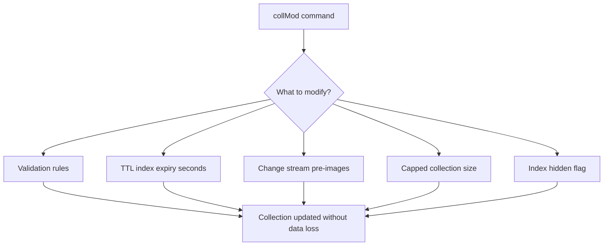
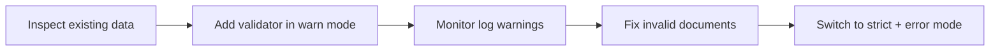

# How to Use collMod to Modify Collection Options in MongoDB

Author: [nawazdhandala](https://www.github.com/nawazdhandala)

Tags: MongoDB, Collection, collMod, Schema Validation, Administration

Description: Learn how to use MongoDB's collMod command to update collection options including validation rules, TTL index expiry, capped size limits, and change stream pre-images.

---

## What is collMod

`collMod` (collection modification) is a MongoDB admin command that modifies options on an existing collection without recreating it. You can use it to add or update validation schemas, change TTL index expiry, convert a capped collection, enable pre-and-post images for change streams, and adjust other collection-level settings.



## Basic Syntax

```javascript
db.runCommand({
  collMod: "collectionName",
  <option>: <value>
});
```

## Modifying Validation Rules

Add or update a JSON Schema validator on an existing collection:

```javascript
db.runCommand({
  collMod: "users",
  validator: {
    $jsonSchema: {
      bsonType: "object",
      required: ["email", "createdAt"],
      properties: {
        email: {
          bsonType: "string",
          pattern: "^.+@.+\\..+$",
          description: "Must be a valid email address"
        },
        age: {
          bsonType: "int",
          minimum: 0,
          maximum: 150,
          description: "Age must be between 0 and 150"
        },
        createdAt: {
          bsonType: "date",
          description: "Must be a date"
        }
      }
    }
  },
  validationLevel: "moderate",   // "off", "strict", or "moderate"
  validationAction: "warn"       // "error" or "warn"
});
```

**validationLevel options:**
- `strict` (default): Validate all inserts and updates
- `moderate`: Validate inserts and updates to documents that already pass validation; do not validate existing invalid documents
- `off`: No validation

**validationAction options:**
- `error` (default): Reject invalid documents
- `warn`: Allow invalid documents but log a warning

## Removing Validation

```javascript
// Remove all validation rules
db.runCommand({
  collMod: "users",
  validator: {},
  validationLevel: "off"
});
```

## Modifying a TTL Index

Change the expiry duration of an existing TTL index without dropping and recreating it:

```javascript
// Create a TTL index
db.sessions.createIndex(
  { lastActive: 1 },
  { expireAfterSeconds: 3600 }   // 1 hour
);

// Update TTL to 7 days (604800 seconds)
db.runCommand({
  collMod: "sessions",
  index: {
    keyPattern: { lastActive: 1 },
    expireAfterSeconds: 604800
  }
});
```

You can also reference the index by name:

```javascript
db.runCommand({
  collMod: "sessions",
  index: {
    name: "lastActive_1",
    expireAfterSeconds: 86400  // 24 hours
  }
});
```

## Hiding and Unhiding an Index

Hide an index so the query planner ignores it without dropping it. Useful for testing whether an index is needed:

```javascript
// Hide the index
db.runCommand({
  collMod: "orders",
  index: {
    name: "status_1",
    hidden: true
  }
});

// Unhide the index
db.runCommand({
  collMod: "orders",
  index: {
    name: "status_1",
    hidden: false
  }
});
```

## Enabling Change Stream Pre-Images

In MongoDB 6.0+, you can enable pre- and post-images for change streams on a collection:

```javascript
// Enable pre-images
db.runCommand({
  collMod: "inventory",
  changeStreamPreAndPostImages: { enabled: true }
});

// Disable pre-images
db.runCommand({
  collMod: "inventory",
  changeStreamPreAndPostImages: { enabled: false }
});
```

With pre-images enabled, change streams can include the full document state before the change:

```javascript
const stream = db.inventory.watch([], {
  fullDocumentBeforeChange: "required"
});
stream.forEach(event => {
  print("Before:", JSON.stringify(event.fullDocumentBeforeChange));
  print("After:", JSON.stringify(event.fullDocument));
});
```

## Converting a Regular Collection to Capped

```javascript
// Convert an existing collection to capped (max 100 MB, max 10000 docs)
db.runCommand({
  collMod: "logs",
  cappedSize: 100 * 1024 * 1024,  // 100 MB in bytes
  cappedMax: 10000
});
```

Note: You cannot convert a capped collection back to a regular collection using `collMod`. You would need to create a new collection and copy data.

## Checking Current Collection Options

```javascript
// View current validation and other options
db.getCollectionInfos({ name: "users" });
```

Output example:

```javascript
[{
  "name": "users",
  "type": "collection",
  "options": {
    "validator": { "$jsonSchema": { ... } },
    "validationLevel": "moderate",
    "validationAction": "warn"
  }
}]
```

## Practical Workflow: Adding Validation to an Existing Collection

```javascript
// Step 1: Inspect existing data to understand schema
db.products.aggregate([
  { $sample: { size: 10 } },
  { $project: { _id: 0 } }
]);

// Step 2: Add validation in warn mode first to catch violations
db.runCommand({
  collMod: "products",
  validator: {
    $jsonSchema: {
      bsonType: "object",
      required: ["sku", "price"],
      properties: {
        sku: { bsonType: "string" },
        price: { bsonType: "double", minimum: 0 }
      }
    }
  },
  validationLevel: "moderate",
  validationAction: "warn"
});

// Step 3: Check logs for validation warnings
// Step 4: Fix any non-conforming documents
// Step 5: Switch to strict + error mode
db.runCommand({
  collMod: "products",
  validationLevel: "strict",
  validationAction: "error"
});
```



## Required Permissions

Running `collMod` requires the `collMod` privilege on the database, which is included in the `dbAdmin` and `dbOwner` built-in roles:

```javascript
// Grant collMod privilege
db.grantRolesToUser("appAdmin", [{ role: "dbAdmin", db: "mydb" }]);
```

## Summary

`collMod` modifies collection-level configuration without touching existing data. The most common uses are: adding or updating JSON Schema validation rules, changing TTL index expiry seconds, hiding or unhiding indexes for testing, enabling change stream pre-images, and converting collections to capped. Always start with `validationAction: "warn"` before enforcing validation to avoid blocking existing writes, and use `db.getCollectionInfos()` to inspect current options before and after changes.
