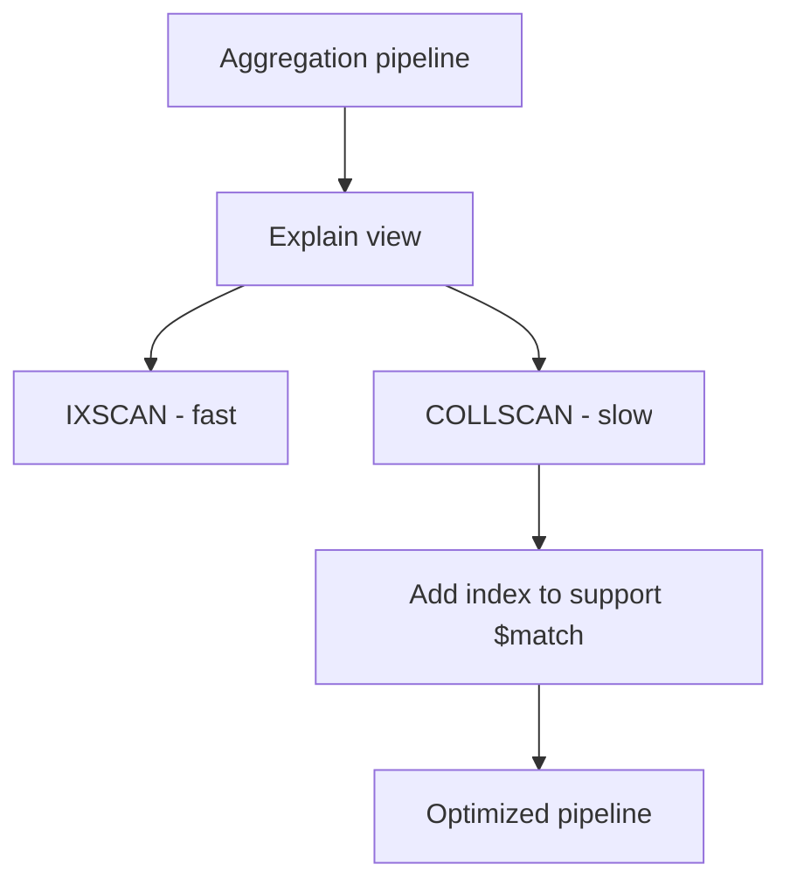

# How to Use MongoDB Compass for Aggregation Building

Author: [nawazdhandala](https://www.github.com/nawazdhandala)

Tags: MongoDB, Compass, Aggregation, Tool, Pipeline

Description: Learn how to use MongoDB Compass Aggregation Pipeline Builder to visually construct, test, and export aggregation pipelines without writing raw JSON by hand.

---

## Why Use Compass for Aggregation

Building aggregation pipelines in the shell requires careful JSON construction and makes it hard to see intermediate results at each stage. MongoDB Compass includes a visual Aggregation Pipeline Builder that shows a preview of documents after each stage, validates syntax in real time, and exports the final pipeline as code in multiple languages.

```mermaid
flowchart LR
    Collection[Collection view] --> Aggregations[Aggregations tab]
    Aggregations --> Stage1[Add stage: $match]
    Stage1 --> Preview1[Preview documents]
    Preview1 --> Stage2[Add stage: $group]
    Stage2 --> Preview2[Preview results]
    Preview2 --> Export[Export pipeline as code]
    Export --> Driver[Paste into application]
```



## Opening the Aggregation Builder

1. Connect to your MongoDB instance in Compass.
2. Select a database from the left sidebar.
3. Select a collection.
4. Click the **Aggregations** tab (next to Documents, Schema, Explain Plan, and Indexes).
5. Click **Add Stage** to start building.

## Adding a $match Stage

Click **Add Stage**, then select `$match` from the stage type dropdown. In the stage editor, type your filter expression:

```javascript
{
  status: "completed",
  createdAt: { $gte: ISODate("2025-01-01"), $lt: ISODate("2026-01-01") }
}
```

The preview panel beneath the stage shows the first few documents that pass the filter. This lets you confirm the filter is correct before proceeding.

## Adding a $group Stage

Add a second stage and select `$group`:

```javascript
{
  _id: "$customerId",
  totalRevenue: { $sum: "$amount" },
  orderCount: { $sum: 1 },
  avgOrderValue: { $avg: "$amount" }
}
```

The preview updates to show grouped results.

## Adding a $sort and $limit Stage

Add a `$sort` stage:

```javascript
{ totalRevenue: -1 }
```

Then add a `$limit` stage:

```javascript
10
```

You now see the top 10 customers by revenue in the preview.

## Adding a $project Stage

Add a `$project` stage to reshape the output:

```javascript
{
  _id: 0,
  customerId: "$_id",
  totalRevenue: { $round: ["$totalRevenue", 2] },
  orderCount: 1,
  avgOrderValue: { $round: ["$avgOrderValue", 2] }
}
```

## Using $lookup for Joins

Add a `$lookup` stage to join with another collection:

```javascript
{
  from: "customers",
  localField: "customerId",
  foreignField: "_id",
  as: "customerDetails"
}
```

Compass renders the joined subdocuments in the preview so you can verify field names before adding a `$unwind`.

## Using the Stage Toolbar

Each stage in Compass has controls:

- **Toggle** (eye icon): Hide or show a stage without deleting it. Useful for debugging intermediate data.
- **Delete** (trash icon): Remove the stage.
- **Drag handle**: Reorder stages by dragging.
- **Collapse/Expand**: Minimize the stage editor to save screen space.

## Sampling and Full Results

By default, Compass shows a preview based on a sample of documents. The count shown in each stage preview is approximate. To run the full pipeline and see all results, click **Run** at the top of the Aggregations tab.

## Exporting the Pipeline as Code

Once the pipeline is working correctly, export it:

1. Click the **Export to Language** button in the top-right of the Aggregations tab.
2. Select a target language: JavaScript, Python, Java, C#, Ruby, PHP, or Go.
3. Copy the generated code into your application.

The exported JavaScript pipeline looks like:

```javascript
db.orders.aggregate([
  {
    $match: {
      status: "completed",
      createdAt: {
        $gte: ISODate("2025-01-01"),
        $lt: ISODate("2026-01-01")
      }
    }
  },
  {
    $group: {
      _id: "$customerId",
      totalRevenue: { $sum: "$amount" },
      orderCount: { $sum: 1 },
      avgOrderValue: { $avg: "$amount" }
    }
  },
  { $sort: { totalRevenue: -1 } },
  { $limit: 10 },
  {
    $project: {
      _id: 0,
      customerId: "$_id",
      totalRevenue: { $round: ["$totalRevenue", 2] },
      orderCount: 1,
      avgOrderValue: { $round: ["$avgOrderValue", 2] }
    }
  }
]);
```

## Saving Pipelines

Compass lets you save frequently used pipelines:

1. Click **Save Pipeline** in the toolbar.
2. Give the pipeline a name.
3. Saved pipelines appear in the **Saved Pipelines** dropdown and persist across sessions.

## Collation and Options

Click **More Options** to configure:

- **Collation**: Set language-specific string comparison rules (e.g., case-insensitive sorting).
- **MaxTimeMS**: Set a timeout for pipeline execution.
- **Comment**: Add a comment to the pipeline for profiler identification.

## Explain Plan for Aggregation

After building the pipeline, switch to the **Explain** view to see how MongoDB executes it. This shows whether the `$match` stage uses an index and where collection scans occur.



## Summary

MongoDB Compass Aggregation Pipeline Builder provides stage-by-stage previews, real-time syntax validation, and one-click code export. Add stages using the dropdown, verify intermediate results in the preview pane, toggle stages on and off for debugging, and export the final pipeline as driver-ready code. Use the Explain view to confirm that early `$match` stages leverage indexes, which is the most important performance consideration for any aggregation pipeline.
