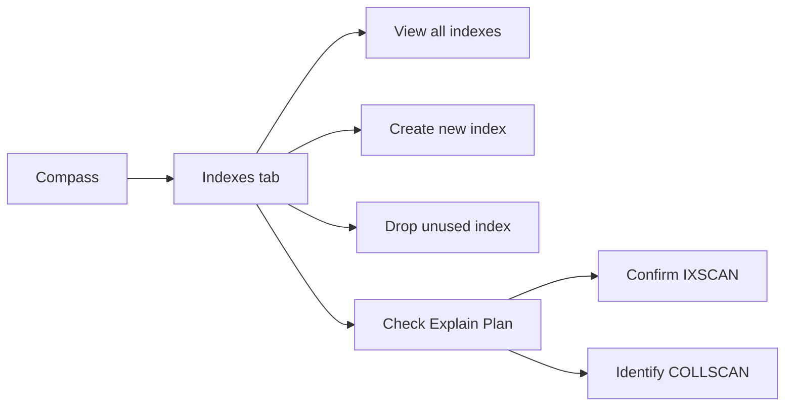
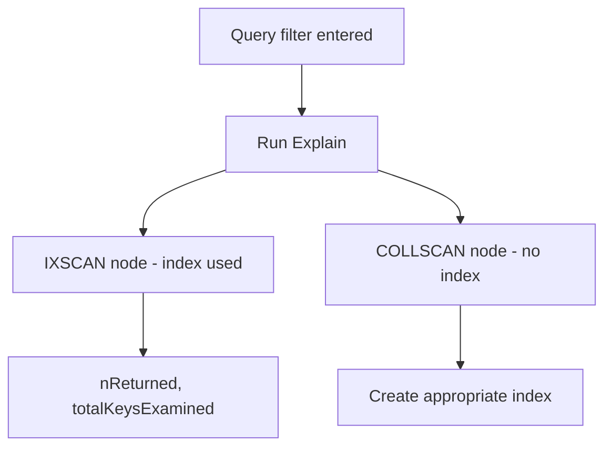

# How to Use MongoDB Compass for Index Management

Author: [nawazdhandala](https://www.github.com/nawazdhandala)

Tags: MongoDB, Compass, Index, Performance, Tool

Description: Learn how to create, inspect, and drop MongoDB indexes using the Compass GUI, including compound, sparse, TTL, and text index types with visual explain plans.

---

## Why Manage Indexes in Compass

The MongoDB shell works well for index management but requires knowing the exact syntax. Compass provides a visual interface where you can see all existing indexes, inspect their properties, create new indexes through a form, and drop unused indexes. The built-in Explain Plan tab shows immediately whether a query uses an index or triggers a collection scan.



## Opening the Indexes Tab

1. Connect to your MongoDB instance in Compass.
2. Select a database and then a collection.
3. Click the **Indexes** tab (visible alongside Documents, Aggregations, Schema, and Explain Plan).

The indexes table shows each index with:
- **Name**: the auto-generated or custom name
- **Type**: Regular, Text, Geo, Hashed, Wildcard
- **Size**: disk space used by the index
- **Usage**: number of query operations that have used this index since last restart
- **Properties**: sparse, unique, TTL, partial, hidden

## Creating a Single Field Index

Click **Create Index** in the top-right, then:

1. Enter a name (optional, MongoDB will generate one if omitted).
2. Click **Add Field** and select the field name from the autocomplete list.
3. Set the sort order to **1** (ascending) or **-1** (descending).
4. Click **Create Index**.

This is equivalent to:

```javascript
db.orders.createIndex({ customerId: 1 })
```

## Creating a Compound Index

Click **Add Field** multiple times to add more fields to the same index:

| Field | Type |
|---|---|
| customerId | 1 (asc) |
| createdAt | -1 (desc) |

```javascript
// Equivalent shell command
db.orders.createIndex({ customerId: 1, createdAt: -1 })
```

The field order in compound indexes matters. The ESR (Equality, Sort, Range) rule suggests placing equality fields first, sort fields second, and range fields last.

## Creating a Unique Index

In the **Options** section of the Create Index form:

- Check **Unique**: prevents duplicate values for the indexed field.

```javascript
db.users.createIndex({ email: 1 }, { unique: true })
```

## Creating a TTL Index

TTL indexes automatically delete documents after a specified number of seconds:

1. Add the date field (e.g., `createdAt`).
2. In **Options**, check **Create TTL** and enter the expiration time in seconds.

```javascript
db.sessions.createIndex({ createdAt: 1 }, { expireAfterSeconds: 86400 })
```

## Creating a Text Index

For full-text search, change the field type to **text** in the dropdown:

```javascript
db.articles.createIndex({ title: "text", body: "text" })
```

You can assign different weights to fields in the shell:

```javascript
db.articles.createIndex(
  { title: "text", body: "text" },
  { weights: { title: 10, body: 1 } }
)
```

## Creating a Partial Index

Partial indexes only index documents that match a filter expression:

In the Create Index form, expand **Options** and enter a **Partial Filter Expression**:

```javascript
{ status: "active" }
```

This is equivalent to:

```javascript
db.orders.createIndex(
  { customerId: 1 },
  { partialFilterExpression: { status: "active" } }
)
```

Partial indexes are smaller and faster than full indexes when most queries target a subset of documents.

## Creating a Sparse Index

A sparse index only includes documents where the indexed field exists:

- In the Create Index form, check **Sparse** in the Options section.

```javascript
db.users.createIndex({ phoneNumber: 1 }, { sparse: true })
```

## Creating a Hidden Index

Hidden indexes are not used by the query planner but remain built on disk. They allow you to test the effect of dropping an index before actually dropping it:

- In the Create Index form, check **Hidden**.

```javascript
db.orders.createIndex({ region: 1 }, { hidden: true })
```

To unhide an index from the shell:

```javascript
db.runCommand({ collMod: "orders", index: { name: "region_1", hidden: false } })
```

## Viewing Index Usage Statistics

The **Usage** column in the Indexes tab shows how many query operations have used each index since the mongod process last restarted. Low or zero usage on an index suggests it may be a candidate for removal.

## Dropping an Index

Click the **Drop** button (trash icon) on the index row you want to remove. Compass will ask for confirmation.

```javascript
// Equivalent shell command
db.orders.dropIndex("customerId_1_createdAt_-1")
```

You cannot drop the `_id` index.

## Using Explain Plan to Verify Index Usage

After creating an index, verify it is used by queries:

1. Click the **Explain Plan** tab.
2. Type your query filter, e.g. `{ customerId: "c123", createdAt: { $gt: ISODate("2025-01-01") } }`.
3. Click **Explain**.
4. The visual tree shows `IXSCAN` (index scan, fast) or `COLLSCAN` (collection scan, slow).



Key metrics to check in the Explain output:

- **nReturned**: number of documents returned
- **totalDocsExamined**: documents scanned (should be close to nReturned)
- **totalKeysExamined**: index keys scanned (should be close to nReturned)

A good index has `totalDocsExamined` close to `nReturned`. A full collection scan has `totalDocsExamined` equal to the entire collection size.

## Index Build Considerations

- Index builds on large collections can take significant time.
- In MongoDB 4.2+, foreground and background builds were unified. Index builds use an optimized protocol that minimizes locking.
- In a replica set, indexes build on the primary first, then replicate to secondaries in a rolling fashion.
- Monitor index build progress with `db.currentOp()` in the mongosh shell.

## Summary

MongoDB Compass Indexes tab provides a visual interface to create, inspect, and drop indexes without writing shell commands. Use the Create Index form to build single-field, compound, unique, TTL, text, partial, sparse, and hidden indexes. Check the Usage column to find underused indexes, and always verify new indexes with the Explain Plan tab to confirm `IXSCAN` is used instead of `COLLSCAN`.
