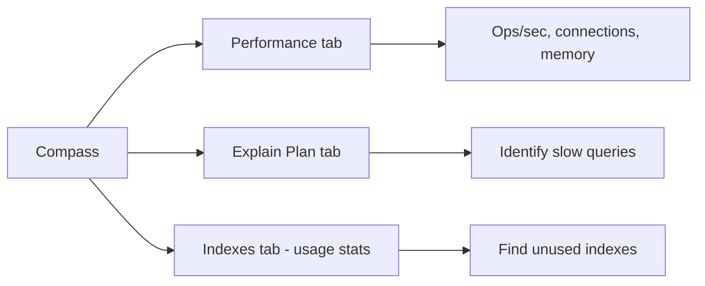
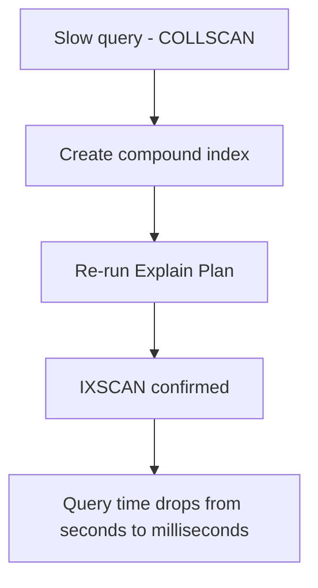

# How to Use MongoDB Compass for Performance Monitoring

Author: [nawazdhandala](https://www.github.com/nawazdhandala)

Tags: MongoDB, Compass, Performance, Monitoring, Index

Description: Learn how to use MongoDB Compass performance tools including real-time server stats, Explain Plan, query profiling, and index advisor to diagnose and fix slow queries.

---

## Performance Tools in Compass

MongoDB Compass includes several features for performance monitoring and optimization:

- **Performance tab**: real-time server metrics
- **Explain Plan tab**: query execution details for individual queries
- **Indexes tab**: index usage statistics
- **Schema tab**: data distribution insights



## Using the Performance Tab

The Performance tab is available at the top-level cluster or server view (before selecting a database). It shows real-time charts for:

- **Operations per second**: reads, writes, commands, and getmore
- **Network**: bytes in and out per second
- **Memory**: resident memory used by mongod
- **Disk**: read and write IOPS
- **Connections**: number of open connections

To open it:

1. Connect to your MongoDB instance.
2. In the left sidebar, click on the server/cluster name (not a specific database).
3. Click **Performance**.

High operation counts with low throughput often indicate inefficient queries or missing indexes. Spikes in resident memory may indicate large query result sets being held in memory.

## Using Explain Plan for a Query

The Explain Plan tab shows exactly how MongoDB executes a specific query:

1. Navigate to a collection.
2. Click **Explain Plan**.
3. Enter your query filter in the query bar, e.g.:

```javascript
{ customerId: "cust_001", status: "pending" }
```

4. Click **Explain**.

The visual tree displays execution stages. Key stages to look for:

| Stage | Meaning |
|---|---|
| IXSCAN | Index scan (efficient) |
| COLLSCAN | Full collection scan (expensive) |
| FETCH | Load documents from disk after an index lookup |
| SORT | In-memory sort (can be slow for large sets) |
| PROJECTION | Field filtering |

## Reading Explain Output Metrics

Below the visual tree, Compass shows:

```
Execution Stats:
  nReturned:          12
  totalDocsExamined:  12
  totalKeysExamined:  12
  executionTimeMillis: 2
```

A healthy query has `totalDocsExamined` close to `nReturned`. A full scan has `totalDocsExamined` equal to the entire collection size even when only a few documents match.

## Identifying a Slow Query and Adding an Index

Scenario: a query is doing a COLLSCAN on a 500,000-document `orders` collection.

Step 1: Open Explain Plan and run:

```javascript
{ customerId: "cust_001", status: "pending" }
```

Step 2: Observe `COLLSCAN` and `totalDocsExamined: 500000`.

Step 3: Navigate to the **Indexes** tab and click **Create Index**. Add fields:

| Field | Type |
|---|---|
| customerId | 1 |
| status | 1 |

Step 4: Return to Explain Plan and run the same query again.

Step 5: Confirm `IXSCAN` is shown and `totalDocsExamined` matches `nReturned`.



## Checking Index Usage Statistics

In the Indexes tab, the **Usage** column shows how many times each index has been used by the query planner since the last mongod restart. Indexes with zero or very low usage are candidates for removal because they consume disk space and slow down write operations.

To verify an index is unused before dropping it, watch its usage counter during a production-like load test.

## Monitoring Connections

Excessive connections can exhaust the mongod connection pool. In the Performance tab, watch the **Connections** chart. If the count is near the `net.maxIncomingConnections` limit (default 1,000,000 but often limited by the OS), application clients may start failing to connect.

Common causes of connection spikes:

- Application connection pools configured too large
- Connection leaks (connections not returned to pool)
- Many short-lived Lambda or serverless function instances each holding a connection

Fix with proper connection pooling:

```javascript
const client = new MongoClient(uri, {
  maxPoolSize: 10,       // max connections per pool
  minPoolSize: 2,        // keep at least 2 connections warm
  serverSelectionTimeoutMS: 5000,
  socketTimeoutMS: 45000
});
```

## Using the Profiler from the Shell

Compass does not have a built-in slow query log viewer, but you can enable the profiler from mongosh and then view the results in the Compass Documents tab:

```javascript
// Enable profiling for queries slower than 100ms
db.setProfilingLevel(1, { slowms: 100 })

// View profiling results
db.system.profile.find().sort({ ts: -1 }).limit(10)
```

Query the `system.profile` collection in Compass by navigating to the `system.profile` collection in the database view.

## Diagnosing Sort Performance

When a query sorts without an index supporting the sort, MongoDB performs an in-memory sort. This is shown as a `SORT` stage in Explain Plan with `memUsage` data.

If `memUsage` approaches 100MB, MongoDB aborts the sort and returns an error. Fix by adding a compound index that covers both the filter and the sort order:

```javascript
// Query: find pending orders sorted by createdAt descending
db.orders.find({ status: "pending" }).sort({ createdAt: -1 })

// Index to support this query
db.orders.createIndex({ status: 1, createdAt: -1 })
```

With this index, the sort is handled by the index traversal order, eliminating the in-memory sort stage.

## Summary

MongoDB Compass provides the Performance tab for real-time server metrics, the Explain Plan tab for per-query analysis, and the Indexes tab for usage statistics. Use Explain Plan to identify COLLSCAN stages and add indexes to replace them with IXSCAN. Check index usage statistics regularly to remove unused indexes that waste write performance. Monitor connections and memory in the Performance tab to catch connection leaks and memory pressure before they affect production workloads.
