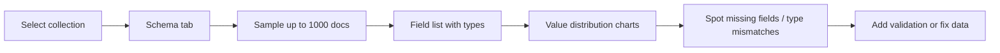
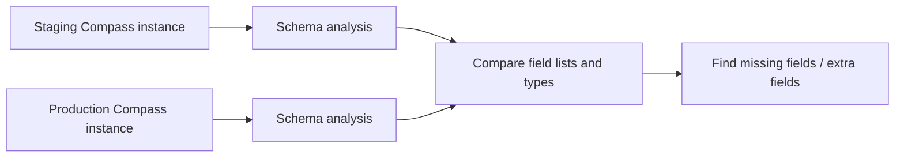

# How to Use MongoDB Compass for Schema Analysis

Author: [nawazdhandala](https://www.github.com/nawazdhandala)

Tags: MongoDB, Compass, Schema, Analysis, Tool

Description: Learn how to use MongoDB Compass Schema tab to analyze field types, value distributions, and data quality issues across a collection without writing any queries.

---

## Why Analyze Schemas in Compass

MongoDB is schema-flexible, which means different documents in the same collection can have different fields and types. This is powerful but can lead to data quality problems over time. The Compass Schema tab samples documents and gives you a visual breakdown of field presence rates, value distributions, and type inconsistencies.



## Opening the Schema Tab

1. Connect to your MongoDB instance in Compass.
2. Select a database and collection.
3. Click the **Schema** tab.
4. Click **Analyze Schema** to start sampling.

By default, Compass samples up to 1,000 documents. For large collections this is usually representative. You can filter the sample using the query bar at the top.

## Reading the Field List

After analysis, Compass shows each field with:

- **Field name and nesting path** (dot notation for subdocuments)
- **Data types detected** shown as colored bars (e.g., String, Int32, Double, Date, Null, ObjectId)
- **Percentage of documents** containing the field

A field present in only 60% of documents indicates optional data. A field showing multiple types (e.g., both String and Int32) suggests inconsistent writes from different application versions.

## Understanding Value Distribution Charts

For string fields, Compass shows a bar chart of the most common values and how often each appears. For numeric fields, it shows a histogram of value ranges. For date fields, it shows a timeline of when values fall.

Example: an `orderStatus` field might show:

```
"pending"    ████████████████████  45%
"completed"  ████████████          30%
"cancelled"  ████████              20%
"refunded"   ███                    5%
```

This reveals the real distribution of your data at a glance.

## Filtering the Schema Sample

Use the query bar to analyze a subset of documents:

```javascript
{ status: "completed", createdAt: { $gte: ISODate("2025-01-01") } }
```

This is useful for comparing the schema of active vs. archived records, or recent vs. old documents written by different application versions.

## Detecting Type Mismatches

If a field shows multiple types, it means documents disagree on that field's type. For example, a `price` field showing both Double and String indicates some records stored prices as numbers and others as strings.

To find documents with the wrong type in the shell:

```javascript
// Find documents where price is stored as a string
db.products.find({ price: { $type: "string" } }).limit(10)

// Find documents where price is stored as a number
db.products.find({ price: { $type: "double" } }).countDocuments()
```

To fix the type:

```javascript
db.products.find({ price: { $type: "string" } }).forEach(doc => {
  db.products.updateOne(
    { _id: doc._id },
    { $set: { price: parseFloat(doc.price) } }
  );
});
```

## Detecting Missing Required Fields

If a required field like `email` appears in only 80% of documents, some records are incomplete. Use the Schema tab to spot this visually, then find the affected documents in the shell:

```javascript
db.users.find({ email: { $exists: false } })
```

Add a missing field in bulk:

```javascript
db.users.updateMany(
  { email: { $exists: false } },
  { $set: { email: null } }
)
```

## Adding JSON Schema Validation

After analyzing the schema and understanding the correct shape, add validation to prevent future bad writes. You can generate a starting point from Compass and refine it:

```javascript
db.runCommand({
  collMod: "users",
  validator: {
    $jsonSchema: {
      bsonType: "object",
      required: ["name", "email", "createdAt"],
      properties: {
        name: { bsonType: "string", description: "Full name, required" },
        email: { bsonType: "string", description: "Email address, required" },
        age: { bsonType: "int", minimum: 0, maximum: 150 },
        createdAt: { bsonType: "date" }
      }
    }
  },
  validationLevel: "moderate",
  validationAction: "warn"
})
```

## Analyzing Nested Documents

Compass expands nested subdocuments in the field list. A field like `address.city` appears as a nested entry under `address`. You can see the type and distribution of individual subfields without flattening the schema manually.

For arrays, Compass shows the types of values found inside the array across all sampled documents.

## Comparing Schema Across Environments

A common workflow is to analyze the schema in both staging and production to verify they match after a migration or deployment:



## Schema Sampling Limits

- Compass samples a maximum of 1,000 documents by default.
- For collections with millions of documents, 1,000 samples may miss rare fields or values.
- Narrow the sample with a query filter to analyze specific document segments.
- For programmatic analysis on the full collection, use the `$sample` aggregation stage with a larger size, or use the `mongocryptd` schema analysis tools.

## Summary

MongoDB Compass Schema tab visually analyzes field presence rates, value distributions, and type consistency across a sampled set of documents. Use it to detect missing required fields, type mismatches from inconsistent application writes, and unexpected value distributions. After analysis, add JSON Schema validation to enforce the correct shape for new writes, and use the shell to backfill or correct existing documents with data quality issues.
