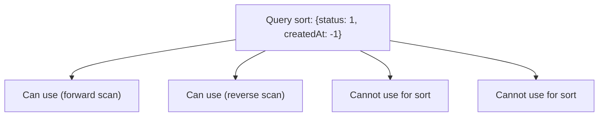

# How to Create a Compound Index with Mixed Sort Orders in MongoDB

MongoDB compound indexes support mixed sort directions across their component fields. Understanding how sort direction interacts with query sort requirements is critical for ensuring that a compound index can satisfy a sort operation without a separate in-memory sort stage.

## Basic Mixed Sort Index

Each field in a compound index can independently be ascending (`1`) or descending (`-1`).

```javascript
// Index on status ascending, createdAt descending
db.orders.createIndex({ status: 1, createdAt: -1 });

// This query uses the index with no in-memory sort
db.orders.find({ status: "active" }).sort({ createdAt: -1 });
```

## Why Sort Direction Matters

For sort-only fields (fields not used in equality filters), MongoDB can traverse an index either forward or backward. This means a single-field index on `createdAt: 1` satisfies both `sort({ createdAt: 1 })` and `sort({ createdAt: -1 })`.

With compound indexes, MongoDB can either use the index in its defined direction or reverse all directions simultaneously. It cannot reverse individual fields independently.



The rule: an index satisfies a sort if the sort direction matches the index direction, or if the sort direction is the exact inverse of the index direction on every field.

## Verifying Index Usage with explain()

Always use `explain("executionStats")` to confirm that the query planner uses the index for sorting rather than performing an in-memory (`SORT`) stage.

```javascript
const plan = await db.collection("orders").find({ status: "active" })
  .sort({ createdAt: -1 })
  .explain("executionStats");

// Check for IXSCAN without a separate SORT stage
console.log(JSON.stringify(plan.queryPlanner.winningPlan, null, 2));
```

If the output contains a `SORT` stage, the index is not satisfying the sort requirement. If it only contains `IXSCAN` and `FETCH`, the index is used end-to-end.

## Equality, Sort, Range (ESR) Rule

The ESR rule guides field ordering in a compound index:

1. **Equality** fields first
2. **Sort** fields next
3. **Range** fields last

For mixed-direction sorts, place equality filter fields first, then sort fields in the exact direction required.

```javascript
// Query: find orders where status = "active" AND priority = "high",
// sorted by createdAt descending, dueDate ascending
db.orders.createIndex({
  status: 1,       // equality
  priority: 1,     // equality
  createdAt: -1,   // sort (descending)
  dueDate: 1       // sort (ascending)
});

db.orders.find({ status: "active", priority: "high" })
  .sort({ createdAt: -1, dueDate: 1 });
```

## Covered Queries with Mixed Directions

A covered query returns results entirely from the index without loading any documents. To cover a query, the projection must include only indexed fields.

```javascript
db.orders.createIndex({ status: 1, createdAt: -1, amount: 1 });

// Covered query: all projected fields are in the index
db.orders.find(
  { status: "active" },
  { _id: 0, status: 1, createdAt: 1, amount: 1 }
).sort({ createdAt: -1 });
```

## Handling Multiple Sort Patterns

When an application sorts by the same fields in different directions depending on user preference (ascending vs. descending), one index may cover both sort directions because MongoDB can scan it in reverse.

```javascript
db.products.createIndex({ category: 1, price: 1 });

// Both of these can use the same index
db.products.find({ category: "electronics" }).sort({ price: 1 });
db.products.find({ category: "electronics" }).sort({ price: -1 });
```

However, if the query mixes two fields with different directional requirements, you need a specifically directed compound index.

```javascript
db.products.createIndex({ category: 1, price: 1, rating: -1 });

// This sort requires the exact or exact-inverse direction
db.products.find({ category: "electronics" })
  .sort({ price: 1, rating: -1 });
// Uses the index as-is

db.products.find({ category: "electronics" })
  .sort({ price: -1, rating: 1 });
// Uses the index reversed (every field inverted)

db.products.find({ category: "electronics" })
  .sort({ price: 1, rating: 1 });
// CANNOT use this index for sort -- mixed inversion
```

## Creating the Index in Mongoose

```javascript
import mongoose from "mongoose";

const orderSchema = new mongoose.Schema({
  status: String,
  createdAt: Date,
  amount: Number
});

orderSchema.index({ status: 1, createdAt: -1 });

const Order = mongoose.model("Order", orderSchema);
```

## Checking Existing Indexes

```javascript
// List all indexes on the orders collection
const indexes = await db.collection("orders").indexes();
indexes.forEach((idx) => {
  console.log(idx.name, idx.key);
});
```

## Summary

MongoDB compound indexes support per-field sort directions using `1` for ascending and `-1` for descending. An index satisfies a query sort only if the sort matches the index direction exactly or is its exact inverse across all sort fields. Follow the ESR rule (equality, sort, range) when ordering fields in a compound index, and always verify sort satisfaction using `explain("executionStats")` to ensure no in-memory sort stage is introduced. For queries that need both `{a: 1, b: -1}` and `{a: -1, b: 1}` sorts, a single index covers both because one is the exact inverse of the other.
