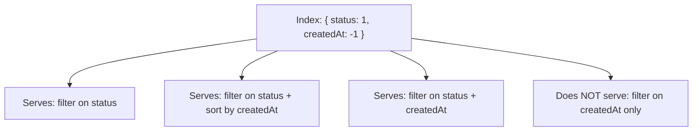

# How to Create a Compound Index in MongoDB

Author: [nawazdhandala](https://www.github.com/nawazdhandala)

Tags: MongoDB, Index, Compound Index, Query Optimization, Performance

Description: Learn how to create compound indexes in MongoDB to optimize multi-field queries, understand field ordering rules, and apply the ESR rule for maximum performance.

---

## How Compound Indexes Work

A compound index stores references to multiple fields in a single index structure. MongoDB can use a compound index to satisfy queries that filter, sort, or project on any prefix of the indexed fields.

For example, an index on `{ status: 1, createdAt: -1 }` can serve queries that filter on `status` alone, or on both `status` and `createdAt`. It cannot serve queries that filter only on `createdAt`.



## Syntax

```javascript
db.collection.createIndex(
  { field1: 1, field2: -1, field3: 1 },
  { options }
)
```

Field values are `1` for ascending and `-1` for descending order.

## The ESR Rule

The ESR rule defines the optimal field order in a compound index:

- **E**quality fields first - fields tested with exact match (`=`)
- **S**ort fields second - fields used in `sort()`
- **R**ange fields last - fields tested with range operators (`$gt`, `$lt`, `$gte`, `$lte`, `$in`)

Following the ESR rule lets MongoDB use the index for both filtering and sorting without an in-memory sort.

## Examples

### Basic Compound Index

An e-commerce orders collection that is frequently queried by `customerId` and sorted by `orderDate`:

```javascript
db.orders.createIndex({ customerId: 1, orderDate: -1 })
```

A query that benefits from this index:

```javascript
db.orders.find({ customerId: "cust_001" }).sort({ orderDate: -1 })
```

### Applying the ESR Rule

A query that filters on `status` (equality), sorts by `createdAt` (sort), and filters on `amount` with a range:

```javascript
db.orders.find({
  status: "shipped",
  amount: { $gt: 100 }
}).sort({ createdAt: -1 })
```

The correct compound index following ESR:

```javascript
db.orders.createIndex({ status: 1, createdAt: -1, amount: 1 })
```

### Covered Query with Compound Index

A covered query returns results entirely from the index without loading documents. Include all projected fields in the index:

```javascript
db.products.createIndex({ category: 1, price: 1, _id: 0 })

// This query is covered - no document fetch needed
db.products.find(
  { category: "electronics" },
  { price: 1, _id: 0 }
)
```

Verify with `explain()`:

```javascript
db.products.find(
  { category: "electronics" },
  { price: 1, _id: 0 }
).explain("executionStats")
```

Look for `"stage": "PROJECTION_COVERED"` and `totalDocsExamined: 0` in the output.

### Node.js Example

```javascript
const { MongoClient } = require("mongodb");

async function createCompoundIndex() {
  const client = new MongoClient("mongodb://localhost:27017");
  await client.connect();

  const orders = client.db("shop").collection("orders");

  // ESR-ordered compound index
  const result = await orders.createIndex(
    { status: 1, createdAt: -1, amount: 1 },
    { name: "idx_status_createdAt_amount" }
  );
  console.log("Index created:", result);

  // Verify with a sample query
  const cursor = orders.find(
    { status: "shipped", amount: { $gt: 100 } },
    { sort: { createdAt: -1 } }
  );
  const docs = await cursor.toArray();
  console.log(`Found ${docs.length} orders`);

  await client.close();
}

createCompoundIndex().catch(console.error);
```

### Checking Index Usage

```javascript
db.orders.find({
  status: "shipped",
  amount: { $gt: 100 }
}).sort({ createdAt: -1 }).explain("executionStats")
```

The output should show `"stage": "IXSCAN"` and a low value for `totalKeysExamined` relative to `nReturned`.

## Index Prefixes

MongoDB can use a compound index to answer queries on any leading prefix of its fields. Given `{ a: 1, b: 1, c: 1 }`, the prefixes are:

```text
{ a: 1 }
{ a: 1, b: 1 }
{ a: 1, b: 1, c: 1 }
```

You do not need separate single-field indexes on `a` or `a, b` if you already have `{ a: 1, b: 1, c: 1 }`.

## Best Practices

- **Follow the ESR rule** to avoid in-memory sorts and maximize index efficiency.
- **Use the fewest fields necessary.** Every additional field increases index size and write overhead.
- **Check prefixes before creating new indexes.** An existing compound index may already cover your new query via its prefix.
- **Use `explain("executionStats")`** to confirm the index is chosen and check `totalKeysExamined` vs `nReturned`.
- **Avoid redundant single-field indexes** when a compound index prefix already covers those queries.
- **Keep sort direction consistent** with common query patterns to avoid in-memory sorts.

## Summary

Compound indexes allow MongoDB to serve complex multi-field queries efficiently with a single index structure. The key to creating effective compound indexes is the ESR rule: put equality fields first, sort fields second, and range fields last. Always verify with `explain()` that the query planner selects the index and performs an index scan rather than a collection scan.
