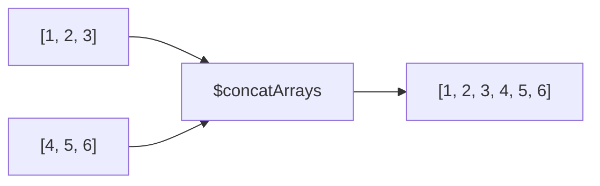

# How to Use $concatArrays in MongoDB Aggregation

Author: [nawazdhandala](https://www.github.com/nawazdhandala)

Tags: MongoDB, Aggregation, $concatArrays, Array, Pipeline

Description: Learn how to use $concatArrays in MongoDB aggregation to merge multiple arrays into a single array within a document.

---

## How $concatArrays Works

`$concatArrays` combines two or more arrays into a single array. It is an expression operator (not a stage) used within `$project`, `$addFields`, `$set`, or any context that accepts expressions.

If any input is `null`, the result is `null`. If an input is a missing field, it is treated as `null`.



## Syntax

```javascript
{ $concatArrays: [ <array1>, <array2>, ... ] }
```

Each element in the argument list can be an array field reference, a literal array, or any expression that evaluates to an array.

## Examples

### Example 1 - Concatenate Two Array Fields

Merge `fruits` and `vegetables` arrays into a single `foods` array:

```javascript
// Input: { _id: 1, fruits: ["apple", "banana"], vegetables: ["carrot", "broccoli"] }
db.produce.aggregate([
  {
    $project: {
      foods: { $concatArrays: ["$fruits", "$vegetables"] }
    }
  }
])
```

Output:

```javascript
[
  { _id: 1, foods: ["apple", "banana", "carrot", "broccoli"] }
]
```

### Example 2 - Concatenate Multiple Arrays

Combine three arrays:

```javascript
// Input: { _id: 1, a: [1, 2], b: [3, 4], c: [5, 6] }
db.data.aggregate([
  {
    $project: {
      combined: { $concatArrays: ["$a", "$b", "$c"] }
    }
  }
])
```

Output:

```javascript
[
  { _id: 1, combined: [1, 2, 3, 4, 5, 6] }
]
```

### Example 3 - Append a Literal Element

Add a fixed element to an existing array by wrapping it in a literal array:

```javascript
// Input: { _id: 1, tags: ["mongodb", "database"] }
db.posts.aggregate([
  {
    $addFields: {
      tags: { $concatArrays: ["$tags", ["nosql"]] }
    }
  }
])
```

Output:

```javascript
[
  { _id: 1, tags: ["mongodb", "database", "nosql"] }
]
```

### Example 4 - Flatten One Level of Nesting

Combine `$reduce` with `$concatArrays` to flatten an array of arrays:

```javascript
// Input: { _id: 1, nested: [[1, 2], [3, 4], [5]] }
db.data.aggregate([
  {
    $project: {
      flat: {
        $reduce: {
          input: "$nested",
          initialValue: [],
          in: { $concatArrays: ["$$value", "$$this"] }
        }
      }
    }
  }
])
```

Output:

```javascript
[
  { _id: 1, flat: [1, 2, 3, 4, 5] }
]
```

### Example 5 - Null Handling

When any input is `null`, the entire result is `null`:

```javascript
// Input: { _id: 1, a: [1, 2], b: null }
db.data.aggregate([
  {
    $project: {
      result: { $concatArrays: ["$a", "$b"] }
    }
  }
])
```

Output:

```javascript
[
  { _id: 1, result: null }
]
```

To safely handle null arrays, use `$ifNull` to provide a fallback:

```javascript
db.data.aggregate([
  {
    $project: {
      result: {
        $concatArrays: [
          { $ifNull: ["$a", []] },
          { $ifNull: ["$b", []] }
        ]
      }
    }
  }
])
```

### Example 6 - Combine $map Output with Existing Array

Transform one array and append it to another:

```javascript
// Input: { _id: 1, prices: [100, 200], tags: ["electronics"] }
db.items.aggregate([
  {
    $project: {
      info: {
        $concatArrays: [
          "$tags",
          {
            $map: {
              input: "$prices",
              as: "p",
              in: { $toString: "$$p" }
            }
          }
        ]
      }
    }
  }
])
```

Output:

```javascript
[
  { _id: 1, info: ["electronics", "100", "200"] }
]
```

### Example 7 - Merge Arrays from $lookup

After a `$lookup`, append two related arrays:

```javascript
db.orders.aggregate([
  {
    $lookup: { from: "items", localField: "items", foreignField: "_id", as: "itemDocs" }
  },
  {
    $addFields: {
      allItems: { $concatArrays: ["$legacyItems", "$itemDocs"] }
    }
  }
])
```

## Use Cases

- Merging arrays from different document fields into a single array field
- Appending new elements or arrays to an existing array in the pipeline
- Flattening one level of nested arrays using `$reduce` + `$concatArrays`
- Combining arrays from joined collections after `$lookup`

## Summary

`$concatArrays` merges two or more arrays into a single array. It preserves the order of elements from each input array. Use `$ifNull` to guard against null fields before concatenating, and combine with `$reduce` to flatten arbitrary levels of array nesting.
